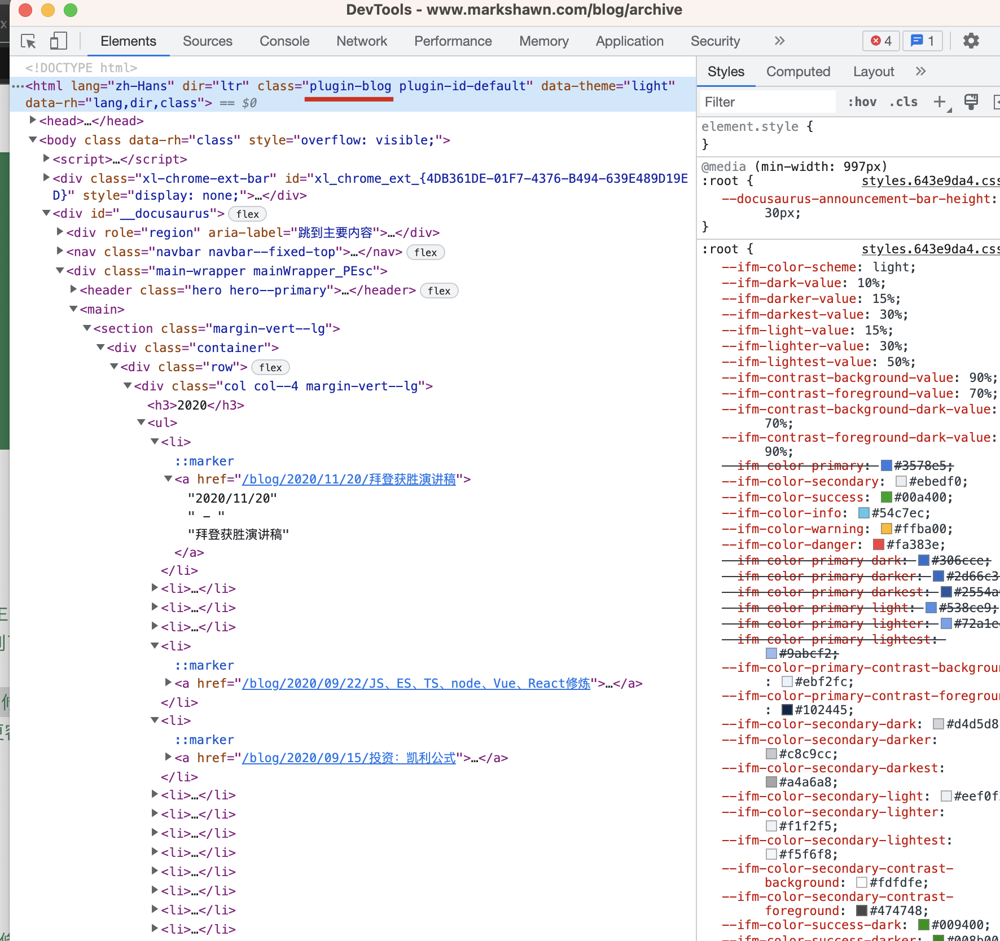
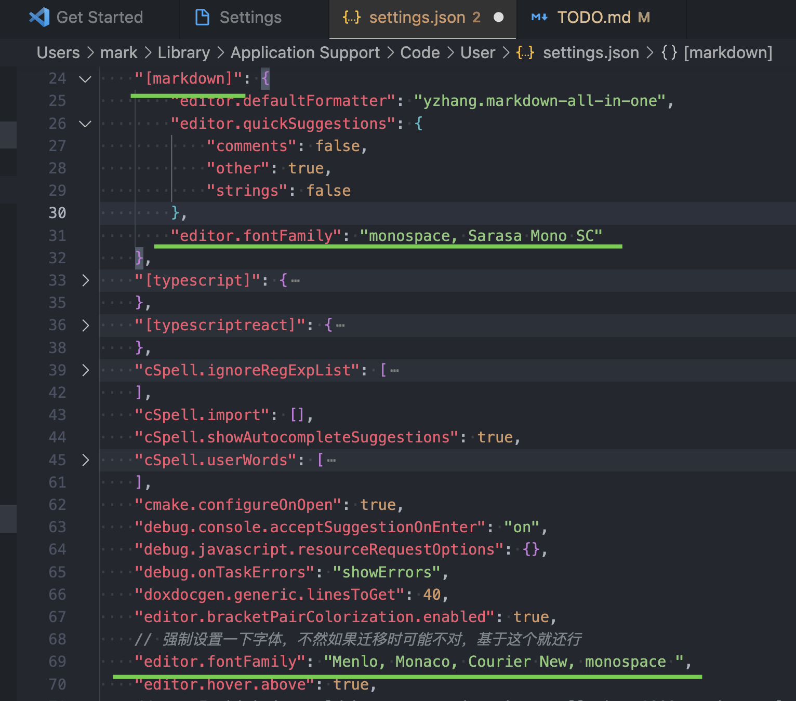
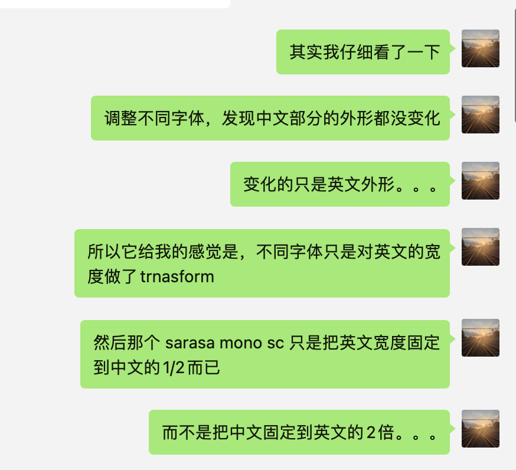

| sDate      | eDate      | category     | title                                        | priority | status    | reason   | detail                      |
| ---------- | ---------- | ------------ | -------------------------------------------- | -------- | --------- | -------- | --------------------------- |
| 2022-09-09 |            | docusaurus   | fix failure to run workflow                  |          |           |          |                             |
| 2022-09-09 |            | project      | feishu-doc-sdk manage docs seen and update   |          |           |          |                             |
| 2022-09-09 |            | project      | feishu-doc-sdk hook on doc update            |          |           |          |                             |
| 2022-09-09 |            | project      | feishu-doc-sdk download and parse docs       |          |           |          |                             |
| 2022-09-08 |            | docusaurus   | blog list page format title with ending      |          |           |          | [^blog-list-title-style]    |
| 2022-09-08 |            | docusaurus   | frontmatter of `ref-expand-depth`            | .8       |           |          | [^ref-expand-depth]         |
| 2022-09-06 |            | docusaurus   | scale image if h > w                         | .3       |           |          |                             |
| 2022-09-06 |            | docusaurus   | add directory route with covers for articles | .7       |           |          |                             |
| 2022-08-26 |            | project      | dev vscode sync to feishu docs               |          |           |          |                             |
| 2022-08-18 |            | feat         | enable chinese align in markdown table       |          |           |          | [^md-table-align]           |
| 2022-08-18 |            | bug          | fix stock-chips step down problem (by fei)   |          |           |          |                             |
| 2022-08-17 |            | bug          | fix docusaurus file updated date             |          |           |          |                             |
| 2022-08-12 |            | learn        | research on different eslint recommends      |          |           |          |                             |
| 2022-08-11 |            | clean        | qq-zone notes, like peking university        | 0.6      | pending   |          |                             |
| 2022-08-09 |            | learn        | google js/ts style learning                  | 0.6      | pending   |          | [^learn-google-js/ts-style] |
| 2022-06-20 |            | bug          | adobe photoshop export                       | -        | discarded | GONE     | [^ps-bug]                   |
| 2022-06-20 |            | chore        | delete MP4 in git repo                       | -        | finished  | FIXED    | [^git-rm-mp4]               |
| 2022-02-04 |            | article      | linux core intro                             | -        | finished  | FINISHED |                             |
| 2022-01-06 |            | feat         | vscode md image upload                       | -        | finished  | FIXED    | [^vscode-md-img-upload]     |
| 2022-08-05 |            | project      | gantt graph                                  |          | pending   |          | inspired by ruo/jack        |
| 2022-08-09 | -          | reading      | 你当飞向你的山                               | 0.7      | pending   |          |                             |
| 2022-08-09 | -          | reading      | 置身事内                                     | 0.7      | pending   |          |                             |
|            |            | blog         | sort out the blog category                   |          | pending   |          |                             |
|            |            | blog         | sort out the tsinghua docs                   |          | pending   |          |                             |
|            |            | learn        | Lee-SLAM                                     |          | started   |          | [^learn-slam]               |
|            |            | learn        | computer graph                               |          | pending   |          | [^learn-computer-graph]     |
|            |            | project      | markdown output with multi-platforms         |          | pending   |          | [^md-multi-output]          |
|            |            | project      | agg-music                                    |          | delayed   |          | [^agg-music]                |
|            |            | project      | markdown realtime engine                     |          | delayed   |          | [^md-realtime-engine]       |
|            |            | project      | aggregated search                            |          | delayed   |          | [^agg-search]               |
|            |            | project      | knowledge graph based on blog system         | 0.7      | delayed   |          |                             |
|            |            | TamperMonkey | douban rent                                  |          | started   |          | [^tm-douban-rent]           |
|            |            | mac          | customize dictionary app                     |          | delayed   |          | chinese <--> english        |
|            |            | project      | online reader                                |          | delayed   |          | [^online-reader]            |
|            |            | project      | video synchronized with captain              |          | delayed   |          | [^video-captain-sync]       |
|            |            | project      | e-commercial analysis system                 | 0.6      | delayed   |          |                             |
|            |            | project      | super financial bill                         |          | delayed   |          | difficulty: need root       |
|            |            | vscode       | markdown synchronized scroll algorithm       |          | delayed   |          |                             |
|            |            | vscode       | auto-completion for headings from md         |          | delayed   |          | [^vscode-auto-heading]      |
|            |            | vscode       | comment line with cursor down                |          | delayed   |          | stay if line is empty       |
|            |            | article      | blog tools comparison                        |          | pending   |          | about remark                |
|            |            | pr           | ttf2bmf backend                              |          | discarded | PASS     | [^ttf2bmf-node]             |
|            |            | article      | ASCII ART                                    |          | discarded | PASS     |                             |
|            |            | feat         | vscode markdown container support            |          | finished  | FIXED    |                             |
|            |            | bug          | vscode lag when input                        |          | finished  | FIXED    | [^vscode-lag-when-input]    |
|            |            | feat         | vscode md flex                               |          | finished  | FIXED    | [^vscode-md-flex]           |
|            |            | chore        | best-practice of md workflow                 |          | finished  | ENOUGH   | [^vscode-md-best-practice]  |
|            |            | book         | frontend, backend to algo                    |          | discarded | LATER    | [^book-coding-overview]     |
|            |            | chore        | control mkl repo size                        |          | finished  | SOLVED   | [^git-control-repo-size]    |
|            |            | refactor     | change `index.yaml` to be `index.md`         |          | discarded | PASS     |                             |
|            |            | project      | Legend of King Auto Simulate System          |          | discarded | PASS     |                             |
|            |            | chore        | add color support for `build/init.zsh`       |          | discarded | PASS     |                             |
|            |            | article      | Prisma is not suitable for electron          |          | discarded | PASS     |                             |
|            |            | plugin       | LinkToText                                   |          | finished  | PASS     |                             |
|            |            | chore        | change the default TOC config                |          | finished  | SOLVED   | [^config-md-toc-depth]      |
|            |            | article      | shortcuts comparison                         |          | finished  | FINISHED |                             |
| 2022-09-06 | 2022-09-06 | docusaurus   | fallback sidebar title with dirname if index | .8       | finished  |          |                             |

[^blog-list-title-style]:

    solution 1: via css
      use `.plugin-blog .container li`:
        

    solution 2: via modification of source code
      `@theme/BlogListPage` at `/Users/mark/my-docusaurus/my-website/config/src/blog.ts`

[^ref-expand-depth]:

      

      

[^md-table-align]: 
    vscode配置:
        

    研究结果:
        

    参考(provided by ruo):
      - 中文等宽字体: https://leonvision.online/technology/monospace-chinese-font-family/
      - `Sarasa Gothic` github: https://github.com/be5invis/Sarasa-Gothic
      - download `Sarasa Gothic` font: https://mirrors.tuna.tsinghua.edu.cn/github-release/be5invis/Sarasa-Gothic/
      - 另一个字体(20k): https://github.com/microsoft/cascadia-code

[^learn-google-js/ts-style]:
    参考(provided by ruo):
      - https://google.github.io/styleguide/jsguide.html
      - https://google.github.io/styleguide/tsguide.html
      - https://github.com/airbnb/javascript
      - https://eslint.org/docs/latest/rules/

[^online-reader]: based on http://b-ok.org
[^agg-music]: features:

    - singers
    - songs
    - albums

[^book-coding-overview]: details: - coding 0-1, with lectures and videos
[^learn-slam]:

[Lee SLAM](https://github.com/MarkShawn2020/Lee-SLAM-source)

[^learn-computer-graph]: [GAMES101-现代计算机图形学入门-闫令琪\_哔哩哔哩\_bilibili](https://www.bilibili.com/video/BV1X7411F744/)
[^md-multi-output]: inspired: [Kris Fei's blog_KrisFei_CSDN 博客------Rockchip------,RK3399,-----Qualcomm------领域博主](https://blog.csdn.net/kris_fei?type=blog)
[^md-realtime-engine]:

基于 marked + webpack + iframe ？从而允许开发模式下将微信公众号排版做好，即一款可以展示环境配置（尤其是全局和局部镜像源）的 gui（参考 baobab）

[^agg-search]: supported platforms:

    - baidu
    - google
    - github
    - wechat
    - zhihu
    - ...

    implementation:

    - [ ] general fullstack
    - [x] ~~2022-07-01， 用油猴实现，但因为 `iFrame` 的限制，只支持某几个开放的网站，所以这个方案无法满足目标需求~~ 

[^tm-douban-rent]: 目标需求：

    1. 在豆瓣小组页面，实现自动输出 excel 结构的豆瓣小组信息
    2. 在豆瓣小组页面，增加一个触发筛选的按钮，触发效果待设计（筛选后不足目标条数是否要自动继续加载下一页；或者直接取消分页机制，而是使用无限滚动的方案）
    3. 实现对多个豆瓣小组的监控与筛选

[^video-captain-sync]: see: http://videolectures.net/nipsworkshops2010_urtasun_gpv
[^vscode-auto-heading]: feat: 实现其他 md 文件的 headings 的自动补全

    - [Auto completion for links to headings / sections in other files · Issue #894 · yzhang-gh/vscode-markdown](https://github.com/yzhang-gh/vscode-markdown/issues/894)
    - [vscode-markdown/completion.ts at master · yzhang-gh/vscode-markdown](https://github.com/yzhang-gh/vscode-markdown/blob/master/src/completion.ts)

    note: 这是一个看起来可行的插件，但我安装后好像并没什么卵用

    - [MarkDown Link Suggestions - Visual Studio Marketplace](https://marketplace.visualstudio.com/items?itemName=TomasHubelbauer.vscode-markdown-link-suggestions)

[^vscode-lag-when-input]: I find this problem is concerned with this plugin.

    

    since, when it's enabled, the window would freeze if I input the '\`' and then `enter` or `back`.

    However, it seems this `auto-completion` is built-in.

    I would first try some time without it.

[^vscode-md-flex]:

- [x] G1：选中两张 md 图片链接，实现右键加入 flex 布局的父级 div，以使图片并行显示

  - [x] \*G2：在 G1 的基础上提供更多细分子选项，以实现更精细的布局

  > :warning: 直接使用 snippet 完成了，写成 markdown 专用的即可，非常方便，第二点算了，没意思

    

[^vscode-md-best-practice]:

- [Markdown Basics](https://shd101wyy.github.io/markdown-preview-enhanced/#/markdown-basics?id=admonition)

  preview, save to pdf, copy to mdnice, directly output pdf, ...

[^config-md-toc-depth]: target:

    - `depth_from`: 1 -> 2
    - `depth_to`: 6 -> 4

    see:

    - [markdown-preview-enhanced TOC](https://shd101wyy.github.io/markdown-preview-enhanced/#/toc)
    - [Configure the default parameters of TOC · Issue #712 · shd101wyy/markdown-preview-enhanced](https://github.com/shd101wyy/markdown-preview-enhanced/issues/712)
    - [可以更改 front-matter 的默认设置么？ · Issue #603 · shd101wyy/markdown-preview-enhanced](https://github.com/shd101wyy/markdown-preview-enhanced/issues/603)

[^ps-bug]: 
[^git-rm-mp4]:

see: https://htmlpreview.github.io/?https://github.com/newren/git-filter-repo/blob/docs/html/git-filter-repo.html [^git-control-repo-size]: 使用`git filter-branch`把图片从历史汇总都删掉就可以，一共 400 多条 commit，每条删几百张图片，一分钟左右就差不多了（前提要都上传到图床，所以需要我们自己的图床批量上传脚本，具体见`~/coding/PycharmProjects/my-markdown-parser/src/main.py` 。 [^vscode-md-img-upload]: see: script of md_img_handler (now maybe under image-playgrounds) [^ttf2bmf-node]: project url: https://github.com/SilenceLeo/snowb-bmf
