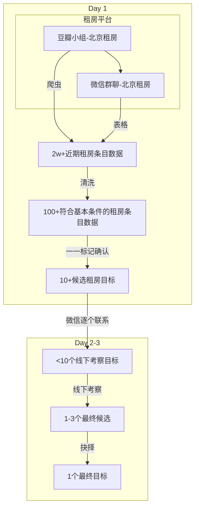

# 编程 | 北京租房系统设计、研究与经验 0.1.0

> 通过一天使用程序化手段获取两万多套房源转租信息，继而再通过程序化粗筛成两百多套，紧接着人工细筛出十几套，最后两天内实地考察九套。
>
> 在北京快速的、低成本的找房，我是如何做到的，我又有什么经验心得与启示，这是本文所要阐述的。

## 个人背景概要

大学实习基本都是在上海，租过远到嘉定每天来回四小时的自如、租过虹口差点要不回钱的蛋壳，租过和别人同睡一张床第二天赶紧溜走连押金都不想要的复旦老破小，租过闵大荒开始闹到威胁后续被窗外幼儿园治愈的公寓式开间，也为把项目做好租过浦东近万的酒店。

所以租房，尤其是在一线租房，确实是个头疼的问题。

现在，作为一名北漂狗，是时候认真研究一下了。

## 租房方案设计

### 个人需求分析

在每个人讨论租房这个问题之前，第一个就是个人需求的剖析。

就我接触下来，99%的人对价格还是相对敏感的，在此基础之上， 有些人更重视通勤时间（比如我），有些人更重视独卫的便利性（比如某互联网男生），有些人更重视卫生条件（某金融业女生）。

而预算方面也会因为因人而异，有预算 2000 的，3000 的，4000 的，甚至 6000 的，等等。

因此从需求、预算角度，每个人所适合的策略就不太一样。

**本文主要介绍的是汇总租房帖然后逐步筛选的方案，理论上适合一切找房群体，同时更适合希望较低成本找房的朋友**。

### 公寓 vs 民宅

我过往的经历，应该来说，住公寓与酒店比较多，现在的年轻人应该大多都是这样。

公寓也并非不好，尤其是身边同学或者朋友一起住青年公寓那种，就特有氛围。

但如果是长租，以下问题就不能忽视：

1. 首先是价格方面，同面积情况下，公寓普遍租金更高，另外商水商电大概是民水民电费用的三倍左右，比如夏天可能开着空调，民水民电的民宅花 150，但公寓就可能是 450，当然这个估算可能不准确，也因人而异
2. 公寓由于自建等原因，隔音效果普遍不是很好，如果喜欢安静的一定要注意这一点
3. 公寓往往缺少家的感觉

如果你能容忍或者确认以上几点，那就很适合选住公寓，因为公寓的配套设施一般更完善，比如自习室、健身房、大厅，甚至食堂等等。

总之，考虑到我的个人经历与接下来的规划，我就没有考虑公寓了。

### 线上 vs 线下

租房大致分纯线上、线上转线下与纯线下三种方式。

#### 纯线下方案

首先讲一下纯线下，如果你是经济非常紧张、对居住环境不是很重视，同时社交能力较强（或长的比较友好），希望以最低成本租房的，根据一些文章指出，你可以线下走街串巷，多和低收入人群（保安、清洁工等等）聊一聊，他们通常能给你非常具有性价比的推荐。

我虽然没有通过这种方式找房，但我确实曾经在拉萨坐人力拉车时和车夫聊过，他就住在大昭寺附近，一个月印象中好像是 300（也有可能是 600）的房子，总之，是很低了，即使我们住青旅，也要三四十一天，一个月下来也是近千的。

其实吧，我觉得纯线下的最主要条件，还是你要能来事，理论上不单单是光和低收入人群聊，你有能耐的话，也可以和包租婆聊，说不定更能找到非常具有吸引力的房源，对不~

但对于北漂狗来说，纯线下方案并不是那么容易操作。

#### 纯线上方案

接着是纯线上方案，这个方案，应该是很多学生党比较喜欢的方式，照片视频一看，或者根据平台品牌，一下就入了。

我便是这么走过来的。我甚至是线上看好后，直接拖着箱子再去看房的，这绝对是大忌！

当然这也不是不行，比如嫌麻烦与不缺钱，就可以无脑 all in 自如（公寓相关的分析接下来章节会说），至少能保证下限。

但如果你想选民宅的话，纯线上的最大挑战，是要有足够的鉴别能力。比如某中介在朋友圈发了某套房的房源信息，一般是位置加文字加图片，你需要第一时间能够识别出信息的真实度如何，另外，同步查询这个小区的相关信息：小区建成于什么年代、附近的设施情况如何等等。

而在你未曾亲自线下跑楼之前，你其实对这些都没什么太大概念，比如什么是筒子楼、什么叫隔断、什么是团结户等等。

不过一旦你对这些概念逐步熟悉之后，看房，尤其是看中介与平台的线上房源，心中就会相对有数了，也就是说，至少不太容易出现预期差太多的情况了。

#### 线上转线下方案

相对来说，先在线上看够足够多的房源，再精挑几个去线下调研，应该是最好的。

这里，有两点，第一点就是尽量以正常通勤工具去看房，你不能因为远或者啥的去打车看房，毕竟你是来租房通勤用的，你必须还原你的真实使用场景去体会这是不是你想要的，所以从我的感受来看，离地铁超过 1 公里的房我就不会要了，走路实在需要太久。

第二点，就是怎么说呢，并不需要刻意排斥中介。

是，中介这个职业，总让人爱恨交加，尤其是碰到就为了多坑点你钱的，我也碰到过，并且不少。但别人也确实给你提供了一定帮助，或者说，insight。

你得明白整个租房市场是怎么回事，在一线城市，绝大多数租房都是相对饱和的，好的、性价比高的房子确实很抢手，比如在国贸上班的金融白领们租房一般就是围绕这一块，相应的就会有中介专门负责这几块小区的生意，一旦有一个房间空出来就会立马挂出来，然后数个中介就能找到数个客户对该房源感兴趣。

如果你排斥中介，拒绝接受中介，你怎么能获得这些房源信息？并不是所有人都会在豆瓣、咸鱼发帖转租什么的，所以中介仍旧是找房的一个重要途径，关键是看你怎么用。

我的看法是，不要只 follow 一个中介，你可以多加几个中介，综合他们的 insight，最终逐渐形成你的租房目标。但所谓的多加，也不是随便加，一定是你目标区域内的中介才是有效的，因此如何加到你目标区域内尽可能多的中介，依旧需要我们后续所用到的技术。

再总结一下，不需要排斥中介，但也不要随意加中介，如果碰到目标区域内的中介，不妨加了多和他们聊聊，可以更快地帮你熟悉目标区域。最重要的是，不要拖着箱子，然后坦诚地、大方地线下去走走，实地看看。说不定想去看的某套是不符合期望的，但其他套却很吸引你，这也是可能的。

当然，中介有风险，后面也会讲一些中介的平常套路。

### 线上平台选择

现在其实有很多租房的平台，比如微信、豆瓣小组、咸鱼、小红书、贝壳找房、链家、58、安居客、自如、泊寓等等。

其中，个人房源主要集中在微信、豆瓣小组、咸鱼、58 等平台上，贝壳找房我试了试房源基本对接的自如的。这其中，58 和安居客据说假房源特别多，所以也未在我选择之列。咸鱼和小红书是我后来才知道的，但不在本次找房所使用工具之类。

本次找房主要使用的是微信和豆瓣小组，其实主要是豆瓣小组，微信的租房群也是通过豆瓣才找到的。

### 总体设计



## 租房前期准备

### 了解行政区域规划

访问 [有没有一种电子地图，可显示详细的行政区域边界 ？ - 知乎](https://www.zhihu.com/question/26731387) 可以很方便地查看行政区域规划地图，例如北京的：


我也是第一次看行政区域地图，一一审查他们的区号发现还挺有规律，核心第一圈东西城区 01 和 02，接着第二圈从朝阳开始顺时针——朝阳（05）、丰台（06）、石景山（07）、海淀（08），接着第三圈从房山开始逆时针——房山（11）、通州（12）、顺义（13）、昌平（14），最后第四圈有点杂乱但整体依旧是逆时针：大兴（15）、怀柔（16）、平谷（17）、密云（18）、延庆（19）。

了解行政区划的目的，主要是分清自己大概会租什么位置的房子，因为现在大多数租房软件都会提供基于行政区划与地铁等多种筛选方式，也许地铁比行政区域更重要一些，但提前了解一下行政区域也会有一个比较重要的区位概念。

至少，我了解下来，断定，我大概会在朝阳与丰台这两个区之间做选择，这是比较重要的信息。也就是说，后续看到转租帖，不是这两个区的基本都可以 pass 了。

### 了解地铁线路规划

从我的角度，行政区域对自己的实际参考意义并不大，作为北漂狗，最重要的依据还是地铁，谁能把握住地铁的脉络，谁就能把握住性价比的尾巴。

所以首先找一张地铁线路图，这个随便一搜就能找到，比如这是百度地图里的北京地铁图：[北京市地铁图 - 百度地图](https://map.baidu.com/@12964228,4821466,13z)

由于公司在四惠南边，所以我从四惠站出发，沿各个方向延伸七站左右，其中遇到换乘加算一站。（七站大概是半小时）


如此来看，其实我的可选范围还是挺多的，整个北京东南方向的一大块都包括了。

但为了控制成本，我特意标记了地铁外环的几个拐角，直觉上这里价格会略低些：

1. 百子湾，位于 7 号线拐角，同时也是离公司最近的侯选处，可以步行上班
2. 北工大西门，位于 14 号线拐角，这里的最大优势是可以直达望京
3. 分钟寺与成寿寺，位于 10 号线上，这两个地方是某北漂朋友推荐的地儿，确实便宜
4. 青年路，6 号线，正好在环外，旁边就是朝阳公园
5. 通州北苑，低处通州区，价格更低，旁边还有万达广场

这几个锚定的区域都需要重点观察。

### 了解周遭小区分布

我们可以在 [北京地图找房*北京小区地图*北京房产地图(北京链家)](https://map.lianjia.com/map/110000/ESF) 简单看到大部分小区的分布情况，例如定位到我司附近的百子湾小区：


再点击一次可以看到具体到每个小区的情况，下面部分有一大块的空白看样子是商区（不确定）。


由于我司位于源创空间大厦，离周围的地铁都比较远，步行距离接近 2 公里（通勤时间可以以步行的 10 分钟/公里计算），因此光是从最近的地铁站步行到公司都要花 20 分钟，所以在租房时要考虑这个问题。


具体地说，如果我的通勤时间要控制在半小时以内，那么大概率远距离的长地铁方案就要 GG 了。（长地铁方案：选择离公司较远、离地铁较近、具有较高性价比租房的方案）比如以我司以及周围的三/四个地铁站为中心，附近有数个小区（高德地图，链家看起来太费劲了，且不全）：


这些小区中，最优先考虑的应该是在四惠东、四惠、大郊亭、百子湾（逆时针）这几个地铁站之间的小区：金海国际、金都杭城、沿海赛洛城和百子湾家园。其中金海国际可能地铁位置最优（仅次于九龙山附近的珠江帝景）但最贵（二手房价格 6w+），沿海赛洛城性价比最高（离地铁次近，二手房价格 4w+），金都杭城与百子湾家园离地铁更远。

其次就是四惠河北部的惠民园、东恒时代、十里堡等。

最后是其他地区，例如大郊亭左边的后现代城、百子湾下面的光华新城、百子湾右边的燕宝保湾家园、四惠东右下角的西店村等。

### 小区的选择依据

个人认为，无论预算是否充沛，最终是否直接选择离公司最近的小区，适当地过一遍周遭小区还是比较重要的，因为你选择这里的概率会比较大。

但并非必须选项，因为我们往往会考虑地铁沿线更远的区域，尤其是在我们把通勤时间放宽到一小时、公司本身离地铁也很近、最后一公里选择骑车而非步行等前提下。

但这样，我们就需要看[了解地铁线路规划](#了解地铁线路规划)中所圈点的更多地铁站旁边的更多小区，工作量指数级上升。

因此，关于其他小区的通勤距离这部分，我倾向于通过程序计算，找到后再单独看~

## 豆瓣小组租房条目的数据获取

基于我们在[平台选择](#平台选择)中的分析，豆瓣小组是本文的重点考察对象（后续可能会考虑再加入闲鱼，据说个人房源信息也不错）。

另外，至少有两种获取豆瓣小组租房信息的方式，一种是基于网络流传的 API，一种是基于我们自己的爬虫。

### 豆瓣小组租房信息获取的目标设计

1. 支持搜索小组名以获得所有相关的小组
   1. 例如：“北京租房”
   2. 豆瓣支持小组名字相同，所以其实会有很多个同名小组
   3. 为了信息的完整性，我们最好捕捉所有符合要求的小组，然后一一进行处理
2. 支持基于小组名（实际是 id）获得该小组下的所有话题
3. 基于话题的标题，进行地名提取与位置确认，进行转租筛选
4. 支持基于话题再获得话题下的图片与文字
   1. 如果有了图片，是很方便可以做一些可视化网站的，势必会比较方便
   2. 另外也可以做筛选，你说对方要把房子租出去，结果图都不晒一张，这合适吗，这不合适，这能要吗，这肯定不能要
   3. 尽管势必会有大量照骗党，杀猪磨盘，但是也不能因为这个而畏惧呢
5. 其他

### 豆瓣小组 API 方案之分析与准备

之前就听说国内电影体系都是靠豆瓣的 api，因此首先就是先谷歌一下“豆瓣 api”，结果发现果然有 [豆瓣 Api V2（测试版） | doubanapi](https://www.doubanapi.com/)，注意这两个 api_key，我一开始表示怀疑，后来发现竟然真能用……

```sh
0df993c66c0c636e29ecbb5344252a4a
0b2bdeda43b5688921839c8ecb20399b
```


但这个网页其实没有提供豆瓣小组的 api，于是我们继续搜索豆瓣小组是否有 api 的信息 [豆瓣小组是否提供 API？ - 知乎](https://www.zhihu.com/question/19889922)：


有几个有趣的回答，第一个给出了 api 地址与形式，并且附送了一个链接：


不过这个所谓的”出处“链接到很有意思，是 2012 年的，最关键的是，打开后一闪而过，倒也没那么快，大概一秒钟之后跳转到了新的页面，看最后一个网址就知道，是被重定位了。

刚刚是手快，截了一下，但是光截图看不到后面的内容，而想中途拉动又不可能。

这个时候，抓包神器的作用就体现了，所有网页加载都有记录，直接把 html 文件导出，再在本地打开，就发现全出来了：


最有意思的是，这个帖子似乎是有两个“小黑客”在尝试破译豆瓣的接口，好吧，也就是我正在做的事了。

读下来饶有味道：


不过他们所描述的获取 access_token 的形式，我也不清楚豆瓣是怎么想的，可能他们同时有两套接口吧，一套 oauth2，一套 api_key。总之，我们目前应该是不需要 access_token 的，直接用 api_key 就可以，并且是固定的。

比如按照上面的截图，获取豆瓣小组里话题列表的 api 是`https://api.douban.com/v2/group/${GROUP_NAME}/topics`，例如：`https://api.douban.com/v2/group/husttgeek/topics`，这个时候如果我们在浏览器中直接打开这个网址，会遇到缺少 api_key 的警告：


这不，我们一开始搜的豆瓣 api 就有用了吗，把那个 api，比如`0df993c66c0c636e29ecbb5344252a4a`复制过来，拼接到网址上去，重新访问，结果就有了：


得来全不费工夫！

至此，其实我们的思路已经大致确定了，不过那个知乎帖子下面还有两个 git 项目，其中一个是监控小组的，倒是确有一点意义，可供闲暇参考，分别罗列如下：

- [yaodi833/rental_house_douban: 本项目基于（非公开）豆瓣 api，实时监控多个豆瓣租房小组发布租房信息，并支持小组订制，关键词订制，邮件推送等功能](https://github.com/yaodi833/rental_house_douban)
- [doubangroupapi](https://gist.github.com/iamsk/1bc0760dfeeeb950f18e)

基于以上分析，可见，豆瓣的 api 还是比较稳定可用的，否则该失效早失效了。

不过有些东西还差一点。其中，我们目前只知道第二点（罗列话题）与第四点（获取话题内容）应该是有了现成的 api，而第一点（搜索小组）则没有，需要我们自己破解。另外第三点是我们后续的算法部分，与豆瓣 api 无关，故暂且可以先不谈。

> 豆瓣小组 API 方案之如何获取搜索小组的 API

按照直觉，我们可以通过对比正常访问的网页地址与已经明确了的 api 之间的关系，得到 $f(x) = y$，然后再把这个 $f$ 作用到正常搜索网页的网址上去。

我们先试试。

但是很快我发现搜索接口是比较独立的，是一个集中式的接口，和那些分别对应的不太一样。

紧接着我又意识到，其实这么多小组，取前几个就已经比较够了。


```sh
function getGroups() {
    curl https://www.douban.com/search\?q\=$1 2> /dev/null \
    | grep -E "小组.*<a href" \
    | gsed -E "s/.*group%2F(.*?)%2F.*/\1/"
}
```

这样我们就得到了豆瓣小组的前几个小组的 id，例如：


这样，我们的第一步就也痛了，于是乎，第一步获取小组 id 列表，第二步获取小组内的主题，第四步获取小组主题内容，这几步都没有技术上的问题了，接下来就是写程序，以及加上第三步算法部分。

### 豆瓣小组 API 方案之设计与实现

可以直接访问 `https://api.douban.com/v2/group/beijingzufang/topics?apikey=0df993c66c0c636e29ecbb5344252a4a` 获取 demo 结果：


基于这个返回结果，可设计数据结构如下：

```py
class Author(TypedDict):
    name: str
    is_suicide: bool
    avatar: str  # url
    uid: str  # int
    alt: str  # url
    type: str  # UserType
    id: str  # int
    large_avatar: str  # url


class Dimension(TypedDict):
    width: int
    height: int


class Photo(TypedDict):
    size: Dimension
    alt: str  # url
    layout: str
    topic_id: str  # int
    seq_id: str  # int
    author_id: str  # int
    title: str
    id: str  # int
    creation_date: str  # datetime


class DoubanApiTopic(TypedDict):
    is_private: bool
    locked: bool
    liked: bool

    like_count: int
    comment_count: int

    id: str  # int
    created: str  # datetime
    updated: str  # datetime

    title: str
    alt: str  # url
    share_url: str  # url
    screenshot_title: str
    screenshot_url: str  # url
    screenshot_type: str
    content: str

    author: Author
    photos: List[Photo]


class DoubanApiTopicResultSuccess(TypedDict):
    """
    请求成功时的结构体
    """
    count: int  # 0 - 100
    start: int  # default: 0
    total: int
    topics: List[DoubanApiTopic]


class DoubanApiTopicResultFailure(TypedDict):
    """
    当请求失败时，就会返回这个结构体
    """
    msg: str  # "access_error"
    code: int  # 403
    request: str
    localized_message: str
```

有了 apikey 可以直接调用 api，获取 json 结果，然后解析，因此本过程省略，以下主要记录一下核心续爬代码：

```py
start = 0
while True:
    result = self._get_topics_of_group(group, start, limit)

    if result.get("code", 0) == 403:
        finished_reason = f"此请求已触及该apikey<{self._apikey}>限制"
        break

    for item in result["topics"]:
        yield DoubanApiTopic(**item)

    start += limit

    if result["start"] + result["count"] >= result["total"]:
        finished_reason = "不容易，所有数据已全部提取完毕"
        break

print("finished, reason: " + finished_reason)
```

### 豆瓣小组爬虫方案之设计与实现

豆瓣的前端页面并不复杂，就是一个传统的 table 结构，按序解析即可。


豆瓣小组的特定小组内条目的字段主要有：`讨论 | 作者 | 回应 | 最后回应`四个基本字段，相应的在程序设计中我编码成了六个字段：`post_title | post_url | author_name | author_url | response_count | response_latest_time`。


有一个问题，是关于多个小组的，由于豆瓣小组针对某一话题会有多个不同的小组，甚至名字相同（但 id 唯一），这就导致需要我们对每个小组分别进行数据提取。有一种办法可以避免这样，那就是集中采集 [我的小组讨论](https://www.douban.com/group/)页面。

比如，我所有的小组都是关于租房的，一共有三个小组：`北京租房 | 北京无中介租房 | 北京租房房东联盟（中介勿扰）`，因此这个页面就是这些小组里所有最新的帖子情况。


但这种办法的缺点有二，一个是你要主动过滤非租房相关的小组，另一个就是不支持提供发帖者相关的信息，这在筛选上，缺失了一个比较有用的维度（不过其实我并没有使用这个维度）。

于是，基于特定小组的话题列表的字段设计如下：

```py
class Topic(TypedDict):
    response_latest_time: datetime
    post_title: str
    post_url: str
    author_name: str
    author_url: str
    response_count: int


TopicColumns = ["response_latest_time", "post_title", "post_url", "author_name", "author_url", "response_count"]
```

直接使用 python 的爬虫基操（`requests + beautifulsoup4`）即可，核心解析代码如下：

```py
rows = soup.select("#content .article tr")[1:]

for row in rows:
    post_title = row.select_one("td:nth-of-type(1) a")["title"]
    post_url = row.select_one("td:nth-of-type(1) a")["href"]
    author_url = row.select_one("td:nth-of-type(2) a")["href"]
    author_name = row.select_one("td:nth-of-type(2) a").text
    response_count = int(row.select_one("td:nth-of-type(3)").text or 0)

    datetime_str = row.select_one("td:nth-of-type(4)").text
    if not re.match("20", datetime_str):  # test if it's year of 20XX
        datetime_str = f"{datetime.now().year}-{datetime_str}"
    response_latest_time = datetime.strptime(datetime_str, "%Y-%m-%d %H:%M")

    yield Topic(post_title=post_title, post_url=post_url, author_url=author_url,
                author_name=author_name, response_count=response_count,
                response_latest_time=response_latest_time)
```

## 豆瓣小组租房条目的数据分析

### 筛选条件分析

在获取到豆瓣租房的目标条目之后，第一步要做的就是程序化筛选。

目前使用的可供筛选的组合条件如下：

- （推荐）发布日期在近十日之内（好房子一般都会较快被租出，因此过长还未租出的房子不值得一看，N 目前可设置为 7 或者 10，是一个比较合理的值）
- （推荐）如果是男生求租，标题中带“女生”、“限女”等字样的一般不予考虑，并且此类房间不在少数
- （参考）基于一些简单规则提取标题中的价格信息，例如“3000”或者“3 千”等，如果匹配上，便使用预设的价格区间进行筛选
- （参考）对评论数进行筛选，评论数一定程度上代表着房源的质量，或发帖者的积极性（有些发帖者会自己给自己顶帖，说明不是中介），因此筛选评论数大于 0 是非常有意义的，但需要谨慎，因为有很多帖子评论数为 0 但房源确实是有效的
- （参考）继续下爬发帖者的个人信息，鉴定其豆瓣的活跃度，以筛选出非中介的发帖者，但这个就涉及到二级页面的爬取，是一个比较大的开销，需要平衡是否有必要
- （参考）由于帖子的标题比较个性化，小区名、地铁线路信息、行政区域信息等的曝光度均不同，因此基于正向筛选有可能会误杀一些帖子（例如以标题中存在朝阳二字筛选帖子，就有可能把只写了朝阳内部小区名字的帖子给误过滤掉），与此相比反向筛选比较有效（例如如果标题中出现了大兴二字，一般就肯定不是朝阳区域的房源）
- （推荐）本项目最有意思的一点是做了智能测距筛选，具体做法就是将豆瓣标题信息喂给高德的区位编码 api 得到经纬度，再结合目标公司经纬度使用高德的线路规划 api 算出通勤时间，然后再进行筛选，该解决方案应该是目前网络上独一份，实际使用下来，也许有误杀，但很有效。

### 高德 API 之申请 Key 配置

访问 `https://console.amap.com/dev/user/permission/authenticate/person` 基于支付宝实名认证申请 key：


很快，认证成功：


创建一个 key:


获得 key：`33e2719dbfXXXXXXXX1b2e6786052`

最后再看一下服务配额：


### 高德 API 调用之地理编码与逆地理编码

参考 [地理/逆地理编码-API 文档-开发指南-Web 服务 API | 高德地图 API](https://lbs.amap.com/api/webservice/guide/api/georegeo#geo) 可以知道，高德地理编码就是将地址文本转成经纬度。而后续的比如说查询两个点之间的通勤距离都是基于经纬度的，因此地理编码 api 非常重要。


重点参数是 `address`，即输入的地址。尽管 api 介绍说是一个结构化地址信息，但实际经过我的测试，一个非结构化的但包含地址的句子也是可以的，高德比较智能，会提取出它认为最有可能的地址，这个非常有用！因为允许我们将豆瓣帖子标题直接喂进地理编码而不需要预先提取出地理信息，这让我原先设想的基于 jieba 分词并多次调用高德 api 进行测试的复杂、低效、高耗方案变得不再需要！

第二个重要参数是`city`，我们只需要指定为`北京`，这样便免去了全国搜索，速度更快准确度更高。

第三个重要参数是`batch`，这个允许我们在一次 api 调用里同时返回多个关键字的搜索结果，这或许可以大幅降低我们的 api 开销，因为高德 api 有额度限制（但我不确定最终计算时，是以单词算，还是 N 次算，我暂时没用）

---

同样，参考 [地理/逆地理编码-API 文档-开发指南-Web 服务 API | 高德地图 API](https://lbs.amap.com/api/webservice/guide/api/georegeo#regeo) 我们可以知道逆地理编码就是从经纬度得到结构化地址。

但值得注意的是，地理编码与逆地理编码之间的输入输出并不完全互逆，因为输入的地理信息也许是非标准化的地址，但输出的逆地理编码信息一定是高德内部标准化的。

这个 api，可以用，也可以不用。

### 高德 API 调用之公线路规划与步行规划

在同城通勤线路规划中，我们主要用公交地铁线路规划（长距离），或者步行规划（短距离）。

参考 [路径规划-API 文档-开发指南-Web 服务 API|高德地图 API](https://lbs.amap.com/api/webservice/guide/api/direction#bus) 可以知道公交路径规划的实际含义是`transit/integrated`，也就是综合了各类公共（火车、公交、地铁）交通方式的通勤方案。


因此，这个 api 就是我们在手机高德地图里最常用的导航方案之一，基于公交、地铁、步行的灵活规划。其中`origin`和`destination`是出发地和目的地的经纬度，这个可以通过我们之前说的地理编码 api 获得，city 依旧和之前的 city 保持一致即可（比如：北京）。值得注意的是`strategy`参数，我个人倾向于使用`3：最少步行模式`，也许也会有人倾向于使用`1：最经济模式` 或者 `0：最快捷模式`，这个因人而异。

而我们最关心的输出则是里面的`duration`字段，它是我们通勤方案所需要的秒数，我们将基于这个进行地点筛选。


---

但仅通过公交线路规划是不够的，因为如果出发地和目的地距离很近（例如不超过一站），则会没有结果，此时就需要使用步行规划接口。

参考 [路径规划-API 文档-开发指南-Web 服务 API|高德地图 API](https://lbs.amap.com/api/webservice/guide/api/direction#walk) ，我们只需要输入起始地和目的地的经纬度即可。


结果里依旧只需要提取`duration`字段，单位还是秒。


### 高德 API 封装设计与实现

理清我们需要的输入与输出。

我们通过豆瓣的 API 或者爬虫可以获得 N 条租房帖条目，其中包括标题，但是不包括具体地址，我们需要通过标题知道这个帖子是否符合自己的通勤目标。

1. 将标题直接喂入高德地理编码 api，得到经纬度 A1
2. 将经纬度 A1 与提前算好的目的地（公司）的经纬度 A2 同时喂进公交路径规划
   1. 如果公交路径规划有结果，则选取第一条；否则再将 A1、A2 喂进步行路径规划
   2. 如果步行路径规划有结果，则选第一条；否则报错、丢弃（推荐）或者人工审查
3. 基于算好的通勤时间进行筛选，例如控制在 30 分钟以内或者 60 分钟以内，因人而异

由于每个高德 api 都需要 key，因此可以使用`requests.Session`直接预先设置好固定的 key 参数。

设计如下：

```py
# 配置
KEY = "XXXXXXXXXXX"
CITY = "北京"    # 地理编码更快
STRATEGY = 3    # 步行距离最短方案

# 配置全局字典，减少高德调用
ADDR_NAME2LOC_DICT = {}  # 地理编码全局字典
DURATION_DICT = {}       # 计算两个经纬度之间的距离，统一用"-"拼接成字符串，方便序列化

# 初始化
import requests

s = requests.Session()
s.params["key"] = KEY

# 调用地理编码api
def get_addr_loc(addr_name):
    """
    使用全局字典减少高德api调用
    """
    if addr_name not in ADDR_NAME2LOC_DICT:
        result = s.get('https://restapi.amap.com/v3/geocode/geo', params={
            "city": CITY,
            "address": address,
        }).json()
        count = int(result.get('count', 0))
        if not count:
            # 不报错，但是赋值为空
            ADDR_NAME2LOC_DICT[addr_name] = None
        else:
            ADDR_NAME2LOC_DICT[addr_name] = result["geocodes"][0]["location"]
    return ADDR_NAME2LOC_DICT[addr_name]

# 调用步行路径规划api
def _get_walking_duration(from_loc, to_loc):
    result = s.get('https://restapi.amap.com/v3/direction/walking',
                   params={
                       "origin": from_loc,
                       "destination": to_loc,
                   }).json()
    count = int(result.get("count", 0))
    if count == 0:
        # 用一个不可能的值表示没有找到任何规划
        return -1
    return int(float(result["route"]["paths"][0]["duration"]) / 60) # minutes

# 调用公交路径规划api
def _get_transit_duration(from_loc, to_loc):
    result = s.get('https://restapi.amap.com/v3/direction/walking',
        params={
            "origin": from_loc,
            "destination": to_loc,
            "strategy": 3, # 0：最快捷模式, 1：最经济模式, 2：最少换乘模式, 3：最少步行模式, 5：不乘地铁模式
            "city": CITY
        }).json()
    count = int(result.get("count", 0))
    if count == 0:
        # 如果没有公交路径，就使用步行路径
        return _get_walking_duration(from_loc, to_loc)
    return int(float(result["route"]["transits"][0]["duration"]) / 60) # minutes

def get_duration(from_loc, to_loc):
    """
    使用全局字典减少高德api调用
    """
    key = f"{from_loc}-{to_loc}"
    if key not in DURATION_DICT:
        DURATION_DICT[key] = _get_transit_duration(from_loc, to_loc)
    return DURATION_DICT[key]

if __name__ == "__main__":
    """
    测试demo
    """
    from_addr = "天坛公园"
    to_addr   = "天安门广场"
    from_loc = get_addr_loc(from_addr)
    to_loc   = get_addr_loc(to_addr)
    duration = get_duration(from_loc, to_loc)
    print({
        "from_addr": from_addr,
        "from_loc": from_loc,
        "to_addr": to_addr,
        "to_loc": to_loc,
        "duration": duration
    })
```

### 基于 pandas 进行筛选

```py
import os
import pandas as pd

from gaode import get_coords_from_addr, get_transit_duration_between_coords, \
    get_addr_name_from_coords, TARGET_ADDRESS
from globals.utils import dump_dict

DATA_FROM_DOUBAN_DIR = "data_from_douban"
FILENAME = '2022-03-02-zhufang.csv'

filepath = os.path.join(DATA_FROM_DOUBAN_DIR, FILENAME)
print("reading file from: " + filepath)
df = pd.read_csv(filepath)

# convert response_latest_time format into datetime
df.response_latest_time = pd.to_datetime(df.response_latest_time)

# filter datetime
df = df.query("'2022-02-25' < response_latest_time")


# filter personal
df = df[df.post_title.apply(lambda s: "女生" not in s and ("个人" in s or "直租" in s or "转租" in s))]
print("shape: ", df.shape)

# get coords from title
print("getting coords from title")
try:
    df['addr_coords'] = df.post_title.apply(get_coords_from_addr)
finally:
    dump_dict()

# get addr from coords
print("getting addr name from coords")
try:
    df["addr_name"] = df["addr_coords"].apply(get_addr_name_from_coords)
finally:
    dump_dict()

# get duration between coords
print("getting distance from coords")
try:
    df["transit_minutes"] = df["addr_coords"].apply(
        lambda x: get_transit_duration_between_coords(x, get_coords_from_addr(TARGET_ADDRESS)))
finally:
    dump_dict()

# filter duration
print("filter duration")
df = df.query("transit_minutes < 60")

# sort
print('sort')
df = df.sort_values(by=["transit_minutes"], ascending=True)

# dump
print("dump")
df.to_csv(filepath.replace(".csv", "_filter.csv"), encoding="utf-8")

df
```

结果如下，注意右边的三列`addr_coords | addr_name | transit_minutes`，就是我们基于程序计算出来的通勤相关数据：


## 人工筛选环节

### 表格迭代标注法

我个人初步的预算其实是 2000-3000、通勤在一小时内、最好能有个独卫，后续证明这在大北京确实是一个相当困难的目标。

所以后续为了能有合适的标的，把预算上升到了 4000。

在经过我的程序化简单筛选后（基于明显不符合自己要求的标题、日期，以及基于标题与高德求解的路径耗时），两张 1w+的表格均被晒成了不足 100 个。

紧接着，我将逐一打开这些链接，进一步确定是否尝试联系或者直接 pass，并进行标记：`-`表示 pass，`+`表示有意愿。

例如，这是“北京租房”小组的表格经过手动标注后按照 choice 列降序的结果：


在处理“北京无中介租房”小组时，觉得单纯的加与减的级别控制还不太够，所以又使用了`+ | ++ | +++`三种级别，加号越多表示越想要，从而排序。而这些加号前面的`-`号，则表示后续在线联系或者线下考察后决定拒绝或者放弃。


因此标注、再标注，这是一个循环迭代的过程，最终我们将只会有很少甚至没有符合目标期望的房源。亦或者，我们将选用最后一个被排除的房源。

这有点像相亲，硬性条件不达标我们一定会 pass，可容忍的缺点我们尝试去磨合，宁缺毋滥。

### 线上联系也有一些困难

因为豆瓣其实不是一个主打即时社交的平台，很多朋友只是在这里发个帖子，然后就可能……人都找不到了， 或者好几天才回。

在我的目标候选房源中，有一个超小的单身独卫房，非常廉价，但却始终联系不上： [6 号线青年路 次卧转租—无隔断 独立卫生间 独立阳台 6 号线青年路 次卧转租—无隔断 独立卫生间 独立阳台](https://www.douban.com/group/topic/261047442/?_i=62974230uaXoRO)


但也许是很快就租出去了吧？反正，豆瓣私信一直联系不上。

所以，错过了见识一下目前认知里最小的独卫房的机会。

其他的基本联系上了，但有些确实比较慢。

通过线上联系直接被 pass 的主要分三种吧，发现是中介、限女生、价格过高等。

也有一些非常热情的朋友（小姐姐居多），聊天、谈房的感觉还是很愉悦的，所以转租确实比冷冰冰的中介体验感要好很多，你更大概率能感觉到真实、安心。

## 线下跑房环节

### 时间与路线规划

再经过一两个小时的手动筛选与一一联系之后，就基本决定了线下跑房的计划。

基于豆瓣租房的筛选，我两天内一共跑了九套房，其中第一天晚上原定五套实看四套，第二天下午原定四套实看五套。

当时还挺天真，每两套之间计划只用半小时，结果发现严重不够，最后还鸽了几个……


第二天吸取教训，把每套房控制在了一小时的间隔：


以及路线方面：


### 跑房（1/10）: 望京附近，3000

第一个房是在望京附近，因为我们甲方爸爸在那，我可能较长一段时间都在那。

当时也是第一次使用豆瓣租房找房，于是找了一所，是个小姐姐，某天晚上过去看了一下。

后续觉得还是得以公司为中心比较好，所以之后开始使用程序手段进行豆瓣小组租房信息爬取与筛选。

### 跑房（2/10）：3-3*1*陆翔佳园\_3200

三月三号晚上整体的跑房策略，就是一路向东，第一个房是在百子湾附近，是一个中介，谈的是金海国际，初步价格是在 3200-3500。


我看着房子还算不错，另外也 check 了地图，是离大郊亭地铁站（这个地铁站位置还行，比百子湾更近中心一点，左边一站就是 14 号线上的九龙山）最近的一个小区。

然而，当我到了之后，有两个中介，好像一位是另一位的上级，我跟着另一位坐上了小电驴……路上问我的价位预期和要求……

我千辛万苦筛选的豆瓣租房，还是从中介的一辆小电驴，开始出发了……

然而，我们最后还是没有去金海国际，因为如果想要金海国际的独卫，预算至少估计要 4000 起，我说我最多只愿意开到 3500，于是我们到了一个小区：陆翔佳园。

【视频：3-3*1*陆翔佳园\_3200.mp4】

这个小区的开价是 3500，有独卫，空间也不小，朝南，有飘窗，听说是部委房。我特意还去看了一下其他次卧的公共洗手间，非常狭窄，说实话觉得“他们”真地很不容易。

中介一直劝说我不用看客厅走廊别人的卫生间什么的，因为我住在主卧，但走廊什么的都很挤很暗，因此觉得还是难以让我满意。

另外，还有一个把我怵到了的地方，就是独卫里竟然还有个大石墩子。中介说可能是用于坐的，房东的，搬也搬不走。我当时竟然还脑补了 maybe 是一个小浴桶……但后续却始终想不明白……


和这个令人想不明白的石墩墩同处一室的还有一个高级马桶，是所有房中最高级的，有点像外滩外企的马桶，emm，也忘记看是啥牌子了……

### 跑房（3/10）：3-3*2*珠江绿洲\_3800

看完第一个陆翔佳园的房子其实已经 7 点 40 多了印象中， 于是原定于 7 点半的慈云寺的房子就肯定早已经被鸽了，事实上，最后即使租完房也没去成，彻彻底底地鸽了……

因此直接奔赴预定 8 点钟传媒大学附近珠江绿洲的房源，不过看起来是一路向东， 其实并没有那么简单……饶了一个大圈呢：


珠江绿洲这个房源让我很放心，因为是个人，并且是刚毕业的两个小姐姐，非常热情，早早地在小区门口等待我。交流下来，非常地纯粹、坦诚，而且有趣地是她们竟然也是（准）程序员，一个做前端，一个做数据分析。

珠江绿洲给我的感觉怎么说呢，房间很大，是主卧，并且有独卫，据小姐姐反馈，原先她们是住三个人的……现在是住两个，并且有两张床……显然，对于我来说，一方面有点多余，另一方面则有点奢侈了。

【视频：3-3*2*珠江绿洲\_3800.mp4】

我也开始动摇对独卫的执着，房源未必没有，但独卫的主要适用对象真不是我这种单身狗……而且价格实在太贵了，有 3800……是所有我看的房源中最贵的，并且离公司更远，也离市中心更远。

不过这个小区倒是很繁华，一楼的各种店铺一应俱全，游乐场、小公园的什么的都有，说实话，很宜居。

由于两位小姐姐其实已经找到了新的合租房，并且不在这里，所以我看完后就一起下楼了，一直亲送我到天桥附近，这份真诚让我很是感动，我也是真地很想接手她们的房源以免刚毕业的她们承受不菲的违约费用。

### 跑房（4/10）：3-3*3*周井大院\_2900

从珠江路景出来后，继续往东，奔赴周井大院，下了地铁后还要走大概 1.5 公里……


这个房是两室一厅一卫，内部空间还是挺大的，小屋也被布置的比较温馨，地面还铺了条毯子。租客是一位在北京工作八年多的小姐姐，做餐饮行业，不知道是原来在大兴现在要去望京还是原来在望京现在要去大兴于是想转租出去。

【视频：3-3*3*周井大院\_2900.mp4】

我仔细问了小姐姐平常她的交通工具是什么，毕竟离地铁比较远，她说自己是骑小电驴到地铁的，我便恍然大悟了。

不过有一说一，对于长租的人来说，离地铁远一点，配个小电驴，确实能显著提升生活体验，拥有近乎最高的性价比。

不过这个房除了区位较偏、地铁较远、小区较老（没有电梯）外还有个问题，原先帖子里说的是隔壁是有个很 nice 的小哥哥，现在被告知是一对情侣。除此之外，我觉得还行。

### 跑房（5/10）：3-3*4*珠江帝景\_3500

接下来就是当晚最后一间房了，位于九龙山附近的珠江帝景。


理论上来说，这个房的地理位置应该是最好的，因为九龙山这里连通 14、7 号线，到达望京只需 50 分钟，到达四惠的公司只要 3.5 公里，比较适合骑车，地铁路线里只有大郊亭到百子湾段是重合的。

珠江帝景也是中介推荐房，两个人把我领了上去。

【视频：3-3*4*珠江帝景\_3500.mp4】

看了一圈下来，空间肯定没有珠江绿洲的大，但其实有的一拼，不过珠江帝景对于我来说，这个阳台的造型与风景更加的有范，比较中我意，但没有独卫则是它的硬伤，否则 3500 的价格在这个地段、这个小区，那是相当值得。

但让我感到不是很舒服的两点之一，珠江帝景这个房是转租，在豆瓣帖上写的很清楚不要中介费和服务费，但是在问中介费用时却仍在算，说给个 500 什么的，我说帖子上不是这么写的，中介立即反应说是嘛，这块晚点确认一下，然后又聊了几句之后我再次确认费用核算时，中介已经没有提中介费相关问题，你细评。

第二点是关于服务费的，因为正常转租，人比较好的或者急于转的一般都会在帖子里说服务费就让给你了不用你交了，等到期再自己和房东与中介谈，这种就是比较友好的，比如珠江绿洲的两个小姐姐就是这样做的。但这里情况就不一样，是要我继续交接下来几个月服务费的，关键是，租客非常同意这一点，说不要在意那么点钱，他自己交了一年都不讲究。租客是一个 tony，也许工资确实比我高？但我觉得我就是很在意这个问题，中介凭什么能收两次服务费，除非，是转给“你”的吧。

不过说来也巧，过了几天后我刷到了一个动画视频，里面的房型竟然几乎和珠江帝景一样！让我哭笑不得。


### 跑房（6/10）：3-4*1*劲松七区\_3000

第二天，吸取昨天的教训，放弃独卫的要求，从而尝试更多高性价比与高质量的房源。

从中午一点起，第一个房源是位于二环的劲松七区，价格 3000。

当天风超级大，出门时打电话都听不大清的那种。而在劲松七区内还看到一条被拴住的小狗，非常可怜。

【视频：大风中的小狗】

这个小区没有电梯，款式较老，有一个小学，感觉像学区房。


“受命”转租的是一位非常 nice 的小姐姐，待转租的是她的一位已经结婚准备回去生孩子的室友。另一位室友也是女生，做行政工作。

房间在六楼，从地铁走过来一点几公里还要再爬六楼着实还是有一点辛苦。

好在小姐姐很热情，消除了我很多的顾虑，我想的是如果租这个房至少能有一个非常好的室友关系，因为这位室友是做财务的，和我本科专业很有联系。

【视频：3-4*1*劲松七区\_3000.mp4】

但最大的问题是，这个房子需要三月底才能搬，这对于我来说，并不太可行，因为这几天为了租房一直在住酒店，我需要尽快搞定租房问题。

### 跑房（7/10）：3-4*2*惠生园\_3300

紧接着就是惠生园，我预留了两小时，正好能赶上。


其实从地图上看，惠生园已经离地铁很近了，但我依旧走了较长时间，所以，一点几公里的步行，可能才是人生常态……

带我看房的是租户的室友，一位刚辞职可能准备创业的很斯文的男生，房间里还有一台大打印机。租户是位女生，房间很明亮。

【视频：3-4*2*惠生园\_3300.mp4】

我能够接受房子价格高于 3000，但我不能接受高于 3000 还没有独卫……另一方面，它似乎离地铁与公司有点远。

但事实上，这也有可能是出于路线偏差。在来看这个房前因为已经走了很长的路（包括去劲松七区、走错地铁、走到惠生园等），看这个房之后又走了很长的路（2-4 公里）到公司附近得了另一套房，所以强化了惠生园走路很远的印象，然而事实上可能并不是，不过惠生园到公司确实不近，并且没法做地铁。

又查了下地图，好像只要两公里，可能当时走绕了……


### 跑房（8/10）：3-4*3*沿海赛洛城\_2200

下一站是沿海赛洛城，就在公司南边 1.2 公里，是一个中介介绍，只要 2200 很便宜的房子。

实际上惠生园到公司与沿海赛洛城到公司距离差不多，两者到地铁距离也差不多，惠生园接近 1 号线，沿海赛洛城接近 7 号线（也可以往上去 1 号线），所以惠生园应该来说地理位置更好一些，但沿海赛洛城去公司不需要经过快速路，相对比较安全。


房客是一个看起来很精致、大方的女孩，经问住了两年了，这次是到期搬走而不像其他的转租一样是中途搬走（因此需要重新交中介费与服务费等）。

【视频：3-4*3*沿海赛洛城\_2200.mp4】

也许是受这女孩感染，查看了她的房后，觉得这个房间虽小，却也能够容纳很多人的生活与梦想，有种很温馨的感觉。

但让我觉得比较遗憾的是，这个窗户太小，并且是朝东的……

### 跑房（9/10）：3-4*4*百子湾家园\_2500

看完上个房后，中介说还有一个房，更大一些，要 2500，我看现在离下一个房还有点时间，所以也答应去看了。

【视频：3-4*4*百子湾家园\_2500.mp4】

这个房确实就比 2200 的更明亮许多了，窗户很大，但是厨房比较脏，洗手间的水龙头竟然还打不开，这让我很不能接受。也许是正在维修什么的，但毕竟我今天是来“查房”，第一印象不好那后续就更麻烦了。

### 跑房（10/10）：3-4*5*垂杨柳百里\_3500

看的最后一套房是一个很奇葩的户型：团结户，我也过来见见世面。


接待我的是一个中介，屋子还坐着一个，好像也是中介，地道的北京人。

【视频：3-4*5*垂杨柳百里\_3500.mp4】

这个房是个老房子了，据说墙体十分结实，后来过来一个 89 岁高龄的老爷爷，跟我们说住这已经五十多年了，唐山大地震那会对面 70 年代的“新”楼都裂缝了，这个房一点事都没有，还是十二人十二天盖一层楼搞定的……听的我直愣。

【照片：老爷爷】

老爷爷问了这个房的价格，中介来之前说是 3500，然后今早房东说要加价 100，所以是 3600，老爷爷听完说那还好，一楼的那个房厨房面积比这小一半前两年还要 3800……

由于这是我看的最后一套房了，所以聊了很久，中介也很会看人，见我已经从原来的室内站到门口了，说让我进来再坐会再聊聊，聊我的工作和家乡地，还讲了点南京的段子，还是挺有意思的。北京人就是实诚，有话就说，也能说会道，这个我还挺欣赏的。

以上就是全部跑房相关内容的记录了，更多问题可以私聊我。

## 投票环节

如果是您，您会选择哪一所房源：

【投票：房源】

## info

- author: 南川

### version: 0.1.0

- date: 2022-03-09
- content:
  1. 完成全部代码封测，并开源，项目地址： [mark-applications/data-science_douban-houses](https://github.com/mark-applications/data-science_douban-houses)
  2. 使用该项目为身边某位正为租房而发愁的朋友无偿提供帮助

### version: 0.0.4

- date: 2022-03-08
- content: 增加人工筛选与线下跑房环节

### version: 0.0.3

- date: 2022-03-07
- content: 完成高德 API 部分

### version: 0.0.2

- date: 2022-03-05
- content: 完成豆瓣小组 api 部分

### version: 0.0.1

- date: 2022-02-28
- content: 完成租房方案设计部分
