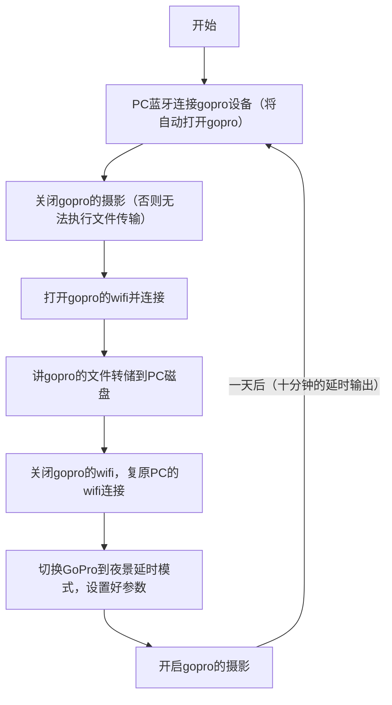

# 编程 | GoPro 01: 全天候自动 4K 延时摄影

## 背景

北京难得下雨，因此，一旦下雨就会想起什么。

可是，人的记忆力总是有限的，也是虚无的。

人毕竟是肉体凡胎，人与人之间需要有实体的互动。

而最有效的实体，便是从古代的文字，到近代的照片，再到现在的短视频。

这是时代的进步，但我想，或许还可以更进一步，例如随着 CPU、硬盘等信息技术的升级，未来建立全息个人档案的可行性将会逐渐增大，以至于，人类或许能够拥有完整追溯一个人过往以及重生一个人的能力。

但这项技术落入大众消费的范畴还远不可敢想，然，并非绝无希望的可能。

最近，恰好因了疫情的肆虐，我偶然间探索出了一种以视频完整记录人生的解决方案。

那就是：全天候自动 4K 延时摄影！

## 概述

首先我们要明确我们的目标，我们想完整录制自己的人生，如果可行，需要什么条件。

首先，我想，分辨率不能太低，不然没眼看，因此至少也得是 1080p，最好是 4K，因为 4K 基本能看清我们任意想看的细节。

我们就以 4K 为例，探讨一下硬件要求。

以 GoPro 摄像机为例，4K30 帧录制 10 分钟的文件大小大约在 4.5G，于是一小时便是 27G，一天便是 648G，一年便是 231T。


231T 是什么概念。。。

显然不可行。

有段时间，我下决心解决我睡眠质量不好的问题，我想到了一个方案，把自己每天的睡眠录制下来，那个时刻，我第一反应便是延时！

没错，延时摄影非常适合长时间观察某个对象的场景：睡眠监控、人生监控，都非常适合。

说干就干，我监控了自己一周的睡眠：


不过一开始由于没有啥经验，因此每天复盘自己的拍摄成果，至少解决了以下几个问题：

1. gopro 的电池容量并不大，4k 视频录制一小时就要关机了，因此需要配一根充电线保持实时输电状态录制。
2. 一开始选用的是夜景延时的默认自动时长选项，这导致了拍摄出来的延时短片没光时帧少，有光时帧多，这是有好处的，对后期非常方便。但其实不太适合我们的需求，因为我们只需要平凡的记录，不需要做啥后期，忽快忽慢的拍摄不利于自己对时间的把握，尤其是有光的时候，gopro 拍的太快了，导致文件体积增大，也可能不太符合预期。后来摸索得出，把每帧时长控制在 5 秒，既可以控制 10 分钟内拍完一整晚，输出的文件不用分片。5 秒的帧间隔有啥意义呢，按照 30p 来算的话，一秒本来需要 30 帧，而现在 30 帧对应了真实世界的 150 秒，所以等于把实际世界压缩了一百多倍。回想我们之前说的 231T，如果除以 150，我们得到了 2，也就是一年的延时录制只需要 2T 的硬盘就可以了，我们买一张 16T 的机械硬盘，将允许我们录制 5 年以上！因此，硬盘方面的问题解决了。
3. 尽管我们使用了固定的帧间隔，我们很多时候还是想知道拍摄的任意一帧是处于什么时间，我查阅了一些资料，有个比较复杂的 python 脚本可以允许对 gopro 的视频添加时间层信息，但我觉得没有必要。我想到了一个有意思的办法，那就是买了个挂钟，能同时显示日期和时间的挂钟（不需要很贵），这样就很直观了： [康巴丝（Compas）挂钟时尚卧室客厅办公时钟日历挂表简约创意石英钟表 2941Y 日历黑白色直径 30cm【图片 价格 品牌 报价】-京东](https://item.jd.com/63986225561.html)
4. gopro 的无线方案其实远比想象地要复杂，官网介绍的是通过手机 gopro quik 软件连接 gopro，并支持预览和操控 gopro，而 pc 端的话要用 usb 连接读卡器，从而完成文件管理。这个步骤其实很繁琐，我想尝试无线的方案。后来我找到了 gopro 的开源代码库：`open-gopro`、`goprocam`，前者是 gopro 官方代码库，后者是某个人开发的 wifi api。前者功能比较全面与底层，后者 sdk 做的比较友好方便，但支持 wifi。从理论上说，我们使用`goprocam`的 wifi api 可以在电脑已经连接到 gopro 后，直接使用程序完成自动下载、清理存储的目标，但仍不够自动化，于是我又花了整整一天的时间研究明白了不需要手机 app 直接全程在电脑端控制 gopro 的原理与实现路径。
5. 全自动化。由于我们最终设计出了完全可以自动的程序，所以又花了一下午研究清楚了基于`crontab`的定时工具，完成了全流程自动化，一切，是那样完美地运行着。

接下来，将详细展开该解决方案中的一些问题。

## 基于 GoPro 的全天候自动 4K 延时摄影系统设计

### 设备依赖

1. 一台 gopro 9+设备（否则不支持`open-gopro`），可持续充电，固定房间某个角落
2. 一台电脑，安装了`python 3.8+`，定时运行转储程序
3. 一个 2T 以上空间的机械硬盘，定时转储视频
4. 不需要网络，在转储时，gopro 会自动开启一个本地局域网（但为了不影响实际 wifi 工作，我们的程序还是做了无线网络切换模块）

### 全自动化流程



## PC 端直接控制 gopro 拍摄、下载、清空的实现方案

首先，我们要知道 gopro 的无线通信框架，参见：[Open GoPro : Open GoPro](https://gopro.github.io/OpenGoPro/)可以知道 gopro 只可以被蓝牙唤醒，然后被蓝牙、wifi 或者 usb 控制，文件管理功能只允许 wifi 或者 usb。


因此要先启动蓝牙连接，成功后再开启 wifi 进行文件传输。

核心代码如下：

```py
import asyncio
import logging
import os
import json
import time
from binascii import hexlify
from datetime import datetime
from typing import List

import requests
from bleak import BleakScanner, BleakClient

from base.const import COMMAND_REQ_UUID, GOPRO_WIFI_BASE_URL, GOPRO_WIFI_GP_COMMAND, GOPRO_MEDIA_DIR
from base.config import CONFIG_WIFI_GOPRO, CONFIG_WIFI_HOME, CURRENT_DATA_PATH
from base.log import logger
from base.utils import get_media_online_path
from base.wifi import connect_wifi, is_wifi_connected

# suppress unnecessary mac ble error
logging.getLogger("bleak.backends.corebluetooth.scanner").setLevel(logging.CRITICAL)


class MyGoPro:

    def __init__(self):
        self._client = None
        self._event = asyncio.Event()
        self._current_data_path = CURRENT_DATA_PATH

    async def connect_ble(self):

        def notification_handler(handle: int, data: bytes) -> None:
            logger.info(f'<--- Response: {handle=}: {hexlify(data, ":")!r}')
            # Notify the writer
            self._event.set()

        logger.info(f"\n==== datetime: {datetime.now()}")
        logger.warning("电脑第一次与gopro配对时，需要保持gopro处于设置面板选中quik应用连接界面，直到收到所有返回消息方可确认配对成功")
        logger.warning("程序运行之时，请确保没有其他进程正在执行，手机quik不要处于预览状态，否则将导致连接不上！")
        try:
            gopro_device = None
            count = 0
            # 1. 扫描蓝牙设备。正常情况下，要扫描1-2遍。
            while not gopro_device:
                logger.info(f"---- Scanning for bluetooth devices... [#{count}]")
                # 需要蓝牙权限，例如pycharm、terminal、iterm之类的应用
                for device in await BleakScanner.discover(timeout=5):
                    logger.info(f"detected ble device: {device.name}")
                    if device.name.startswith("GoPro"):
                        gopro_device = device
                count += 1
            logger.info(f"found gopro：{gopro_device.name}")

            # 2. 连接蓝牙设备。配对自动进行，mac平台跳过（待确认）。
            logger.info(f"----- Establishing BLE connection to {gopro_device.name}...")
            client = BleakClient(gopro_device)
            await client.connect(timeout=30)  # 太短的话会导致连接失败
            logger.info("BLE Connected!")

            # 3. 获取通知。
            logger.info("---- Enabling notifications...")
            for service in client.services:
                for char in service.characteristics:
                    if "notify" in char.properties:
                        logger.info(f"Enabling notification on char {char.uuid}")
                        await client.start_notify(char, notification_handler)
            logger.info("Done enabling notifications")

            self._client = client
        except Exception as e:
            logger.error(f"Connection establishment failed: {e}")
            raise e

    async def _send_command(self, data: List[int], desc: str = None):
        if not self._client:
            await self.connect_ble()
        if desc is None:
            desc = f"Sending command of: {data}"
        desc = "---> Requesting: " + desc
        logger.info(desc)

        self._event.clear()
        await self._client.write_gatt_char(COMMAND_REQ_UUID, bytearray(data), True)
        await self._event.wait()  # Wait to receive the notification response
        time.sleep(2)  # 比如开启wifi之间就需要时间间隔

    async def send_command_load_timelapse_preset(self):
        # ref: https://gopro.github.io/OpenGoPro/ble_2_0#commands-quick-reference
        await self._send_command([0x04, 0x3E, 0x02, 0x03, 0xEA], "Loading timelapse preset")

    async def send_command_enable_shutter(self, on: bool):
        await self._send_command([3, 1, 1, on], "Control shutter: " + ("ON" if on else "OFF"))

    async def send_command_enable_wifi(self, on: bool):
        """
        wifi名称和密码的程序化获取方式，参见`tutorial_5_connect_wifi/wifi_enable.py`
        :param on:
        :return:
        """
        await self._send_command([0x03, 0x17, 0x01, on], "Control wifi: " + ("ON" if on else "OFF"))

    def _check_wifi(func):
        """
        对需要使用wifi的函数装饰检查与修复
        :return:
        """

        def wrapper(self, *args, **kwargs):
            if not is_wifi_connected():
                self.send_command_enable_wifi(True)
            return func(self, *args, **kwargs)

        return wrapper

    @_check_wifi
    def list_all_media(self):
        url = GOPRO_WIFI_BASE_URL + "/gopro/media/list"
        result = requests.get(url).json()
        logger.debug(result)
        date_ = datetime.today().isoformat()
        with open(f"media_list_{date_}.json", "w") as f:
            json.dump(result, f, indent=2)
        return result

    @_check_wifi
    def download_single_media(self, fn: str):
        logger.info(f"downloading file: {fn}")
        result = requests.get(get_media_online_path(fn)).content
        fp = os.path.join(self._current_data_path, fn)
        with open(fp, "wb") as f:
            logger.info(f"saving into: {fp}")
            f.write(result)
            logger.info("√")

    def _delete_media(self, option):
        url = GOPRO_WIFI_GP_COMMAND + "/storage/delete" + option
        res = requests.get(url).json()
        logger.info(res if res else '√')

    @_check_wifi
    def delete_single_media(self, media_name: str):
        """
        删除单个文件时，网址结尾的"delete"不能带"/"
        :param media_name:
        :return:
        """
        logger.warning(f"deleting media: {media_name}")
        self._delete_media(option=f"?p={GOPRO_MEDIA_DIR}/{media_name}")

    @_check_wifi
    def delete_all_media(self):
        logger.warning("deleting all the media")
        self._delete_media("/all")


async def task_daily_download_all_the_videos():
    my_gopro = MyGoPro()

    # connect_ble part
    await my_gopro.connect_ble()

    # wifi part
    await my_gopro.send_command_enable_shutter(False)  # wifi打开之间需要停止拍摄
    await my_gopro.send_command_enable_wifi(True)
    connect_wifi(*CONFIG_WIFI_GOPRO)
    logger.info("---- downloading all the media")
    for dir in my_gopro.list_all_media()["media"]:
        logger.info(f"traverse media in dir: {dir['d']}")
        for file in dir["fs"]:
            fn = file["n"]
            my_gopro.download_single_media(fn)
            my_gopro.delete_single_media(fn)
    # TODO：将gopro无线桥接到路由器，从而化简该步
    # 最终要保证wifi回来
    connect_wifi(*CONFIG_WIFI_HOME)
    await my_gopro.send_command_enable_wifi(False)

    # continue part
    await my_gopro.send_command_load_timelapse_preset()
    await my_gopro.send_command_enable_shutter(True)


if __name__ == '__main__':
    # 若以下任务是类的一个方法，则需要使用loop，如果是一个全局函数，则可以直接用run，参考：https://cloud.tencent.com/developer/article/1598240
    asyncio.run(task_daily_download_all_the_videos())

```

该代码主要参考`open-gopro`仓库里的`samples`，做了不少的修改与自己的封装，核心难点是`asyncio.Event`的使用。

除去技术上的难点，在产品上也有不少的坑。首先官网和绝大多数文章都只告诉你怎么用手机连 gopro，而鲜有用电脑无线练的。

我也是抱着尝试的心态，在 gopro hero 9 中打开“连接设备-quik 应用”后，直接在电脑端启动脚本成功连上的，这说明，手机 gopro quik 软件的连接原理和`open-gopro`仓库是等同的。

另外，蓝牙连接要使用到`bleak`底层库，也有一些可以忽略的`Error`信息，这些都需要花时间去鉴别，幸而没有大问题。

紧接着，由于蓝牙属于系统的敏感权限，因此脚本启动时，需要确保有蓝牙权限，一般情况下会弹窗，否则得自己加（比如`terminal.app`、`iTerms.app`、`/usr/sbin/cron`等），这一步将直接劝退对操作系统不怎么熟的程序员，因为你几乎找不到任何相关的资料。


## 基于`crontab`自动化的定时程序

### 自动化的必要性

尽管程序我们写好了，已经可以运行，自动控制 gopro 的开启、录制、转储等功能，但是得每天都运行一遍，否则 gopro 的存储卡（我放的是一张 128G 的存储卡）将很快被撑爆（尤其是录制视频而非延时的话）。

而每天手动执行是很烦的，并且由于执行过程中需要连接到 gopro 的无线网络，因此本地就没法联网了。所以最适合的办法是让电脑自动夜间执行，达到无感的目的。

我想了想，最佳的时间点是凌晨五点，此时大多数情况下环境已有微光，能看清，而自己一般都在熟睡，不会有太大的动作；而 gopro 自动操作的哔哔哔声，也一定程序上有益于自己的早起。

### 自动化的充分性

我们要回到项目的起点上，我们做这个工程的意义是什么？

是为了如实地记录自己的人生，而非是一场作秀，对不？

那就尽量做到无感，甚至忘记这个项目！

当一切做到自动化之后，很多时间里自己都不知道自己是处于被记录的状态，这才是我们最想要的。

因此，我们需要自动化

### 自动化方案选择

在 mac 平台上，至少有两种，一种是基于`crontab`，这也是 linux 通用的解决方案。

还有一种是使用`launchtl`和`plist`的方案。

考虑到兼容性，以及自己在 linux 平台上的经验，我选择使用`crontab`。

### `crontab`自动化的核心难点

理论上当我们的程序已经写完之后，将程序喂给`crontab`然后自动化运行，是再自然不过的事情了。

然而，我们的项目却有点不一样。

首先就是我们刚刚说的蓝牙权限的问题。由于`crontab`是一个后台程序，因此不会弹窗提醒你要不要允许系统权限，而是直接报错。

所以我们首先要跟踪`crontab`的输出，这是写自动化脚本的基本素养。

其次在定位到问题之后，要把我们的蓝牙权限交给`cron`。

另外还有一个问题，在我们的程序中，我们调用了 mac 的系统调用去控制 wifi，其中在 mac 平台上连接名称为 A 密码为 B 的 wifi 的命令如下：

```py
networksetup -setairportnetwork en0 A B
```

但这里有两个问题，首先是如果我们的名称里有引号，则会被 unix 系统识别错误，我们需要这么写：

```py
networksetup -setairportnetwork en0 "A's wifi" B
```

`open-gopro`项目里这部分代码就写的很粗糙，他们直接用单引号去包括 wifi 的名称和密码，这在 wifi 名称或密码里包含单引号时将导致错误。


其次还有个问题：

```sh
➜  ~ which cron
/usr/sbin/cron
➜  ~ which networksetup
/usr/sbin/networksetup
```

虽然`cron`和`networksetup`都处于`/usr/sbin/`目录下，但当`cron`运行时，系统路径里却只有少的可怜的`PATH`：


因此在`cron`程序中，无法直接调用`networksetup`：


最简单的做法，是在我们的程序中显式指定`networksetup`的路径：

```sh
/usr/sbin/networksetup en0 A B
```

这样，将原程序配置到`crontab`实现自动化的所有问题都解决了：


## 说在最后的话

绝大多数人的生命都是平淡如水的，因为我们不是 Harry Porter，不是那个"The Chosen One"，甚至连被 Voldemort 选中的资格都没有。

  


我们有的只是当下：


最后借一部短片 [“cheems，你要去码头整点薯条吗？”\_哔哩哔哩\_bilibili](https://www.bilibili.com/video/BV1Rv4y1w7hA?p=1&share_medium=iphone&share_plat=ios&share_session_id=FC6EA2F7-5433-42F2-B9E1-1ED0F5A232A1&share_source=WEIXIN&share_tag=s_i&timestamp=1654581591&unique_k=0kUaMFS&vd_source=9cb028fe6c978c6816626901d9249eb1) 结束本文：


【音乐：The Time To Run(Finale)】
