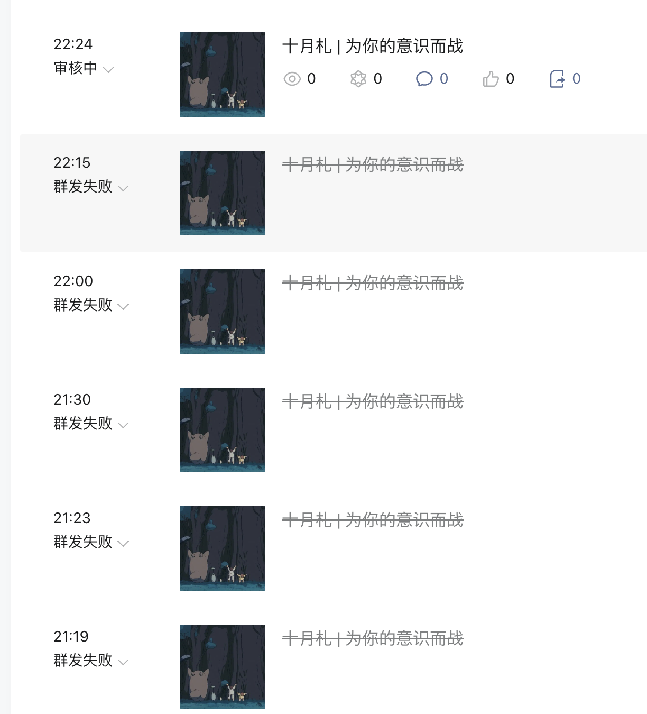
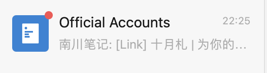
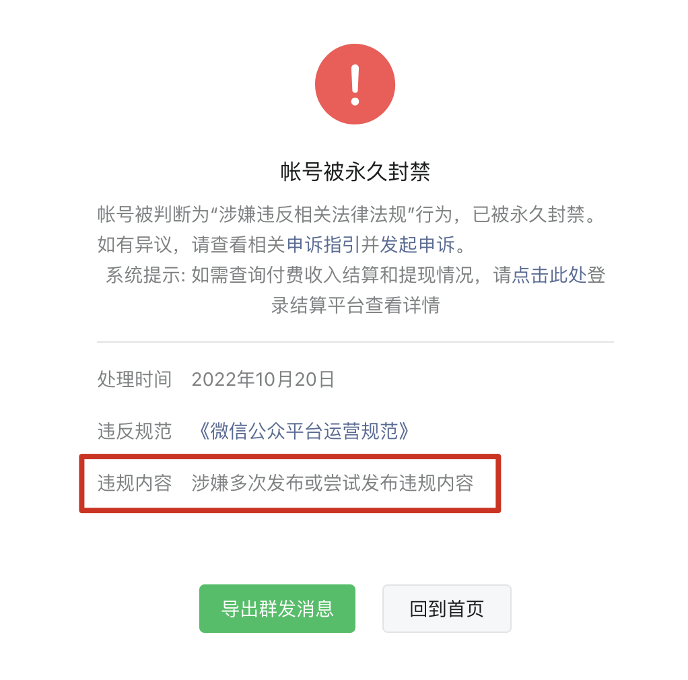
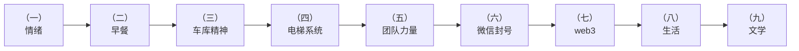
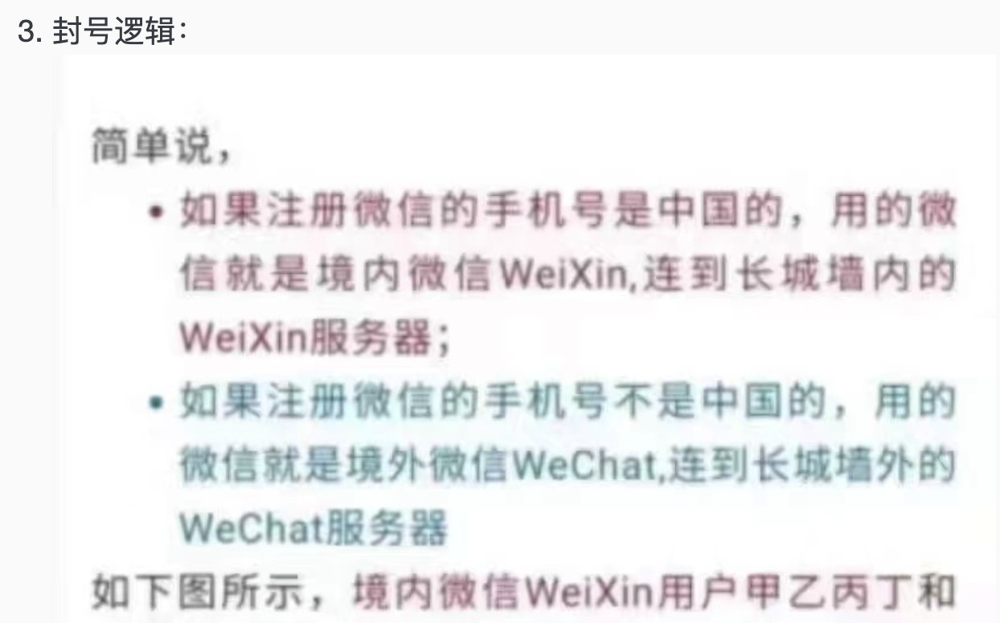

# 关于微信公众号「南川笔记」被永久封禁申诉书

## 1. 本次申诉背景

2022年10月19日晚21时19分起我尝试发布当日新构思的一篇文章《十月札 | 为你的意识而战》，其中的内容主要是围绕马云和马斯克的一场公开交流而展开的对今年来个人工作、生活、创业和时事热点的一些反思，但没想到因为违反相关法律法规而发布失败。

但我确实不知道具体哪些内容违反了法律法规，比如可能是某些关键词（哪些我也不是很清楚），或是某些意识形态，或是某些不实言论？于是进行了反复修改，前后多达六次，这也是史无前例的。

  

最后一次修改，是删去了微信封号的文字逻辑，最终得以发送通过。

  

但次日便收到了多次违规发布而导致封号的处理，而且是永久封号，我对此十分不能理解。

  

故陈述此文，希望能得到一个更为合理的答案。

## 2. 本次封禁反思

先说说此文的发布背景。

2022年来受疫情相关影响，很多公司经营恶化，民众焦虑程度上升，在这期间每个人都不断积压着一些自己的情绪与想法，而本文便是在这样的一个背景下，对自己的个人生活与工作进行反思与展望的一次尝试。

于是，我的开篇就是：

```markdown
# 十月札 | 在不确定的时代维护内心的秩序

1. 大家都说成年人要学会管理情绪，此话自然不假……
```

后来随着思绪展开，便从情绪逐渐展开到其他话题，行文话题主要如下：



其中主要比较敏感的话题是第六点：微信封号。在一开始的版本里我提及了一个网络上流传的关于微信对不同手机号归属地不封号的逻辑：

  

不过后来发现不能审核通过，我心想就可能是这些相关的内容不能散步，一来可能是不实信息，二来也可能比较敏感，所以后续就把它删了。

紧接着还是不能发布，于是我又仔细盘查了文章其他部分的内容，发现还有封号逻辑相关的文字揣测，于是又把那些给删了。

来来去去，修改了一个多小时，竟然改了好多遍，最终才得以通过。

事后也意识到我们作为公众号的主体，应该对自己的言论有所约束有所敬畏，确实不该对平台本身做过多揣测，也不符合自己公众号的定位，所以借此机会好好反思一下自己，从新来过。

## 3. 承诺书

**尊敬的微信管理部门：**

2022年10月19日21时19分至22时25分，南川笔记公众号曾多次尝试发布一份含有敏感信息的文章，不符合公众号主体定位，也不符合相应法律法规规范，考虑到该公众号长期以来一致致力于输出优质的知识服务给群众，希望平台能从轻处理，本公众号一定以此为鉴，杜绝此类事情再次发生，并做出承诺如下：

1. 在以后的工作中，不断提高政治素养，坚决拥护中国共产党的领导，坚决杜绝“色情、非法广告、敏感话题”等在文章中出现
2. 在以后的发文中，认真学习与遵守微信公众号平台的管理规范，服从微信公众号平台的管理，听从微信公众号平台的安排
3. 在以后的生活中，不忘初心，牢记使命，摆正定位，努力为目标群体长期创造更优质的价值，一起为公众号平台营造更良好的环境

承诺人：邢健，17766091857
