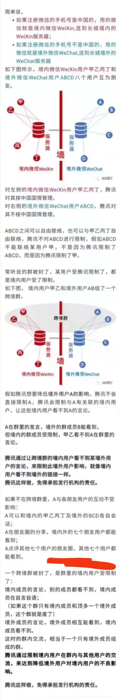

# 十月札 | 在不确定的时代如何维护好内心的秩序

## 1. 情绪

大家都说成年人要学会管理情绪，此话自然不假，但多半特指不让自己的情绪失控，也就是所谓“泰山崩于前而色不变”。但私以为，这还只是初等的入世造诣，我认为我们应该追求的目标不是管理，而是驾驭，也就是能够为达到自己的某些目标而相应的调整自己的情绪。这听起来像是戏精的必修课，似乎是种邪门歪道，不过我侧重的是理解自己的情绪，允许适当的放松，明白什么情绪下该做什么事，以及如果不适合如何调整的一套体系，与见人说人话、见鬼说鬼话那套还是要适当划清界限，可以作为中等的入世造诣。那有没有高等的入世造诣？从理论上来说，肯定也是有的，从文学上说则比较简单了：大道至简、无欲则刚，情绪相关的高等入世造诣，我想，大抵就是：永远做自己吧。因为知其不可而为之，那一定是真的勇士。致敬近日的勇士，中华大地竟有一人是男儿。

## 2. 早餐

自工作以来，每天的早餐吃什么，是一个令人头疼的问题。也有和一些健康饮食的博主聊过，大致也知道比较好的、方便的早餐形式是啥样，可惜一个人总没有那样的动力与习惯，所以至今甚至没有耐心地亲手做过一次早饭。还好通勤沿路幸而有一两家早点店，不过也无非就是些包子、灌饼、手抓饼和蛋之类的。杭州有家一男二女三年轻人开的早点店，主卖煎包和煎饺，五元四个，倒是很可口，只可惜店铺正在转租了，我询问为啥呀，这不生意挺好嘛，他苦笑，说有新的事情要做。杭州公司对面是一个老阿姨的小摊，有糯米鸡，是大学时前女友和我都最喜欢吃的，遂点了几次，确是还有点味道。北京公司附近有一家天天路过，但直到最近才意识到有早点卖，头两次去她们家时还颇有点生疏，连递个啥东西还隔着张桌那种，后来买多了，已经会主动问「今天吃点啥」之类的了，而我一般就说「你有啥推荐的吗」。我从大学时就开始关注创业领域，向来对开个馆子（除非是咖啡馆）之类的生意不感兴趣，所以每次与这样的小馆子产生命运的羁绊时，都会不可避免地感叹一句：「我要是能和他们一样只满足于开个小馆子，在某个几十平米甚至几平米的空间内一干就是好多年，多好啊，可惜我做不到」。

## 3. 车库精神

开小馆子肯定不是我的style，但埋头苦干的车库精神我倒是欣然往之。近年来，确实可以自豪地说是在不断拓宽与拓深自己的技术栈，源码阅读、BUG调试、工程设计能力得到显著的提升，这点是让自己感到很满意的。尤其是去年单枪匹马签订对赌协议挑战系统开发、年中三天内搭好了烂尾楼开源项目的数据分析框架，以及给facebook等公司开源的博客、图形渲染、微信机器人等开源项目贡献PR等，我已然进入了全面 Social Coding 的阶段，再也不是大学时那种止步于和非程序员炫技的阶段了。同时也已经同步启动了打磨一些自主开发的程序员工具，例如基于http的飞书文档sdk、豆瓣租房爬虫与油猴脚本、电商比价平台等等，都是把支持对外使用作为目标之一的，尽管暂时还没把商业化列为目标之一。我始终相信，一个人总是倾向于高估自己一年能做的事，而低估十年能做的事，我承认自己不属于坐电梯的那档人，但我正在努力打造一个自己的电梯（就像马斯克想打造的纠正反馈循环），这一切的一切，都得感谢当今的互联网技术，让个人的力量可以变得无比强大。

## 4. 共同成长

但诚如一句流行的话所说：一个人可以走的很快，但一群人可以走的更远。今年比较幸运的是新认识了一群有理想、有能力、有魄力的计算机与创业相关的朋友/年轻人，比如清华本科直接辍学创业的ccy同学，第一次和他线下交流就被他极其敏捷的思维与表达能力、极其开放的视野与格局所触动；北邮毕业在字节工作的jack、若哥[^jack-ruo]等，他们对各个领域有着自己独特的见解，在计算机技术的涉猎广度与研究深度上给我留下了深刻的印象；全球知名的反动分子领袖立党老师永远戏谑国内外政治经济与技术、时不时拉个discord和大家一起讨论热点、理性与感性并存的风格一定程度上冲击了我旧有的盲目崇拜的世界观……三年前我就问过leader一个问题，关于每天一般都干嘛的，她回答就是看书-->交流-->工作，然后循环。在这个循环里，中间那环“交流”当时启发了我许多，后来我虽然不做投融资方向了，但即使是在纯技术领域，交流的过程中也会偶然就能打开新的思路，甚至一切是在自言自语的过程中理出来的，背后的原理当然也是清晰的，那就是费曼学习法。总之，这也是我今年一直运营着一个小小的微信社群直到现在的原因所在，通过一定的社交可以快速帮我们迭代。

## 5. 微信封号

说到微信群，这就不得不谈今年各种封号、炸群的故事了。这部分，没有经历过的人可能真地一无所知，但亲历了四次封号（无法查看群聊新消息、无法交互朋友圈）与两次封群（群消息能发但是除了自己其他人[^invisible-users]都看不见，从而形成群还活着但没人愿意继续聊天的错觉）的我来说，实在太能理解被封号的感受了。一般而言，目前被封号的逻辑就是因为在群里或者朋友圈聊了一些敏感的话题，导致被短暂封号（1天或2天或7天或半个月不等），而根据一些传言、测试与经验判断，目前微信私聊是不被监控的，但群聊和朋友圈每一句话、每一张图都是被监控的，所以请我的朋友们谨言慎行，因为不但有被封号（社交性死亡）的风险，还有被请喝茶的风险（尽管作为男人，不进几次🍊实在说不过去）。这里有张图[^seal-wechat-logic]解释了封号逻辑，个人认为说的比较清晰。另外，随着最近大规模永久封号（永久限制所有社交场景使用功能，只保留财产体现）现象的发生，一些大谈特谈社交死亡的文章已经出现，不得不说这便是中心化绑定的弊端，也许进一步利好web3；而技术方面，几年前教大家如何备份联系人的一些文章也陆续被挖了出来，我个人倒是对这些传统手段不是甚感兴趣，而对自己以程序手段解决更暗兴趣，这也是我接下来比较想做的一件事：基于`wechaty, dtrace`等技术做一个统一化的跨平台实时聊天与备份系统，并兼容tg、twitter等，目前已经有部分子项目再work进程中。如果硬要说为啥要做这么个玩意，大概就是「如果一件事情你无法改变，那就接受它」--> 「如果一件事情你无法改变，那就改变你自己」。（此消彼长的朴素道理，既然消不了敌人，那就成长自己）
6. 

[^jack-ruo]: 
    - 我和若哥都深爱typescript这门新兴的强类型语言，同时活跃在wechaty开源社区，分别拥有自己的博客
    - jack的telegram channel和若哥基于matrix+bridge的自建聊天服务器，也成为了接下来最吸引我的一些潜在研究项目

[^invisible-users]: 准确的说是大陆手机号注册用户

[^seal-wechat-logic]: 封号逻辑：
      
