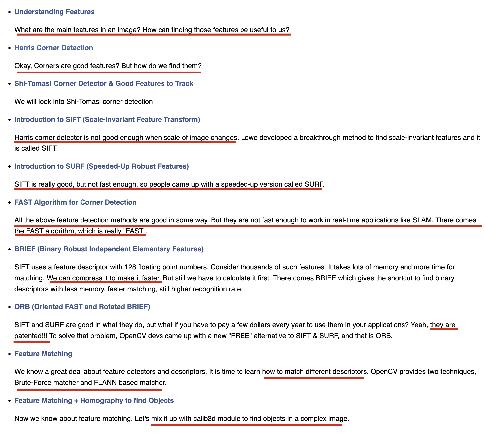
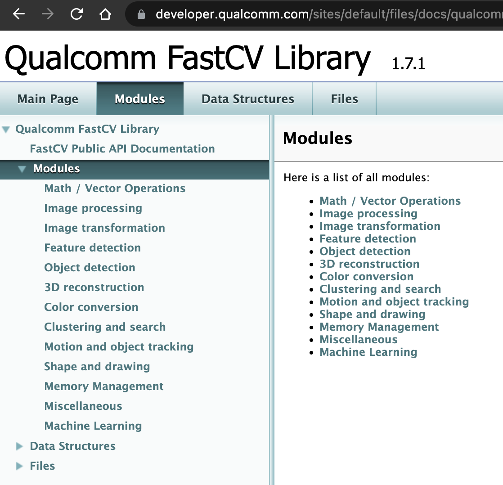

import NeteaseMusicIFrame from "../../src/components/neteaseMusic";

# 上半年回顾 —— 拥抱开源的新征程

> Kill the boy, and let the man be born.

<NeteaseMusicIFrame id="527566"/>

今年以来，随着工作，伴着疫情，我的生活与思想发生着极大的变化，这种变化体现在方方面面，很难一一而足，因此我想重点阐述其中的几点，以分享给我的朋友们。

首先是对大厂和小厂（尤指创业公司）之间的认识有了进一步、具体的深化。

在未步入工作之前，对于象牙塔里的同学们来说，大厂可能更多是一种身份与能力的象征，以及所谓的平台属性。但目前接触下来，有些是对的，有些则要打个问号。或者大部分是对的，一部分则要打个问号。

从统计的角度来说，大厂的整体水平肯定要优于市场上小厂的整体水平，否则所有小厂都该成为大厂了。但大厂的平均水平，应该要弱于小厂的精英水平，例如米哈游之类。从这个角度出发，如果你恰好属于有想法的精英，并同时聚集了一群同样有想法的精英，那么再造一个“米哈游”或是“十八罗汉”之类的，去实现美国的“车库梦”而非大陆的“中国梦”，将是最具有吸引力的。

当然，大厂里精英的精英，依旧拥有很高的含金量，这些主要体现在一些很有实操能力的博士身上。从理论角度来说，一个人只要耐心地修完各个学科的基础通识课程，并在一个较好的环境中熏陶，他确实能达到一个融会贯通的高度，从而能做到随心所欲不逾矩。稚晖君显然是在这个时代背景下，提供了一个很成功的样本，以天才少年的身份加入华为，在华为的平台上疯狂输出，实现双赢。

把目光拉回大厂与小厂的中间地带：所谓的中厂上，则还有一番可品味的天地。

不得不抱着一丝沉重的心情向大家介绍身边发生的一个案例，我们VR行业一家500人规模的头部企业今年彻底破产了，在那之前他们有着独立的办公楼、非常好的办公室、一群很活跃的员工。但真地没想到，企业的存亡，只在一线之间。让我不禁后背发凉。

尽管，这在刀光剑影的商业社会，是再稀疏平常不过的一件事，BATJ这两年也在疯狂裁员，类似的消息已屡见不见，我们要追问的是 why and how。

- why would this happen?
- why would this happen so?
- how would those companies do then?
- how would those employees do then?
- how should we do then?
- ...

有些问题，我们有些答案；有些问题，我们也没有答案。我们唯一能确信的一点就是：如果不够强，那一定会死。至少在公司运营的角度，丛林法则体现的淋漓尽致。

我不敢把话说满，比如说是字节收购了pico、meta收购了quest把它们逼死的。用大家喜闻乐见的话说，就是资本把它们逼死的。

诚然，资本肯定脱不开关系，有了资本，员工才有工资、才有动力，公司也只有资本，才能招募到更多更优秀的人，打造出更好的产品。

我举我自己切实感受到的一些体会。例如，我平时要负责实现从一张图像中识别一个物体，这个技术就叫目标检测技术，以及衍生的一些其他内容。

那对于没有系统学习过该领域的人，他可能就会去想有没有什么api去实现，或者什么开源的框架（比如yolo之类）。假如他能力尚可的话，也许他可能运气好能找到一些能运行的代码，但实际上，如果他恰好学习过该领域的系统知识就会知道，要想从一张图片中识别出一个物体，有哪些理论方法，并且都有哪些优缺点。

比如这就是opencv官网对于图像特征识别的参考文档，就详细地罗列着各种方法和评判，这些都是很多数学家、计算机图形学专家数十年来的一些经验成果，然后被opencv的开发者罗列于此：

  

如果公司里就恰好有这样的这些大牛，很难不做出一些领先其他公司的产品（至少从概率上）。

这也是我对目前国内的vr/ar行业，感到无比紧张的原因之一，因为meta里负责vr/ar相关的员工已经达到1w+了据说。这些人里可是有大量的专家与高级工程师，这些硬条件让人望而生畏。例如高通就根据`opencv`框架，抽离出了一个性能更高的、基于高通芯片本身的`fastcv`框架，进一步让国内从业者感到遥不可及：

  

这些是我能感受到的国内外大、中、小厂之间的一些细小的差别，一旦我们认清了这些差距，我们很难不感到一种压力与焦虑，更不用说疫情了。

说到疫情，我也想展开几点。

【以下打算各种diss国内政策、、、】