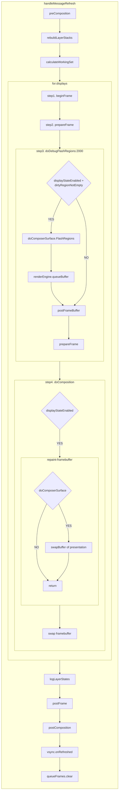

# arpara distortion logic

```mermaid
flowchart TD


subgraph doComposition[step4. doComposition]
    direction TB

    subgraph doDisplayComposition[repaint-framebuffer]
        direction TB

        r[return]
        doComposerSurface{doComposerSurface} --> |NO| r
        doComposerSurface --> |YES| swapBuffer[swapBuffer of presentation] --> r
    end

    displayStateEnabled{displayStateEnabled}
    --> |YES| doDisplayComposition
    --> clearAndFlip[swap framebuffer]
end


subgraph doDebugFlashRegions[step3. doDebugFlashRegions:2000]
    direction TB

    needDoComposerSurface{displayStateEnabled +<br> dirtyRegionNotEmpty}
    --> |YES| doComposerSurface.FlashRegions
    --> renderEngine.queueBuffer
    --> postFrameBuffer

    needDoComposerSurface --> |NO| postFrameBuffer
    --> prepareFrame
end

subgraph for:displays
    direction TB

    beginFrame[step1. beginFrame]
    --> prepareFrame.Refresh[step2. prepareFrame]
    --> doDebugFlashRegions
    --> doComposition
end

subgraph handleMessageRefresh
    direction TB

    preComposition
    --> rebuildLayerStacks
    --> calculateWorkingSet
    --> for:displays
    --> logLayerStates
    --> postFrame
    --> postComposition
    --> vsync.onRefreshed
    --> queueFrames.clear

end

```
