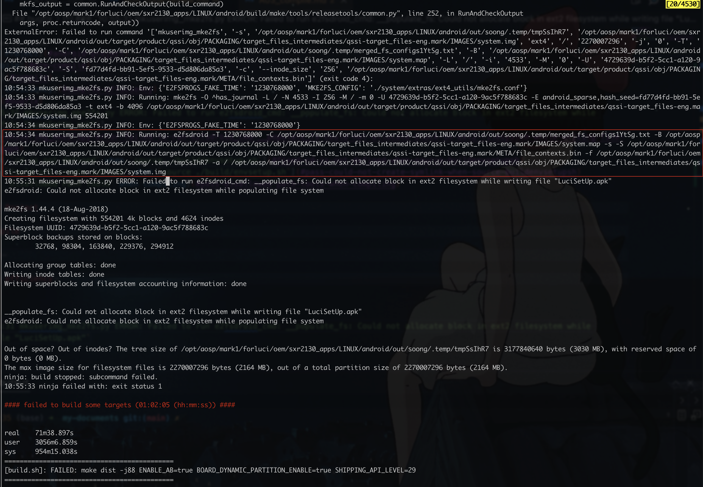

## 编译经验总结

- 多次编译过程中，不要更换源代码目录，否则会引发`FAILED: out/target/product/xxxx/abl.elf`，如果确已更换，可参考本文相应章节进行修复而不需要全部重新编译

## pre-compile

### install dependencies (necessary)

> ref: [搭建构建环境  |  Android 开源项目  |  Android Open Source Project](https://source.android.com/docs/setup/build/initializing#installing-required-packages-ubuntu-1804)

:::caution
必须要按照趣立的依赖进行安装，按照谷歌的会报错，因为趣立的依赖里包含谷歌未给出的，例如`openssl`
:::

```sh
# [X] -- AOSP dependencies given officially by google for Ubuntu 18
sudo apt-get install git-core gnupg flex bison build-essential zip curl zlib1g-dev gcc-multilib g++-multilib libc6-dev-i386 libncurses5 lib32ncurses5-dev x11proto-core-dev libx11-dev lib32z1-dev libgl1-mesa-dev libxml2-utils xsltproc unzip fontconfig

# [Y] -- dependencies given by quli
sudo apt-get install -y libx11-dev:i386 libreadline6-dev:i386 libgl1-mesa-dev g++-multilib git flex bison gperf build-essential libncurses5-dev:i386 tofrodos python-markdown libxml2-utils xsltproc zlib1g-dev:i386 dpkg-dev libsdl1.2-dev git-core gnupg flex bison gperf build-essential zip curl zlib1g-dev gcc-multilib g++-multilib libc6-dev-i386 lib32ncurses5-dev x11proto-core-dev libx11-dev libgl1-mesa-dev libxml2-utils xsltproc unzip m4 lib32z-dev ccache libssl-dev libxml-simple-perl bc rsync


# -- using aptitude for ubuntu 20
sudo apt install aptitude

sudo aptitude install -y libx11-dev:i386 libreadline6-dev:i386 libgl1-mesa-dev g++-multilib git flex bison gperf build-essential libncurses5-dev:i386 tofrodos python-markdown libxml2-utils xsltproc zlib1g-dev:i386 dpkg-dev libsdl1.2-dev git-core gnupg flex bison gperf build-essential zip curl zlib1g-dev gcc-multilib g++-multilib libc6-dev-i386 lib32ncurses5-dev x11proto-core-dev libx11-dev libgl1-mesa-dev libxml2-utils xsltproc unzip m4 lib32z-dev ccache libssl-dev libxml-simple-perl bc rsync
# bugfix for libtinfo.so not found: https://stackoverflow.com/questions/48674104/clang-error-while-loading-shared-libraries-libtinfo-so-5-cannot-open-shared-o
sudo apt install libncurses5

# ensure python2, for later merge_images.py use
# ➜  android ls prebuilts/python/linux-x86/      
# 2.7.5
sudo ln -fs /usr/bin/python2 /usr/bin/python
```

### increase swap area (necessary in low memory machine)

see: [external: increase-swap-area-recommended](../general//02-aosp-compile/index.md#3-increase-swap-area-recommended)

I would suggest moving the source code to an SSD that is connected to
the MotherBoard of the computer via SATA interface or (NVMe M.2 if
possible) instead of using an external SSD , reason being there is lot
of linking involved while building AOSP(or any project for that
matter).

I'm assuming your external SSD is connected to your PC via USB 3.0
interface or USB-C interface , either of which would be slower than
SATA/NVMe M.2 and would require more processor time to perform
linking, that might be a reason why your CPU usage is so outrageous!
:P 

### config environment variables (recommended private usage)

```sh
AF_SOURCE="~/work@arpara/AF1020"

export AF_OEM="$AF_SOURCE/forluci/oem"
alias af-oem="cd $AF_OEM"

export AF_ROOT="$AF_OEM/sxr2130_apps/LINUX/android"
alias af-root="cd $AF_ROOT"
```

## 编译优化

### 磁盘系统与存储路径

推荐将源代码放在 SATA/NVMe 连接的主板上，而非外置ssd，因为会有大量的链接引用（需要CPU去处理，这似乎可以解释为什么我放在外置盘编译时CPU是满的，但是内存始终就耗了一半）：

as said at https://groups.google.com/g/android-building/c/fCKrBlzdGfM/m/tyh3Orp7AQAJ: 
> Software builds are typically bottlenecked by link time(disk bound)
> and not compile time(processor bound). 
> 
> I would suggest moving the source code to an SSD that is connected to
> the MotherBoard of the computer via SATA interface or (NVMe M.2 if
> possible) instead of using an external SSD , reason being there is lot
> of linking involved while building AOSP(or any project for that
> matter).
> 
> I'm assuming your external SSD is connected to your PC via USB 3.0
> interface or USB-C interface , either of which would be slower than
> SATA/NVMe M.2 and would require more processor time to perform
> linking, that might be a reason why your CPU usage is so outrageous!
> :P 

## compile
 
> - Android官方: https://source.android.com/docs/setup/build/building
> - arpara编译: https://arpara2021.feishu.cn/wiki/wikcn1lWQsHDluKB5WHwm83WlJd?appStyle=UI4&domain=www.feishu.cn&locale=en-US&tabName=space&theme=light&userId=7085189359086878748

:::caution
使用`m`编译无法通过，要基于`build.sh`
:::

### auto build script

```sh
# at path: xx/oem

cd sxr2130_apps/LINUX/android

source ./build/envsetup.sh

# cannot compile eng version for kona
choosecombo debug kona userdebug V02A

./build.sh dist -j8 | tee "build_$(date +"%m-%dT%H:%M").log"

# 回到 /oem 目录下   注:依赖/pgk,将pkg放置于系统根目录/pgk
cd ../../..
./bld_prj.sh V02A                           //编译oem   
./make_usf.sh dir                           //打包   生成usf刷机包
```

  

### how to speed up compilation

see: [external: how-to-speed-up-aosp-building](../general//02-aosp-compile/index.md#how-to-speed-up-aosp-building)

## compile efficiency

:::tip
TODO: `ln out` implementation not yet passed, however we caught one `-j1` log at: `$AF_LOGS/build_09-04T00:33.log`, with its last lines as:

```txt
[  3% 1557/47140] Export includes file: out/soong/.intermediates/system/libhidl/transport/manager/1.0/android.hidl.manager@1.0_genc++_headers/gen/android/hidl/manager/1.0/IServiceManager.h -- out/target/product/kona/obj/SHARED_LIBRARIES/vendor.qti.hardware.audiohalext@1.0.vendor_intermediates/export_includes
[  3% 1558/47140] target Generated: audio_kernel_headers_32 <= vendor/qcom/opensource/audio-kernel/include/uapi/linux/avtimer.h
FAILED: out/target/product/kona/obj/vendor/qcom/opensource/audio-kernel/include/linux/avtimer.h
/bin/bash -c "\$(cd out/target/product/kona/obj/KERNEL_OBJ; ../../../../../../../kernel/msm-4.19/scripts/headers_install.sh ../../../../../../../out/target/product/kona/obj/vendor/qcom/opensource/audio-kernel/include/linux/ ../../../../../../../vendor/qcom/opensource/audio-kernel/include/uapi/linux/ avtimer.h)"
/bin/bash: ../../../../../../../kernel/msm-4.19/scripts/headers_install.sh: No such file or directory
ninja: build stopped: subcommand failed.
07:31:19 ninja failed with: exit status 1

^[[0;31m#### failed to build some targets (15:06 (mm:ss)) ####^[[00m

============================================
[build.sh]: FAILED: make dist -j1 ENABLE_AB=true BOARD_DYNAMIC_PARTITION_ENABLE=true SHIPPING_API_LEVEL=29
============================================
```
:::

| sDate       | eDate       | minutes | env                                     | note |
| ----------- | ----------- | ------- | --------------------------------------- | ---- |
| 09-15T09:53 | 09-15T13:26 | 213     | vmware, j12, ccache-2, inplace, clion   |      |
| 09-06T08:35 | 09-06T09:20 | 45      | /aospPool/mark3, j88. ccache-2, inplace |      |
| 09-06T03:27 | 09-06T04:10 | 43      | /aospPool/mark2, j88, ccache-2, inplace |      |
| 09-06T00:29 | 09-06T03:26 | 177     | /aospPool/mark2, j88, ccache-1, inplace |      |
| 09-03T06:02 | 09-03T06:49 | 47      | af-root, j88, ccache-2, inplace         |      |
| 09-03T05:12 | 09-03T06:00 | 48      | af-root, j88, ccache-2, inplace         |      |
| 09-03T03:02 | 09-03T05:10 | 128     | af-root, j88, ccache-1, inplace         |      |
| 09-02T18:34 | 09-02T20:38 | 124     | af-root, j88, ccache-0, inplace         |      |

## ZFS porting

### disk

https://patch-diff.githubusercontent.com/raw/landley/toybox/pull/177.diff

## bugfix

### `FAILED: out/target/product/xxxx/abl.elf`

参考：
- https://blog.csdn.net/ngyzqf/article/details/82054329
- https://www.cnblogs.com/xuewangkai/p/14385813.html

这是由于我更换了源代码目录导致的（去掉了原来路径中的`@`）

解决办法：

```sh
cd bootable/bootloader/edk2
rm -rf Conf/BuildEnv.sh
unset EDK_TOOLS_PATH
./edksetup.sh BaseTools

cd BaseTools
make clean
```

### `10:55:31 mkuserimg_mke2fs.py ERROR: Failed to run e2fsdroid_cmd: __populate_fs: Could not allocate block in ext2 filesystem while writing file "LuciSetUp.apk"`

  

查看博文指出的 `BoardConfig.mk` 文件可以发现目前比 `BOARD_SYSTEMIMAGE_PARTITION_SIZE` 更重要的一个参数：`BOARD_SYSTEMIMAGE_FILE_SYSTEM_TYPE`，显然我们至少要把这个参数从 `ext4` 改成 `ext2`（基于目前 `zfs` 的磁盘系统）。

```sh
➜  android grep BOARD_SYSTEMIMAGE -C 3 device/qcom/kona/BoardConfig.mk
### Dynamic partition Handling
ifneq ($(strip $(BOARD_DYNAMIC_PARTITION_ENABLE)),true)
BOARD_VENDORIMAGE_PARTITION_SIZE := 1395863552
BOARD_SYSTEMIMAGE_PARTITION_SIZE := 3221225472
BOARD_ODMIMAGE_PARTITION_SIZE := 67108864
BOARD_BUILD_SYSTEM_ROOT_IMAGE := true
AB_OTA_PARTITIONS ?= boot vendor dtbo vbmeta
--
BOARD_PROPERTY_OVERRIDES_SPLIT_ENABLED := true

TARGET_USERIMAGES_USE_F2FS := true
BOARD_SYSTEMIMAGE_FILE_SYSTEM_TYPE := ext4
BOARD_USERDATAIMAGE_FILE_SYSTEM_TYPE := f2fs
BOARD_BOOTIMAGE_PARTITION_SIZE := 0x06000000
BOARD_USERDATAIMAGE_PARTITION_SIZE := 48318382080
```

其次，报错的具体命令是：

```sh
mke2fs -O ^has_journal -L / -N 4533 -I 256 -M / -m 0 -U 4729639d-b5f2-5cc1-a120-9ac5f788683c -E android_sparse,hash_seed=fd77d4fd-bb91-5ef5-9533-d5d806da85a3 -t ext4 -b 4096 /opt/aosp/mark1/forluci/oem/sxr2130_apps/LINUX/android/out/target/product/qssi/obj/PACKAGING/target_files_intermediates/qssi-target_files-eng.mark/IMAGES/system.img 554201

e2fsdroid -T 1230768000 -C /opt/aosp/mark1/forluci/oem/sxr2130_apps/LINUX/android/out/soong/.temp/merged_fs_configs1YtSg.txt -B /opt/aosp/mark1/forluci/oem/sxr2130_apps/LINUX/android/out/target/product/qssi/obj/PACKAGING/target_files_intermediates/qssi-target_files-eng.mark/IMAGES/system.map -s -S /opt/aosp/mark1/forluci/oem/sxr2130_apps/LINUX/android/out/target/product/qssi/obj/PACKAGING/target_files_intermediates/qssi-target_files-eng.mark/META/file_contexts.bin -f /opt/aosp/mark1/forluci/oem/sxr2130_apps/LINUX/android/out/soong/.temp/tmpSsIhR7 -a / /opt/aosp/mark1/forluci/oem/sxr2130_apps/LINUX/android/out/target/product/qssi/obj/PACKAGING/target_files_intermediates/qssi-target_files-eng.mark/IMAGES/system.img
```

### FIXED: `cd is not defined` when `source ./build/envsetup.sh`

这是由于我在 `~/.bash_profile` 中配置了 `alias .="cd ."` 这样的东西，可能超前使用了`cd`，去掉这些之后就可以了。

另外，最好用 `bash`，而非`zsh`（google官方推荐）。

### PASS: `Could not create symlink` when `source ./build/envsetup.sh`

problem:

  

solution: 咨询趣立的结果是：“不影响”：

    

### PASS: `Disallowed Path Tools` when compiling

1. 咨询趣立的结论是这个可以忽视。

2. 具体参考google的变动：

  - [Build System Changes for Android.mk Writers](https://android.googlesource.com/platform/build/+/master/Changes.md#PATH_Tools)

  以及（如果明确副作用的话）可以将工具写入配置文件中，参考：https://forum.xda-developers.com/t/guide-complete-android-rom-development-from-source-to-end.2814763/post-80923041


