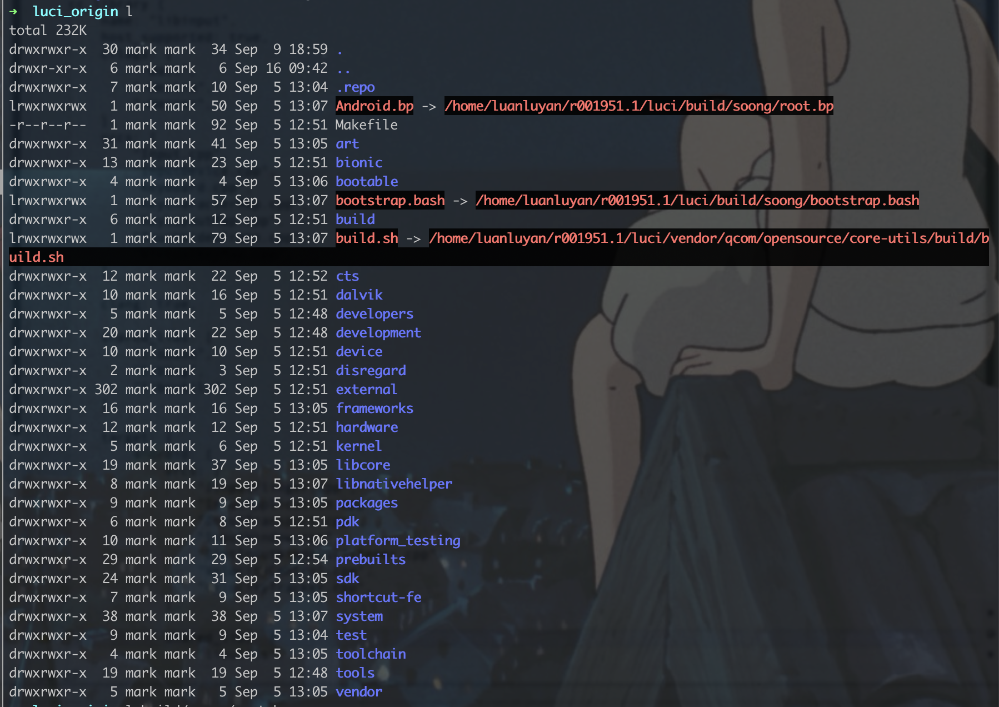
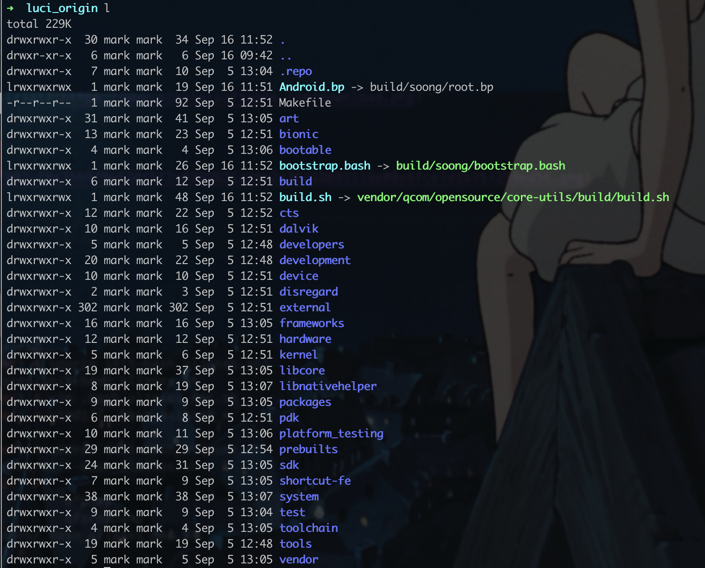

## review / debug native frameworks (C++)

### 1. generate CMakeLists for clion

> core ref: [如何顺滑地查看 Android Native 代码 | HansChen 的博客](http://blog.hanschen.site/2019/10/11/aosp-native-ide/)

:::caution
基于`SOONG_GEN_CMAKEFILES`生成 `CMakeLists.txt` 的方式，开销还是很大的，编译感觉慢了两三倍，所以如果 api 没有什么大变动，编了一次后下次就不要启用了。
:::

1. check if files exist at `out/development/ide/clion/frameworks/native/**/CMakeLists.txt`
2. if not exist, we should set `SOONG_GEN_CMAKEFILES=1 SOONG_GEN_CMAKEFILES_DEBUG=1`, and compile again.

:::caution
TODO: 但是我后来发现，还不够。 编译自动生成的 `CMakeLists.txt` 里包含的库补全，需要自己手动添加目标库。然后这些库的 cpp 文件就会都罗列在项目根目录下，至于为啥不是树状结构，是因为这些都是引用，并且来自不同的目录结构。


:::

### 2. load (ALL) native frameworks in clion

1. open `CROOT/frameworks/native` in clion (now there is no intellisense)
2. import/load `out/development/ide/clion/frameworks/native/CMakeLists.txt` (root index cmake file)
3. mark root directly under `Project` view for `Root for Headers and Sources`


4. restart IDE (if necessary), then we can get the intellisense and jump features.

### 3. (RECOMMENDED) load (PARTIAL) native frameworks in clion

你想改哪个模块，就导入哪个模块的 cmake 文件，导入后 ide 就会自动只对那些文件进行代码提示，其他的不会。

如果你想再包括其他的，直接在 cmake 文件里加一点 include 就行。

在项目结构上有两种办法：

1. 直接打开 cmake（导致 cpp flattened），然后在`Tool | CMake | Change Project Root`
2. 直接打开 project，再 select cmake files (ide 会自动弹窗)

另外同时查看多个项目的话可以在 `development` 下配置（我当时想配置`out`，结果没注意其实配的是`development`，我说怎么始终没有`surfaceflinger`部分呢，当时非常不解!一定要注意前面有没有`out`！)


最后，如果想手动加入其它源代码查看，可以在 cmake 里手动配置 `include`。


## compare

### generate git 

#### 1. fix symlink

  

```sh
➜  luci_origin ln -sf build/soong/root.bp Android.bp
➜  luci_origin ln -sf build/soong/bootstrap.bash .
➜  luci_origin ln -sf vendor/qcom/opensource/core-utils/build/build.sh .
```

  


### quli native changes

native 改动：

```sh
➜  native git:(08a3cdb3e3) git diff --dirstat=files,0 HEAD~ | sort -k1 -r
  13.4% services/GSXR/scrender/Common/glm/glm/ext/
  10.1% services/GSXR/scrender/Common/glm/glm/gtx/
  10.0% services/surfaceflinger/invision/thirdpart/glm/glm/gtx/
   5.3% services/surfaceflinger/invision/thirdpart/glm/glm/detail/
   5.0% services/GSXR/scrender/Common/glm/glm/detail/
   3.2% services/surfaceflinger/invision/thirdpart/glm/glm/gtc/
   3.1% services/GSXR/scrender/Common/glm/glm/gtc/
   1.9% services/surfaceflinger/invision/thirdpart/glm/glm/
   1.9% services/GSXR/scrender/Common/glm/glm/
   1.8% services/ivphone/xvisoaudioservice/include/
   1.8% services/GSXR/scrender/Common/stb/stb/
   1.4% services/GSXR/app_api/
   1.3% services/ivphone/xvisoaudioservice/
   1.3% services/ivgesture/services/
   1.1% services/ivslam/services/
   1.1% services/ivdatalogger/
   1.1% services/ivcoremanager/imu/libusb/os/
   1.0% services/ivphone/services/
   0.9% services/surfaceflinger/
   0.9% services/ivhandshank/services/
   0.9% services/ivcoremanager/imu/libusb/
   0.9% services/a11gdevice/services/
   0.9% services/GSXR/app_api_impl/
   0.8% services/ivslam/client/
   0.8% services/GSXR/scrender/Common/qvr/
   0.8% services/GSXR/scrender/Common/glm/glm/simd/
   0.7% services/surfaceflinger/invision/thirdpart/glm/glm/simd/
   0.7% services/ivhandshank/client/
   0.6% services/ivcoremanager/camera/NDKCamera/
   0.6% services/a11gdevice/client/
   0.6% services/GSXR/scrender/Common/utils/
   0.6% services/GSXR/scrender/Common/slam/
   0.5% services/surfaceflinger/invision/render/
   0.5% services/ivslam/aidl/
   0.5% services/ivhandshank/aidl/
   0.5% services/ivgesture/client/
   0.5% services/ivgesture/aidl/
   0.5% services/ivcoremanager/imu/NDKImu/
   0.5% services/ivcoremanager/camera/
   0.5% services/a11gdevice/aidl/
   0.5% services/GSXR/scrender/Common/gl/
   0.4% services/surfaceflinger/invisionclient/
   0.4% services/surfaceflinger/invision/utils/
   0.4% services/ivslam/prebuild/lib64/
   0.4% services/ivhandshank/libjsio/
   0.4% services/ivgesture/prebuild/resources/mesh/
   0.4% services/ivgesture/prebuild/V02A/resources/models/
   0.4% services/ivgesture/prebuild/V02A/resources/mesh/
   0.4% services/ivgesture/prebuild/V02A/lib64/
   0.4% services/ivgesture/prebuild/A11B/lib64/
   0.4% services/ivcoremanager/imu/
   0.4% services/inputflinger/
   0.4% libs/gui/include/gui/
   0.4% libs/gui/
   0.3% services/surfaceflinger/invision/thirdpart/glm/glm/ext/
   0.3% services/ivhandshank/prebuild/lib64/
   0.3% services/ivhandshank/helper/
   0.3% services/ivgesture/prebuild/resources/models/
   0.3% services/ivgesture/prebuild/A11B/lib/
   0.3% services/ivgesture/
   0.3% services/GSXR/dev_api/
   0.2% services/ivslam/prebuild/v02/lib64/
   0.2% services/ivslam/prebuild/tools/sync_with_pc/x64/Debug/
   0.2% services/ivslam/prebuild/slam2_0/lib64/
   0.2% services/ivslam/
   0.2% services/ivgesture/prebuild/A11B/resources/models/
   0.1% services/surfaceflinger/invision/thirdpart/tinyobj/
   0.1% services/surfaceflinger/invision/thirdpart/lodepng/
   0.1% services/surfaceflinger/invision/
   0.1% services/ivutils/
   0.1% services/ivslam/prebuild/tools/sync_with_pc/
   0.1% services/ivslam/prebuild/cmcc/lib64/
   0.1% services/ivphone/xvisoaudioservice/lib64/
   0.1% services/ivphone/xvisoaudioservice/lib/
   0.1% services/ivhandshank/prebuild/v02/lib64/
   0.1% services/ivhandshank/prebuild/v02/bin/
   0.1% services/ivhandshank/prebuild/symbols/lib64/
   0.1% services/ivhandshank/prebuild/dsp/
   0.1% services/ivhandshank/
   0.1% services/ivcoremanager/
   0.1% services/inputflinger/include/
   0.1% services/a11gdevice/
   0.1% services/GSXR/scrender/Common/sc/
   0.1% services/GSXR/prebuild/lib64/
   0.1% services/GSXR/prebuild/lib/
   0.1% services/GSXR/prebuild/V02A/lib64/
   0.1% services/GSXR/prebuild/V02A/lib/
   0.1% services/GSXR/gesture/
   0.1% services/GSXR/
   0.1% libs/input/
   0.1% include/input/
   0.1% include/android/
   0.0% services/surfaceflinger/invision/thirdpart/jpeg/include/
   0.0% services/surfaceflinger/invision/include/
   0.0% services/ivutils/include/ivserviceutils/
   0.0% services/ivslam/prebuild/slam2_0/lib/
   0.0% services/ivslam/prebuild/slam2_0/dsp/
   0.0% services/ivslam/prebuild/slam2_0/bin/
   0.0% services/ivslam/prebuild/slam2_0/
   0.0% services/ivslam/prebuild/luci/lib64/
   0.0% services/ivslam/prebuild/lib/
   0.0% services/ivslam/prebuild/dsp/
   0.0% services/ivslam/prebuild/cmcc/lib/
   0.0% services/ivslam/prebuild/bin/
   0.0% services/ivslam/prebuild/
   0.0% services/ivphone/
   0.0% services/ivhandshank/prebuild/v02/lib/
   0.0% services/ivhandshank/prebuild/v02/calib/
   0.0% services/ivhandshank/prebuild/v02/
   0.0% services/ivhandshank/prebuild/symbols/lib/
   0.0% services/ivhandshank/prebuild/luci/calib/
   0.0% services/ivhandshank/prebuild/lib/
   0.0% services/ivhandshank/prebuild/calib/
   0.0% services/ivhandshank/prebuild/
   0.0% services/ivgesture/prebuild/lib64/
   0.0% services/ivgesture/prebuild/V02A/resources/
   0.0% services/ivgesture/prebuild/V02A/adsp/
   0.0% services/ivgesture/prebuild/V02A/
   0.0% services/ivgesture/prebuild/A11B/symbols/lib64/
   0.0% services/ivgesture/prebuild/A11B/symbols/lib/
   0.0% services/ivgesture/prebuild/A11B/resources/
   0.0% services/ivgesture/prebuild/A11B/adsp/
   0.0% services/ivgesture/prebuild/
   0.0% services/ivdatalogger/prebuild/lib64/
   0.0% services/GSXR/system/
   0.0% services/GSXR/scrender/sc/
   0.0% services/GSXR/scrender/Common/stb/
   0.0% services/GSXR/scrender/Common/glm/
   0.0% services/GSXR/scrender/Common/
   0.0% services/GSXR/prebuild/
   0.0% services/GSXR/invision/handshank/
   0.0% services/GSXR/controller/
```

### via `beyond compare`

download at: - [Download Beyond Compare Free Trial](https://www.scootersoftware.com/download.php)

install command line tool (`bcomp`):

  

how to compare codes over ssh:

- documentation: https://www.scootersoftware.com/support.php?zz=kb_ssh
- example: https://stackoverflow.com/questions/44386321/beyond-compare-remote-with-local-file

```sh
bcomp local.txt sftp://user@server/folder/file.txt
```