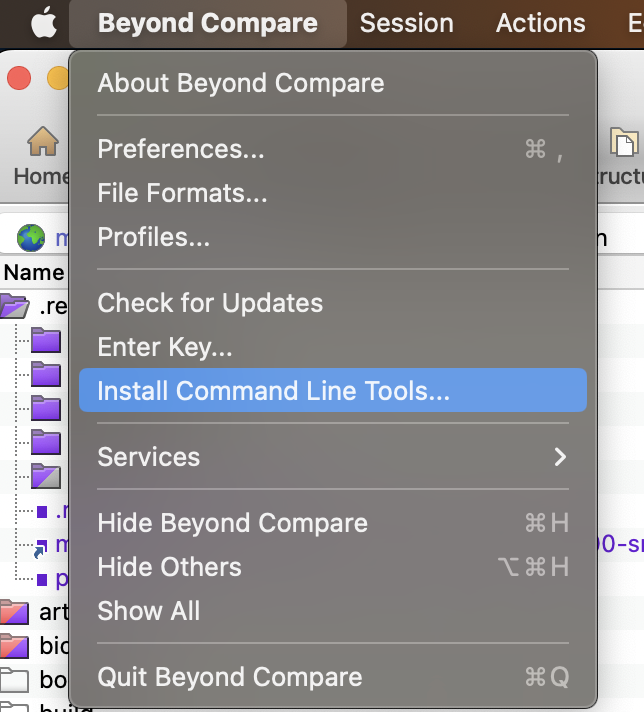

## review / debug native frameworks (C++)

### 1. generate CMakeLists for clion

> core ref: [如何顺滑地查看 Android Native 代码 | HansChen 的博客](http://blog.hanschen.site/2019/10/11/aosp-native-ide/)

:::caution
基于`SOONG_GEN_CMAKEFILES`生成 `CMakeLists.txt` 的方式，开销还是很大的，编译感觉慢了两三倍，所以如果 api 没有什么大变动，编了一次后下次就不要启用了。
:::

1. check if files exist at `out/development/ide/clion/frameworks/native/**/CMakeLists.txt`
2. if not exist, we should set `SOONG_GEN_CMAKEFILES=1 SOONG_GEN_CMAKEFILES_DEBUG=1`, and compile again.

:::caution
TODO: 但是我后来发现，还不够。 编译自动生成的 `CMakeLists.txt` 里包含的库补全，需要自己手动添加目标库。然后这些库的 cpp 文件就会都罗列在项目根目录下，至于为啥不是树状结构，是因为这些都是引用，并且来自不同的目录结构。


:::

### 2. load (ALL) native frameworks in clion

1. open `CROOT/frameworks/native` in clion (now there is no intellisense)
2. import/load `out/development/ide/clion/frameworks/native/CMakeLists.txt` (root index cmake file)
3. mark root directly under `Project` view for `Root for Headers and Sources`


4. restart IDE (if necessary), then we can get the intellisense and jump features.

### 3. (RECOMMENDED) load (PARTIAL) native frameworks in clion

你想改哪个模块，就导入哪个模块的 cmake 文件，导入后 ide 就会自动只对那些文件进行代码提示，其他的不会。

如果你想再包括其他的，直接在 cmake 文件里加一点 include 就行。

在项目结构上有两种办法：

1. 直接打开 cmake（导致 cpp flattened），然后在`Tool | CMake | Change Project Root`
2. 直接打开 project，再 select cmake files (ide 会自动弹窗)

另外同时查看多个项目的话可以在 `development` 下配置（我当时想配置`out`，结果没注意其实配的是`development`，我说怎么始终没有`surfaceflinger`部分呢，当时非常不解!一定要注意前面有没有`out`！)


最后，如果想手动加入其它源代码查看，可以在 cmake 里手动配置 `include`。


## compare

### via `beyond compare`

download at: - [Download Beyond Compare Free Trial](https://www.scootersoftware.com/download.php)

install command line tool (`bcomp`):

  

how to compare codes over ssh:

- documentation: https://www.scootersoftware.com/support.php?zz=kb_ssh
- example: https://stackoverflow.com/questions/44386321/beyond-compare-remote-with-local-file

```sh
bcomp local.txt sftp://user@server/folder/file.txt
```