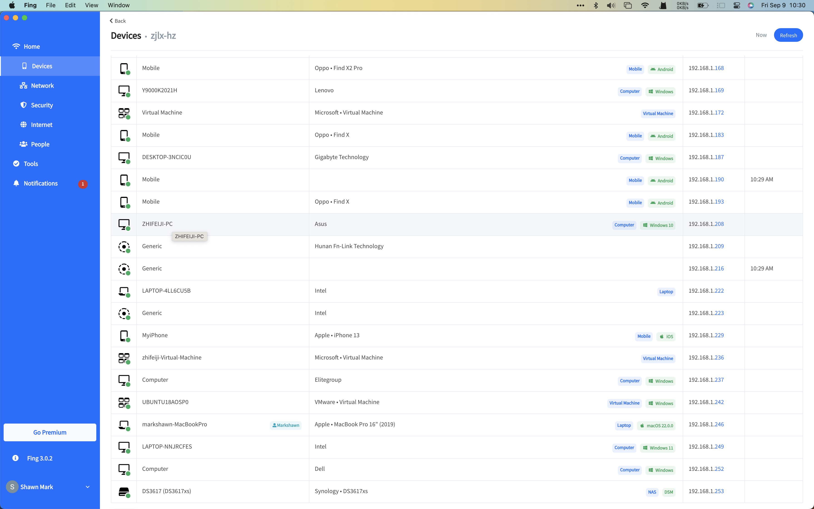
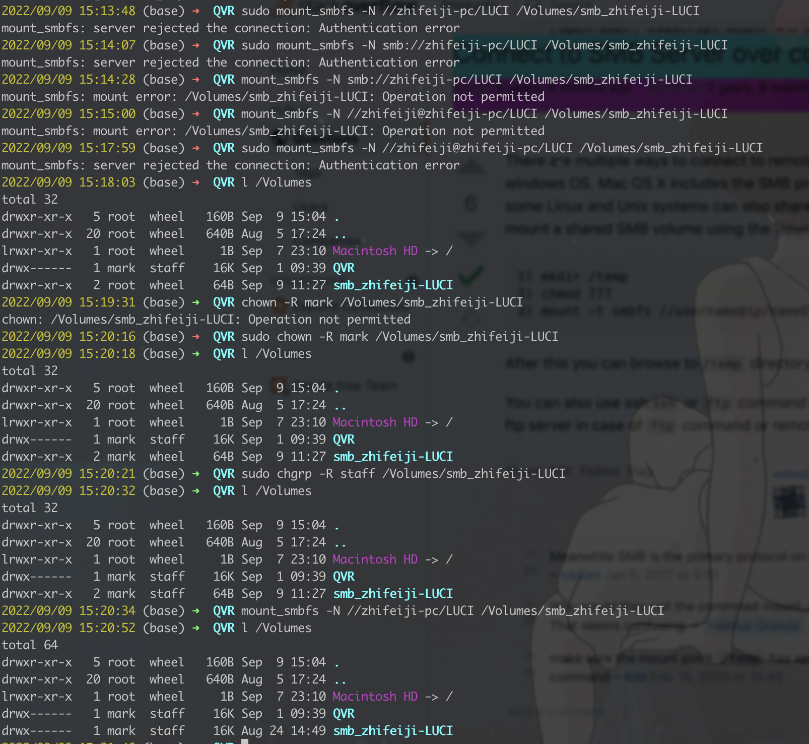

## office

### list LAN devices with name

#### motivation

to get zhifeiji IP for pulling `pkg.zip` in the terminal

#### solution

1. research

In [linux - How can I list all IPs in the connected network, through Terminal preferably? - Super User](https://superuser.com/questions/261818/how-can-i-list-all-ips-in-the-connected-network-through-terminal-preferably), `arp-scan` not works, but `fing` is OK.

2. implementation

download `fing` via `brew install fing --cask`, and run in APP mode (no command of `fing` now), and login using account (e.g. via google):

  

3. result

we can get to know that ip of zhifeiji is `192.168.1.236`, and the ip of `UBUNTU18AOSP0` (`$ARPARA_AOSP_SERVER`) is `192.168.1.242`.

### how to mount/unmount LAN drivers

#### how to list drivers on Mac

```sh
l /Volumes
```

#### how to unmount drivers on Mac

ref: - [Mount & Unmount Drives from the Command Line in Mac OS X](https://osxdaily.com/2013/05/13/mount-unmount-drives-from-the-command-line-in-mac-os-x/)

```sh
diskutil unmount /Volumes/XXX
```

#### how to mount LAN-drivers on Mac

##### solution 1 (via `osascript`)

```sh
# ref: https://apple.stackexchange.com/a/282778
osascript -e 'mount volume "smb://zhifeiji-pc/LUCI"'
```

##### solution 2 (via `mount`)

=== track part ===

[network - mount_smbfs: server rejected the connection: Authentication error on Mac OS High Sierra 10.13.6 - Ask Different](https://apple.stackexchange.com/questions/341631/mount-smbfs-server-rejected-the-connection-authentication-error-on-mac-os-high), recommends using:

```sh
# all the following would fail for authentication
mount -t smbfs '//server.domain/share' /Volumes/share
mount -t smbfs '//user@server.domain/share' /Volumes/share
mount -t smbfs '//share;user@server.domain/share' /Volumes/share

# I also find a `-N` parameter for `not ask for password`, but I didn't find it in mac `mount`
# ref: https://apple.stackexchange.com/a/282778
```

=== resolution part ===

  

Indeed, the problem is not consistent with `mount`, but with filesystem permission.

Since we wanna to mount filesystem to under `/Volumes` which need root permission, so we use `sudo mkdir` to get the owner of `/Volumes/targetMountPoint` to be `root`, and we cannot use `sudo` with `mount` (I do not know clearly it why).

TODO: why we can not mount to a driver with the root role.

Then when we `chgrp` the directory, we can easily mount the driver.

=== answer part ===

```sh
TARGET_SERVER="zhifeiji-pc"
TARGET_SHARE="QVR"
TARGET_MOUNT_POINT_NAME="zhifeiji_quli-QVR"

TARGET_MOUNT_POINT_PATH=/Volumes/$TARGET_MOUNT_POINT_NAME
# sudo rm -rf $TARGET_MOUNT_POINT_PATH # delete directory (if not mounted)
# diskutil unmount $TARGET_MOUNT_POINT_PATH # delete directory (if mounted)

sudo mkdir -p $TARGET_MOUNT_POINT_PATH
sudo chown $USER $TARGET_MOUNT_POINT_PATH
# sudo chgrp staff $TARGET_MOUNT_POINT_PATH # not necessary, but to get the same result if I use iFinder

# do not use `mount_smbfs -N` directly as `man mount_smbfs` instructed
mount -t smbfs //guest:@$TARGET_SERVER/$TARGET_SHARE $TARGET_MOUNT_POINT_PATH
```

