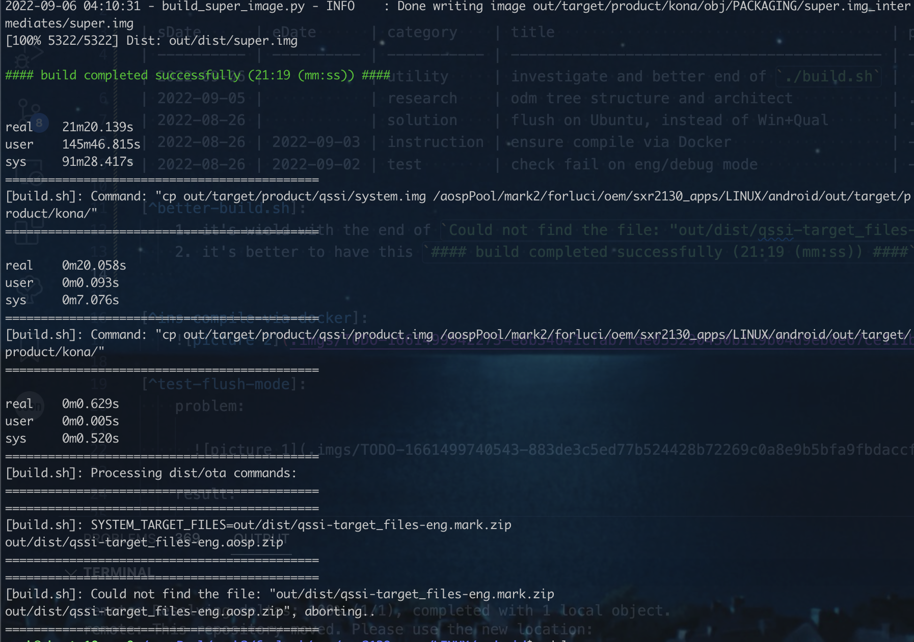

# quli todo

| sDate      | eDate      | category    | title                                      | priority | status   | reason      | detail                |
| ---------- | ---------- | ----------- | ------------------------------------------ | -------- | -------- | ----------- | --------------------- |
| 2022-09-06 |            | utility     | investigate and better end of `./build.sh` |          |          |             | [^better-build.sh]    |
| 2022-09-05 |            | research    | odm tree structure and architect           | .7       |          |             |                       |
| 2022-08-26 |            | solution    | flush on Ubuntu, instead of Win+Qual       | .9       |          |             |                       |
| 2022-08-26 | 2022-09-03 | instruction | ensure compile via Docker                  | -        | canceled | unnecessary | [^ins-docker-compile] |
| 2022-08-26 | 2022-09-02 | test        | check fail on eng/debug mode               | -        | finished |             | [^test-flush-mode]    |

[^better-build.sh]:
    1. it's wield with the end of `Could not find the file: "out/dist/qssi-target_files-eng.mark.zip`
    2. it's better to have this `#### build completed successfully (21:19 (mm:ss)) ####` in the end
      

[^ins-compile-via-docker]:
      

[^test-flush-mode]:
    problem:

        

    result:

      咨询了趣立候，确定 `kona-eng`  会编译失败

        

