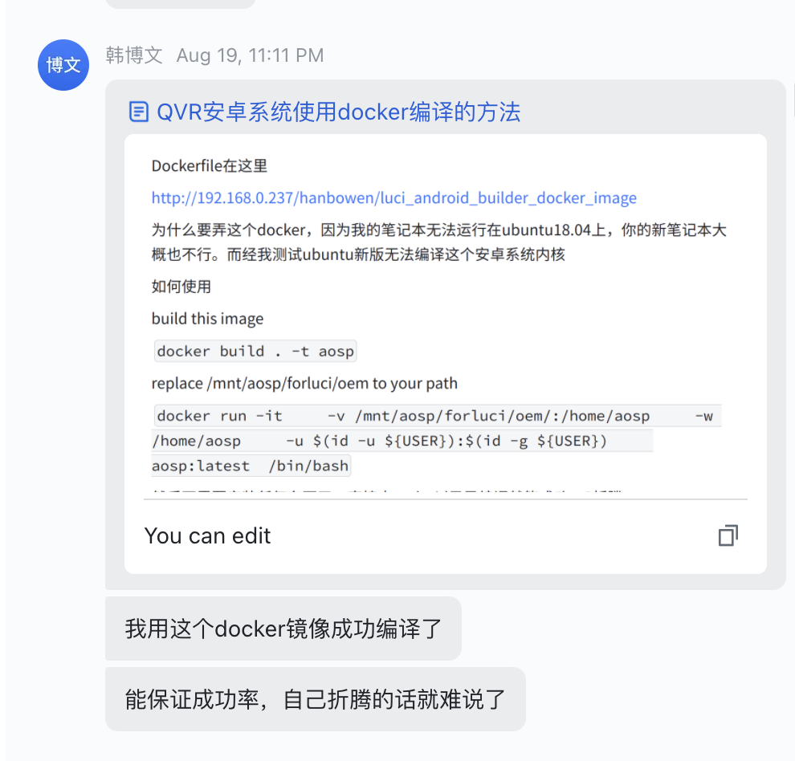
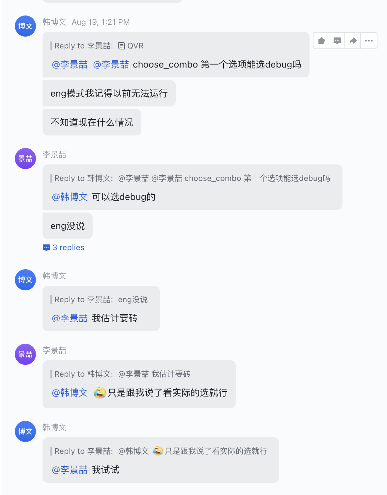
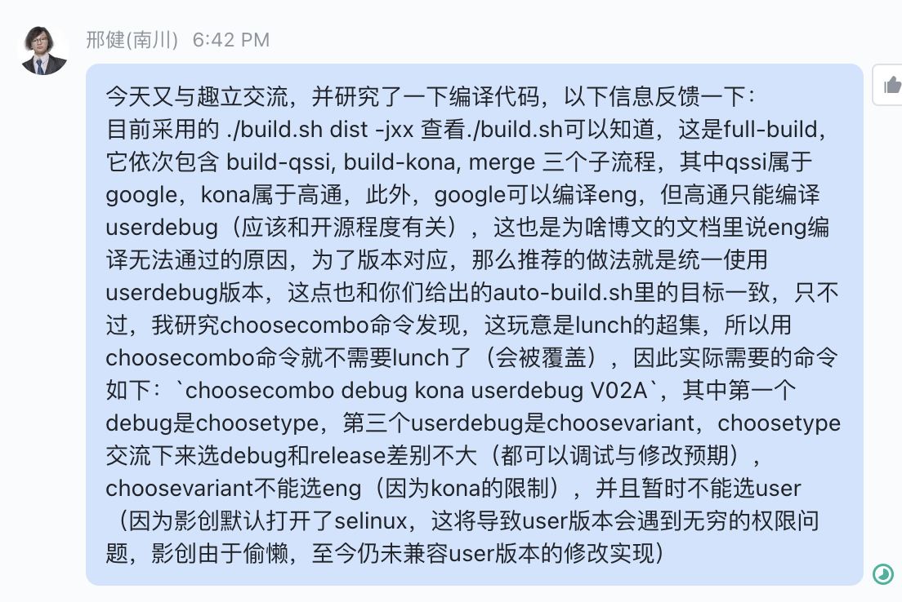

# quli todo

| sDate      | eDate      | category    | title                                | priority | status   | reason | detail                |
| ---------- | ---------- | ----------- | ------------------------------------ | -------- | -------- | ------ | --------------------- |
| 2022-08-26 |            | instruction | ensure compile via Docker            |          |          |        | [^ins-docker-compile] |
| 2022-08-26 |            | solution    | flush on Ubuntu, instead of Win+Qual |          |          |        |                       |
| 2022-08-26 | 2022-09-02 | test        | check fail on eng/debug mode         |          | finished |        | [^test-flush-mode]    |

[^ins-compile-via-docker]:
      

[^test-flush-mode]:
    problem:

        

    result:

      咨询了趣立候，确定 `kona-eng`  会编译失败

        

