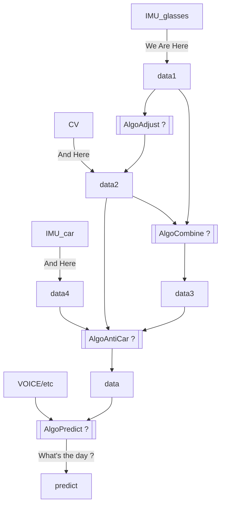

# TIMEWARP RESEARCH

- [Timewarp Guide](#timewarp-guide)
- [Source Code Research](#source-code-research)
  - [decide the target code](#decide-the-target-code)
- [SDK Logic Backward-track](#sdk-logic-backward-track)
- [SDK Logic Forward-implementation](#sdk-logic-forward-implementation)
  - [step 1. `vertexShader` and `fragmentShader`](#step-1-vertexshader-and-fragmentshader)
    - [1.1. definition of `vertexShader` and `fragmentShader`](#11-definition-of-vertexshader-and-fragmentshader)
    - [1.2. usage of `vertexShader` and `fragmentShader`](#12-usage-of-vertexshader-and-fragmentshader)
    - [2.3 `Pose`（姿态）](#23-pose姿态)
    - [2.4. PASS: `[CG]PU_PROFILE_(BEGIN|END)`](#24-pass-cgpu_profile_beginend)
  - [2.5. 初始化 `Pose`](#25-初始化-pose)
  - [2.6 获取 `Pose`](#26-获取-pose)
- [SDK custom](#sdk-custom)
  - [implementation](#implementation)
  - [FIXME: `glUniformMatrix4fv is depreciated`](#fixme-gluniformmatrix4fv-is-depreciated)
  - [TODO: 获取的姿态不等于我们对 buffer 要做的操作](#todo-获取的姿态不等于我们对buffer要做的操作)
  - [FIXED: how to init C++ class](#fixed-how-to-init-c-class)
  - [FIXED: how to "import" `GLint`](#fixed-how-to-import-glint)
- [Framework Logic](#framework-logic)
  - [intro: `ProgramCache.cpp`](#intro-programcachecpp)
  - [filter out `uniform` Logic](#filter-out-uniform-logic)
  - [add `vertexShader` and `fragmentShader`](#add-vertexshader-and-fragmentshader)
- [Timewarp Forecast](#timewarp-forecast)
  - [documentation](#documentation)
  - [workflow](#workflow)
- [Timewarp Algo](#timewarp-algo)
- [mark::update@2022-02-25: timewarp framework test](#markupdate2022-02-25-timewarp-framework-test)
  - [打印 timewarp matrix](#打印-timewarp-matrix)
- [can we change log level?](#can-we-change-log-level)
- [can we debug shader?](#can-we-debug-shader)

## Timewarp Guide

- 核心参考资料（Oculus 的 ATW 介绍） [Asynchronous TimeWarp (ATW) | Oculus Developers](https://developer.oculus.com/documentation/native/android/mobile-timewarp-overview/)


In this article: [Android N VR 代码简析 - 简书](https://www.jianshu.com/p/027916e345bc), it said:

> 单独分离出一个 SDK，除了方便应用开发者之外，主要的目的是用来把 VR 的一些核心算法隐藏起来，比如用来减少延迟的 ATW 异步时间扭曲算法就是被封装在这里，是闭源不公开的。众所周知，在手机上面运行 VR 的时候一个最大的挑战就是延迟，当一副画面的延迟超过 20MS，人就会感觉不舒服恶心，严重影响用户体验，一个好的 VR 产品都会尽量避免延迟。

## Source Code Research

### decide the target code

According to the grep search and vimdiff, we can locate the target codes are in `./src/lib/cpp/Distortion/BarrelDistortion1ShaderProgramGL.cpp`.


## SDK Logic Backward-track

sdk 关于 `timewarp` 的逻辑，尤其是 `Shader` 部分主要集中在 `vrsdk-20210813/src/lib/cpp/Distortion/BarrelDistortion1ShaderProgramGL.cpp` 文件中，并基于 `opengl` 的版本决定 `VertexShader` 和 `FragmentShader` 的初始化，其对应的版本也不同。

~~我们直接使用 `opengl3.3` 的版本就可以（也就是 `opengl-core` 对应的逻辑）部分。~~

mark::update@2022-02-19: 根据志刚反馈，车机使用的是`opengl 3.0`，因此我们只能使用 本 SDK 中`opengl 1.0` 的写法了。


其中 `BarrelDistortionShaderProgramPerApi` 函数是在 `cpp/Distortion/BarrelDistortionShaderProgram.h` （注意，不是 1 了）中定义的，它接收三个 Shader 参数，前面两个分别是 `VertexShader` 和 `FragmentShader`，最后一个是叫 `geomShader`，初始化为空。它们会调用 `ShaderBase` 函数。


注意，这个 `ShaderBase` 函数其实是一个泛型，在我们的调用栈中，它实际是 `cpp/Distortion/BarrelDistortion1ShaderProgramGL.h` 中的 `ShaderProgramGL`。


也就是说，实际初始化时，调用的具体函数是 `ShaderProgramGL(vertexShader, fragmentShader, null)`。

它是在 `cpp/Renderer/gl/ShaderProgramGL.h` 中定义的：


查看实现，其实底层就是调的`cpp/Renderer/gl/ShaderProgramGL.cpp`（TO-CONFIRM: 应该是官方`opengl`） 的 `ShaderProgram`。


注意到这里也有 `IVR_GRAPHICS_API_GLES2` 和 `IVR_GRAPHICS_API_GLCORE` 的定义，~~可以看出来，其实两个文件结构是差不多的~~。mark::update@2022-02-18: 对比了下具体的文件，还是差挺多的，只有很少的一部分（比如 `compile`接口）有保留，其他的基本都改了，应该来说，结构差不多，但内容差了很多，深度定制了。


最后追到 `cpp/Renderer/ShaderProgram.cpp` 里 `ShaderProgram` 的实现，可以看到就是一个初始化的过程。


## SDK Logic Forward-implementation

基于 [sdk logic backward-track](#sdk-logic-backward-track) 的梳理，我们可以前向整理出整套 sdk 逻辑了。

### step 1. `vertexShader` and `fragmentShader`

#### 1.1. definition of `vertexShader` and `fragmentShader`

原 SDK 中，基于 `opengl` 版本进行判断，选择是否使用 `opengl#version 100` 或者 `opengl#version 330`。

但是经过查询 android 官方 opengl 部分： [OpenGL ES  |  Android 开发者  |  Android Developers](https://developer.android.com/guide/topics/graphics/opengl?hl=zh-cn)，发现可能只支持`opengl 3.1`：


理论上应该不至于，因为 `opengl 3.3` : [OpenGL - Wikipedia](https://en.wikipedia.org/wiki/OpenGL#OpenGL_3.3) 早在 2010 年就发布了：


!!! warning DEPRECIATED

    FIXED: 所以这一点还要确认一下。

    因此，目前的保守做法，就还是沿用老SDK的处理方式，根据opengl的不同版本，写两套处理程序（为精简，都去除了和旋转有关的内容），一套为了兼容（`opengl 1.0`），一套为了性能（`opengl 3.3`）：

    see: [define_shader.h](./define_shader.h)

mark::update@2022-02-19: 已确认，车机只能使用 `opengl 3.9`。

这样我们就有了两个变量：

1. `s_barrelDistortion1VertexShader`
2. `s_barrelDistortion1FragmentShader`

#### 1.2. usage of `vertexShader` and `fragmentShader`

根据调用栈：

cpp++ BarrelDistortion1ShaderProgramGL::BarrelDistortion1ShaderProgramGL() --> BarrelDistortionShaderProgramPerApi(s*barrelDistortion1VertexShader, s_barrelDistortion1FragmentShader) --> ShaderBase(vertShader, fragShader, geomShader /\_null*/) --> ShaderProgramGL(vertShader, fragShader, geomShader /_null_/) --> ShaderProgram(vertShader, fragShader, geomShader /_null_/) --> \_vertShaderSource(vertShader), \_fragShaderSource(fragShader), \_geomShaderSource(geomShader)

```

所以，其实就是单纯赋值一直往上就可以了，最终在 `BarrelDistortion1ShaderProgramGL` 或者说 `ShaderProgram` 里有个 `_vertShaderSource`被初始化为 `s_barrelDistortion1VertexShader`，有个 `_fragShaderSource` 被初始化为 `s_barrelDistortion1FragmentShader`。

#### 1.3. dependencies of `vertexShader` and `fragmentShader`

其实怎么使用功能 `vertexShader` 和 `fragmentShader` 理论上不是我们需要思考的事，因为在 android 框架里，使用部分貌似是已经封装好的，我们只需初始化这两个shader并启用就好。

而这一步，在后面的 [framework logic](#framework-logic) 里会继续深入，此处不是我们关心的问题。

而且我们确实有现在需要关心的问题，那就是两个Shader里还有一些变量需要我们手动提供。

如下图，`a_texcoord` 应该只是内部属性，不需要自己实现（TODO: 确认这一点）；而真正需要自己定义、实现与操作的是 `u_timewarp_mat` 和 `u_enable_timewarp` 变量。


### step 2. `setWrapMatrix`

#### 2.1 call/set `u_enable_time_warp` and `u_timewarp_mat`

!!! note

    ~~我们可以先从 `u_enable_time_warp` 变量入手，因为它只是一个 bool 类型变量，在理解了它的“前世今生”之后，可以更快地理解 `u_timewarp_mat`。~~

    mark::update@2022-02-18: 后续分析发现，其实 `u_enable_time_warp` 是在 `setWarpMatrix` 函数中和 `u_timewarp_mat` 一起设置的，所以也没有分开研究的必要。

在 `src/lib/cpp/Distortion/BarrelDistortion1ShaderProgramGL.cpp` 中可以看到关于 `u_enable_time_warp` 相关的 set 操作（已修正原SDK误把 `_uniformTimewarpEnable` 写成 `_uniformRotationEnable` 的问题 ）。

但其实，对照 `setScreenParameters` 中对 `_uniformRotationEnable` 的使用，可以发现，我们的 `_uniformTimeWarpEnable` 方法只有 set 1 的动作，而没有set 0.


我们尝试添加 set 0 的操作，以支持 timewarp 的动态开关。

一个比较简单的方法，是保留现在的接口，但允许传入参数 `warpMatrix` 为空，然后当它为空时，我们设置 set `_uniformTimeWarpEnable` 为 0。

修改如下：


现在还得知道 `setWarpMatrix` 的逻辑。

#### 2.2 `setWrapMatrix`

首先搜索所有 `setWarpMatrix` 相关的调用信息：


其中第一个就是我们刚刚修改（加入disable timewarp选项）的那个，然后其他都是初始化相关的，最终调用的就两个地方，也就是 `src/lib/cpp/Distortion/BarrelDistortion1RenderPass.cpp` 内的 `composeSingleEye` 和 `composeDoubleEye`。


询问了晓研哥，回复是“曾经提过一个让不支持3D分辨率的设备只输出2D画面的需求”，具体也不懂，也不是很重要，我们直接看 `composeDoubleEye` 就好。

TODO: `composeDoubleEye` 函数中与 `ShaderProgram` 有关的有四个方法调用：


首先分析和 `timewarp` 相关的那个，使用了`getWarpMatrix`方法，容易知道，这个方法是在 `Renderer` 里面定义的：


进来发现，它其实只是使用了数组 `_warpMatrix`，因此我们需要知道这个数组的意思。


结果发现，还是在这个文件里，有一个传参赋值动作：


因此我们又得知道 `setWarpMatrix` 的赋值调用。

此时如果直接搜索 `*1*GL*`，则发现回到了我们的起点……闭环了……


说明，实际 `setWarpMatrix` 的动作还在外面，我们需要知道 `setWarpMatrix` 真正是由谁调用的。

其实仔细看底层的 `setWarpMatrix` 会发现它有两个参数，第一个参数是眼睛。

因此直接在根目录搜索，会发现是在 `Composer`里调用的。


至此，关于 `warpMatrix` 的逻辑栈就通了：

cpp++
// get
BarrelDistortion1RenderPass::composeDoubleEye()
--> _shaderProgram->setWarpMatrix(getWarpMatrix(eye)) // _warpMatrix[eye]

// set
VrComposerInproc::_distortionPass->setWarpMatrix(eye, warpMatrix)
--> BarrelDistortion1ShaderProgramGL::setWarpMatrix(warpMatrix)
--> _warpMatrix[eye] = warpMatrix
```

#### 2.3 `Pose`（姿态）

姿态相关的是在 `Composer/VrComposerInProc.cpp` 中，主要函数是 `void VrComposerInProc::present(uint32_t renderOptions, const Pose &renderPose)`：


其中 `renderOptions` 参数可以几乎不用管，用来判断逻辑的， 我们只需要 enable 它就可以。

核心处理是这部分，首先获取最新的姿态（接下来由 `hmdClient` 提供），然后算出一个矩阵，再设置给左右眼：


追到 `calculateWarpMatrices` ，发现就是个逆矩阵计算。(不过还需要通过 `computeViewMatrix` 函数得到每个矩阵。)


再看 `computeViewMatrix` 函数，就是基于 `Pose` 的姿态属性，进行 `glm` 相关的计算（可以照抄）。


而 `Pose` 的定义是在 `./Tracker/TrackerClient.h` 中（这里虽然写的是 `PoseState`， 但实际上对比之前那个函数，会发现，应该就是 `Pose`）：


#### 2.4. PASS: `[CG]PU_PROFILE_(BEGIN|END)`

> 根据晓研哥指示，这部分适用于测试性能的，所以也不用看。

在 `VrComposerInProc::present` 函数中，有个关于 `[CG]PU` 的调用值得注意：


在 `src/common/CpuProfile.h` 中可以找到关于 `CPU_PROFILE_(BEGIN|END)` 的定义。


在 `src/common/CpuProfile.cpp` 中可查到实现如下：


### 2.5. 初始化 `Pose`

在 `TrackClient.h` 中定义了 `PoseState` 的数组，但是并没有什么 set 的操作。


查看 `_historyBuffer` 相关的信息，发现主要还是集中在 `onSensorUpdate` 函数上。


但其实这个函数里对 `_historyBuffer` 的 set 操作，也是基于其“本身”的，所以很奇怪：


### 2.6 获取 `Pose`

在 `TrackerPalHmdService.cpp` 的 `readSensor` 接口里获取 `hmdService` 的姿态数据，然后将姿态数据再基于自己的 `onSensorUpdate` 函数进行更新维护，并触发预测。


## SDK custom

### implementation

一开始 `vertexShader` 中阉割旋转部分把 `gl_Position` 也阉割了，导致最后没有图形，补上来之后就有图形（三角形）了（但是是黑色）。


黑色一般是着色没着成，检查了一下 `fragmentShader`，再对照官网 case，果然，没有一个输出，加上后就有白色的三角形了。


!!!tip 结果后来发现，这个 `gl_FragColor` 是 1.0 版本产物，现在也不行……

    

    最后确定是用 `gl_FragColor` 但是不要加 `out`，并且我换成 `FragColor`也是不对的。

    

接着发现 `timewarp` 没效果，以为是 `a_texcoord` 没生效，于是测试添加一个明显的、固定的 `a_texcoord`，测了几个，结果还是不行。


后来研究这部分函数`gl_FragColor = texture2D(eye_texture, t);`发现 `timewarp` 其实就是重新设置了贴纸的中心坐标（所以并没有什么神奇的），既然是这样，再联系我们之前的三角形问题，由于我们三角形的颜色是单一的白色，自然，就没有任何变化了（因为中心坐标无论在哪，周围都是白色）。

FIXME: 基于此，我突然想到，要是我们设置一个超出范围（0-1）的坐标，基于官网裁切、重复那部分章节，或许至少能有不一样的效果。

但是很遗憾，还是没有，如下，我设置成了 (1.2, 1.3) 都不行。


!!!tip 原来还有一个错误，这么设置固定的数组是不行的……

    

但这也不是不可以接受，因为和教程中那个场景还是有可能不一样的，不过这个不是重点，这条路暂时不行，也不用深究，还有一个更加稳妥的办法，那就是换贴纸。

参照官网换贴纸的案例：[LearnOpenGL/textures.cpp at master · JoeyDeVries/LearnOpenGL](https://github.com/JoeyDeVries/LearnOpenGL/blob/master/src/1.getting_started/4.1.textures/textures.cpp)：

---

终于，有图片了，但是好奇怪，是非常扭曲的那种，即便我取消了一切 shader 操作也不行……


经过不懈尝试，使用 3.3+版本的 `glad` 结合官网的 `shader` [LearnOpenGL/src/1.getting_started/4.1.textures at master · JoeyDeVries/LearnOpenGL](https://github.com/JoeyDeVries/LearnOpenGL/tree/master/src/1.getting_started/4.1.textures) 完成了初步的正常显示，如下：


### FIXME: `glUniformMatrix4fv is depreciated`

We can find the definition of `glUniformMatrix4gv` at here [glUniform](https://www.khronos.org/registry/OpenGL-Refpages/es2.0/xhtml/glUniform.xml):


### TODO: 获取的姿态不等于我们对 buffer 要做的操作

### FIXED: how to init C++ class

As mentioned in [c++ - Creating an instance of class - Stack Overflow](https://stackoverflow.com/questions/12248703/creating-an-instance-of-class), we can use: `Foo* foo1 = new Foo ();` or `Foo foo2` to declare an instance of a class.

### FIXED: how to "import" `GLint`

Just to add `#include <OpenGL/gl.h>`, then we can use `GLint`, since Mac has opengl supported built-in.


It's inspired from [Drawing to a Window or View](https://developer.apple.com/library/archive/documentation/GraphicsImaging/Conceptual/OpenGL-MacProgGuide/opengl_drawing/opengl_drawing.html#//apple_ref/doc/uid/TP40001987-CH404-SW8):


More detailed configuration (on Windows) can be learned from [How To Set Up OpenGL (and freeglut) on MinGW w/ CLion + Run Demo Programs | Game/3D programming - YouTube](https://www.youtube.com/watch?v=AUFZnA3lW_Q).

## Framework Logic

### intro: `ProgramCache.cpp`

晓研哥说 Shader 的逻辑是在 `frameworks/native/libs/renderengine/gl/ProgramCache.cpp`，一开始我还表示十分怀疑，因为是一个带`Cache`名的文件。

但进去之后一看，不得了，都在这里。

比如 `VertexShader`:


还有 `FragmentShader`:


这两个 Shader 都是生成函数，并且还都集中定义在一个函数 `generateProgram` 下：


而 `generateProgram` 又是在 `useProgram` 函数下调用的（还有一些其他地方也在调用 `generateProgram`，但是主逻辑应该是在 `useProgram`这里 ）。

`useProgram` 中接收 `EGLContext` 和 `Description`，其中 `Description` 用于生成 `needs`。


`computeKey` 函数中对 `description` 进行处理，将目标属性一一加在 `needs` 上。


`Description` 是在 `renderengine/private/Description.h` 中定义的。


具体位置是在 `frameworks/native/libs/renderengine/include/renderengine/private/Description.h`


可以看到，还是比较复杂的，定义了很多属性，估计是全局的。

我们可能要基于这些属性，去操纵我们的目标。

### filter out `uniform` Logic

We have seen some `uniform` variables defined in `Shader` language, such as `displayMaxLuminance`.


搜索发现，其实就是在 `Prime.cpp` 中进行赋值的。


可以看到，就是用 `glGetUniformLocation` 函数获得地址，接着用`glUniform1f` 基于 `Description & desc` 进行赋值。


不过这里有个疑惑，这个 `Program::Program` 的初始化，`vertex` 和 `fragment` 都是 `const char *`，和我们之前看到的不断的加文本不太一样，所以得看一下是怎么初始化的。

### add `vertexShader` and `fragmentShader`

## Timewarp Forecast

### documentation

:sparkles::sparkles: 这是关于姿态的非常好的介绍资料

- [姿态的数学表示方法 | Crazepony 开源四轴飞行器](http://www.crazepony.com/book/wiki/attitude-math.html)

:sparkles::sparkles: 这是一篇非常好的，手把手的基于 MA 和动量的时间序列预测教程：

- [Chapter 2: Linear, Trend, and Momentum Forecasting — Time Series Analysis Handbook](https://phdinds-aim.github.io/time_series_handbook/02_LinearForecastingTrendandMomentumForecasting/02_LinearTrendandMomentumForecasting.html#momentum-strategies)

:sparkles::sparkles: 理解卡尔曼滤波

- [(19 封私信 / 68 条消息) 如何通俗并尽可能详细地解释卡尔曼滤波？ - 知乎](https://www.zhihu.com/question/23971601)

:sparkles::sparkles: 理解传感器融合

- [Understanding Sensor Fusion and Tracking, Part 1: What Is Sensor Fusion? - YouTube](https://www.youtube.com/watch?v=6qV3YjFppuc&t=59s)

### workflow



## Timewarp Algo

```cpp
/**
 * see: glm of "./ext/matrix_transform.inl" 153L, 4728B
 * @param m
 * @param v
 * @return
 */
mat4 translate(mat4 m, vec3 v) {
    mat4 result(m);
    result[3] = m[0] * v[0] + m[1] * v[1] + m[2] * v[2] + m[3];
    return result;
}
```

## mark::update@2022-02-25: timewarp framework test

- [ ] timewarp 的 matrix 没有打印出来（可能是添加位置错误，那个地方是初始化用的）
- [ ] timewarp shader 效果异常（可能是 TexCoords 问题，因为输入是 vec4, 我们需要 vec2

### 打印 timewarp matrix

发现根本没有走我们的逻辑！


所以这个时候需要 ide 进行调试了。

定位到我们打印 matrix 的部分，是在 `Program::setUniform` 里，后来我们加了断点，结果发现，逻辑是走的，但是我们的变量没有触发：


---

修改后发现，还剩一个 `mArparaTimewarpEnableLoc` 没绑定上。


知道原因了，原来是被优化了。


## can we change log level?

```sh
adb shell setprop log.tag.XXX V
```

ref: - [logging - How do I enable/disable log levels in Android? - Stack Overflow](https://stackoverflow.com/questions/2018263/how-do-i-enable-disable-log-levels-in-android)

## can we debug shader?

see at [Is it possible to debug shaders in Android OpenGL ES 2? - Stack Overflow](https://stackoverflow.com/questions/41161346/is-it-possible-to-debug-shaders-in-android-opengl-es-2), it's impossible:


