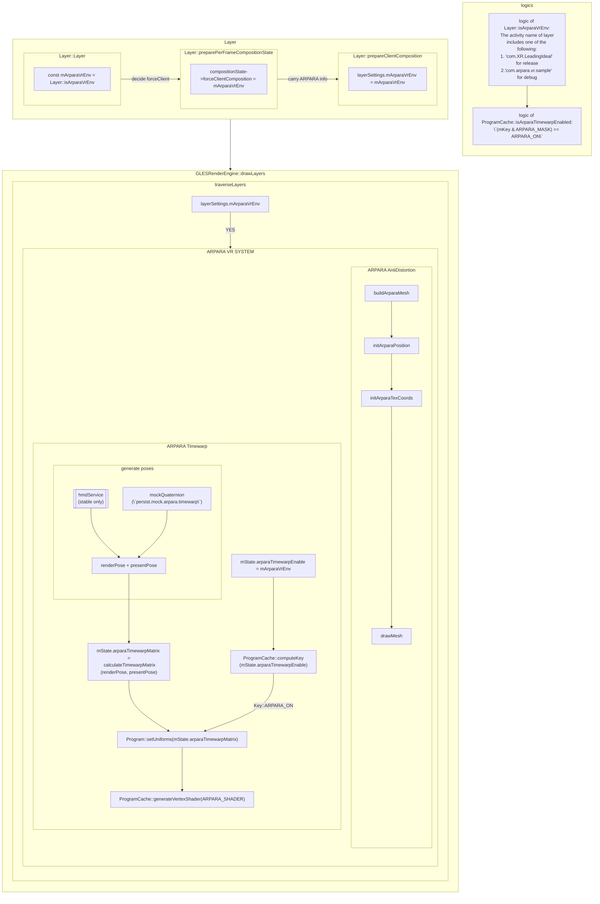

# arpara vr logic

## anti-distortion: implementation

我们需要生成一个 $(100+1)^2*2$ 的 mesh 网，这由我司内部生成，文件分别为 `HmdTypeXXXDistortionMesh.*` ，目前 `XXX=8`。

生成算法与 `opengl` 三角型绘制原理有关，并且需要综合眼镜焦距、分辨率等进行调整，此处不展开。

核心问题是`mesh`的初始化位置与实现。

检索可知，`AOSP` 内部只在`GLESRenderEngine.cpp`的三个函数内部初始化了`mesh` ,分别是 `fillRegionWithColor | drawLayers | handleShadow` ，这三者在业务上并非选择关系，我们只需要处理 `drawLayers`即可。

在 `drawLayers` 函数中，`Mesh` 的构建参数与我们的不同，最主要的差异是体现在顶点的个数上，AOSP 只需要处理 4 个顶点，但我们的反畸变在效果上则需要越多越好，因此不可共用同一个 mesh。我们第一版修改如下：

但该设计存在问题，按照现在的需求，我们只应在检测到 Arpara 的 app 在运行时才需要启用，更准确地说，是在检测到某个 layer 是在渲染 arpara 的 app 时才要启用反畸变，以排除系统弹窗这种不能启用反畸变的场景，否则将造成分裂（智委）。

因此我们的反畸变控制逻辑需要进一步精细到每个 layer 层面。

这时，如果我们直接把 mesh 初始化下移，预期会大幅降低性能，因为每次绘图时，遍历 layer，然后分别初始化每个 mesh。理论上，AOSP 可以直接把 mesh 写成静态变量，但他们没有，而是写在了函数的内部，这也许是出于后续还要进行裁剪等处理或防止泄露等原因。

考虑到我们的 mesh 的顶点、尺寸`3840*1920` 等都是固定的，理论上我们可以静态写死反畸变 mesh 的一切属性，但由于条件限制我的开发环境是`1920*1080`亦或`1280*720` ，因此比较合适的是，至少尺寸这块还是基于 layer 的实际大小来重新设定。

也就是，最合适的办法，静态初始化一个反畸变 mesh，然后在遍历 layer 时，需要该 layer 正在渲染 arpara 的 app，则基于这个 layer 重新调整尺寸，并采用我们的 mesh 进行渲染。

---

但这里有个问题：在 `drawLayers` 中遍历的 `layer` 并非 `class Layer` 而是 `class LayerSettings*` ，在 `LayerSettings`中默认是没有`activity name`的相关信息的。

因此我们需要定制。

---

## data

### package names

- release: `com.XR.LeadingIdeal`
- debug: `com.arpara.vr.sample`
- debug: `com.arpara.arparahome`

## info

- version: 0.0.1
- date: 2022-02-25
- author: 南川
