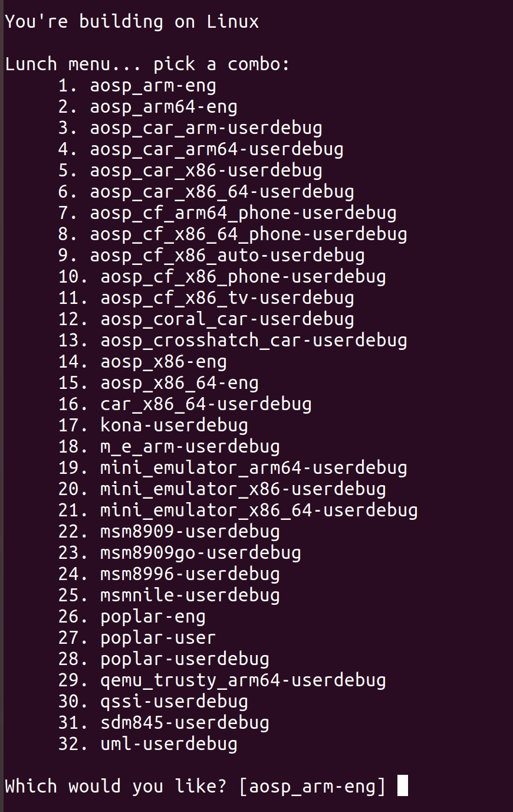
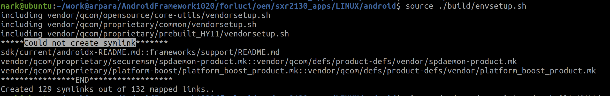
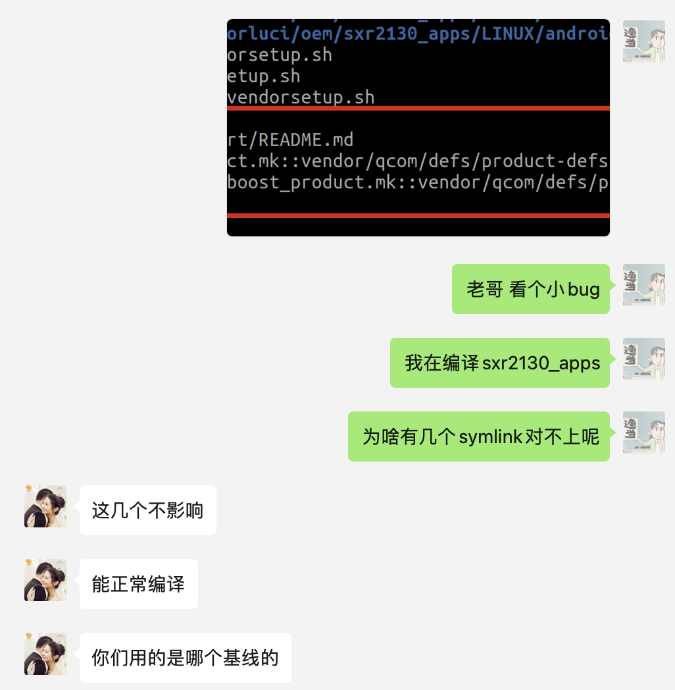

# compile quli 1020

## basic info

```yaml

android_path: sxr2130_apps/LINUX/android

```

## pre-compile

### install dependencies (necessary)

install dependencies, ref: [搭建构建环境  |  Android 开源项目  |  Android Open Source Project](https://source.android.com/docs/setup/build/initializing#installing-required-packages-ubuntu-1804)

```sh
# google
sudo apt-get install git-core gnupg flex bison build-essential zip curl zlib1g-dev gcc-multilib g++-multilib libc6-dev-i386 libncurses5 lib32ncurses5-dev x11proto-core-dev libx11-dev lib32z1-dev libgl1-mesa-dev libxml2-utils xsltproc unzip fontconfig
```

```sh
# arpara, especially with `openssl`
sudo apt-get install -y libx11-dev:i386 libreadline6-dev:i386 libgl1-mesa-dev g++-multilib git flex bison gperf build-essential libncurses5-dev:i386 tofrodos python-markdown libxml2-utils xsltproc zlib1g-dev:i386 dpkg-dev libsdl1.2-dev git-core gnupg flex bison gperf build-essential zip curl zlib1g-dev gcc-multilib g++-multilib libc6-dev-i386 lib32ncurses5-dev x11proto-core-dev libx11-dev libgl1-mesa-dev libxml2-utils xsltproc unzip m4 lib32z-dev ccache libssl-dev libxml-simple-perl bc rsync
```

### increase swap area (recommend)

> if not, the `-j` must be smaller, e.g. 4 instead of 8, otherwise would fail

see: https://askubuntu.com/a/1075516

```sh
sudo swapoff /swapfile
sudo rm /swapfile
sudo fallocate -l 16G /swapfile
sudo chmod 600 /swapfile
sudo mkswap /swapfile
sudo swapon /swapfile
```

### 配置环境变量

```sh
export OEM="~/work@arpara/AndroidFramework1020/forluci/oem"
alias oem="cd $OEM"

export CROOT="$OEM/sxr2130_apps/LINUX/android"
alias croot="cd $CROOT"
```

## compile
 
> Android官方: https://source.android.com/docs/setup/build/building
> arpara编译: https://arpara2021.feishu.cn/wiki/wikcn1lWQsHDluKB5WHwm83WlJd?appStyle=UI4&domain=www.feishu.cn&locale=en-US&tabName=space&theme=light&userId=7085189359086878748

:::warn
使用`m`编译无法通过，要基于`build.sh`
:::

### 一键编译脚本

```sh
# at path: xx/oem

cd sxr2130_apps/LINUX/android

source ./build/envsetup.sh

lunch kona-userdebug

choosecombo debug kona eng V02A

./build.sh dist -j8 | tee "build_$(date +"%m-%dT%H:%M").log"

# 回到 /oem 目录下   注:依赖/pgk,将pkg放置于系统根目录/pgk
cd ../../..
./bld_prj.sh V02A                           //编译oem   
./make_usf.sh dir                           //打包   生成usf刷机包
```

  

### fix: `missing dependencies`（有副作用）

using `ALLOW_MISSING_DEPENDENCIES=true` when compiling, ref: [March AOSP builds failing with undefined module "java_api_finder" [150626837] - Visible to Public - Issue Tracker](https://issuetracker.google.com/issues/150626837?enable_mat=true&pli=1)

用这个虽然可以忽略编译前期的 dependencies 缺失问题，但是后续还是会有编译无法通过的bug。

## compile efficiency

| sDate | eDate | env | commands | note |
| ----- | ----- | --- | -------- | ---- |


## bugfix

### bugfix:`source ./build/envsetup.sh` 

#### 遇到 `cd` 问题

这是由于我在 `~/.bash_profile` 中配置了 `alias .="cd ."` 这样的东西，可能超前使用了`cd`，去掉这些之后就可以了。

另外，最好用 `bash`，而非`zsh`（google官方推荐）。

#### PASS: `Could not create symlink`

  

咨询趣立的结果是：“不影响”：

  

### PASS: `Disallowed Path Tools`

参考google的变动：

- [Build System Changes for Android.mk Writers](https://android.googlesource.com/platform/build/+/master/Changes.md#PATH_Tools)

以及（如果明确副作用的话）可以将工具写入配置文件中，参考：https://forum.xda-developers.com/t/guide-complete-android-rom-development-from-source-to-end.2814763/post-80923041

不过咨询趣立的结论是这个可以忽视。
