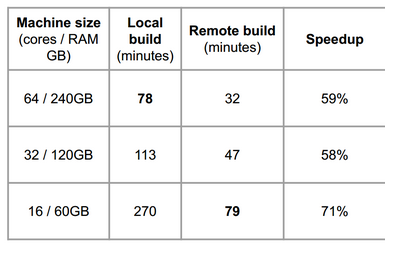
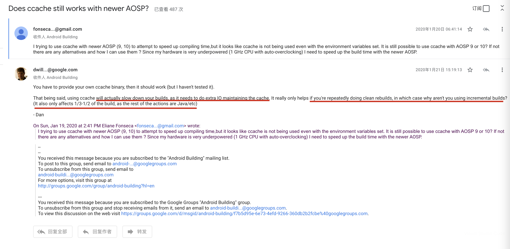

## AOSP build efficiency

### AOSP build time vs CPU core count (up to 56)

  

ref:

- [AOSP build time vs CPU core count (up to 56)](https://groups.google.com/g/android-building/c/Q76dYAhwrkA)

## how to speed up AOSP building

### TODO: 1. using `CCACHE`

see the discussion on whether to use `CCACHE`: https://groups.google.com/g/android-building/c/EI-w1WX-e90/m/wnaJ8IXfDQAJ 
  

refs: 
- [android source - How to use ccache to speed up compiling of aosp? - Stack Overflow](https://stackoverflow.com/questions/59811821/how-to-use-ccache-to-speed-up-compiling-of-aosp)

- [android source - How to use ccache to speed up compiling of aosp? - Stack Overflow](https://stackoverflow.com/questions/59811821/how-to-use-ccache-to-speed-up-compiling-of-aosp)

- [ccache.mk - Android Code Search](https://cs.android.com/android/platform/superproject/+/android10-release:build/make/core/ccache.mk;l=17)

### TODO: 2. using `ramdisk` for `/tmp`

- [performance - Speeding up Android (AOSP) build time - Stack Overflow](https://stackoverflow.com/questions/25790732/speeding-up-android-aosp-build-time)

- [Speeding up AOSP Builds – System Temp Directory | Chris Piekarski](https://cpiekarski.com/2013/01/02/speeding-up-aosp-builds/)

- [Ubuntu using Ramdisk for better performance and fast response - Ubuntu Sharing](http://ubuntuguide.net/ubuntu-using-ramdisk-for-better-performance-and-fast-response)

- [How to Create and Use a Ramdisk on Ubuntu 18.04](https://linuxhint.com/ramdisk_ubuntu_1804/)

- [How to Check the Size of /TMP in Linux](https://linuxhint.com/check-size-tmp-linux/)

### TODO: 3. adding `swp`

- [Optimize the Usage of Swap to Speed up Response for Ubuntu - Ubuntu Sharing](http://ubuntuguide.net/optimize-the-usage-of-swap-to-speed-up-response-for-ubuntu)

### 4. increase threads as many as possible

```sh
# N is the max threads, e.g. 88 in our server
./build.sh dist -j N
```

## utilize AOSP building

### SSD不够

解决办法：

可以考虑将 `out` 软链接到外部机械盘。

注意要点：

1. 软链接时要用绝对路径

副作用：

可能最终会编译不过（进度80+时，-j88一个半小时后）。

相关记录：

`$CROOT/logs/build_09-02T12:29.log` 就是使用 out 软链接进行编译，最后报错的，当时out的对象是 `$MY-OUT-SLOW/out_0902_with_grp_failed//`（注意多了个`/`）。

接着重新链接到 `$MY-OUT-SLOW/out_0902_wo_extra_slash/`，继续编译，log文件为`$CROOT/logs/build_09-02T16:08.log`

参考：

- [Android高版本P/Q/R源码编译指南_IT先森的博客-CSDN博客_android p编译](https://blog.csdn.net/tkwxty/article/details/111684291)
