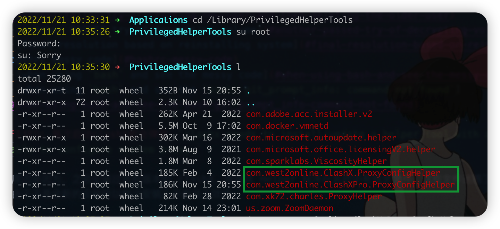

# mac bugfix

- [FIXED: 每次启动clashX都会弹窗安装 Helper Tool](#fixed-每次启动clashx都会弹窗安装-helper-tool)
- [FIXED: adobe acrobat save-as blank](#fixed-adobe-acrobat-save-as-blank)
- [FIXED: mac 静电问题](#fixed-mac-静电问题)
- [FIXED: `date -d` not work on Mac](#fixed-date--d-not-work-on-mac)
- [FIXED: `/etc/sudoers` file broken](#fixed-etcsudoers-file-broken)
- [FIXME: need double confirm/password when boot/restart mac](#fixme-need-double-confirmpassword-when-bootrestart-mac)
  - [FAILED try of switching from `List of Users` to `name and password`](#failed-try-of-switching-from-list-of-users-to-name-and-password)
  - [another FAILED try of deleting old archive](#another-failed-try-of-deleting-old-archive)
  - [another FAILED try of creating new user and then deleting the older user](#another-failed-try-of-creating-new-user-and-then-deleting-the-older-user)
  - [another PASSED try of decrypting volume](#another-passed-try-of-decrypting-volume)
  - [final resolution based on reinstalling system](#final-resolution-based-on-reinstalling-system)
- [bashrc messy code](#bashrc-messy-code)
  - [when using `bash` and see the messy code](#when-using-bash-and-see-the-messy-code)
  - [when using `bash` and see the `bash: git_prompt_info: command not found`](#when-using-bash-and-see-the-bash-git_prompt_info-command-not-found)

## FIXED: 每次启动clashX都会弹窗安装 Helper Tool

问题：`clashx needs to install/update a helper tool with administrator privileges, otherwise clashx won't be able to configure system proxy.`

原因：之前安装过其他版本的 clashX，导致其 Helper 程序在系统中有残余文件，这些文件迷惑了当前运行的 clashX 程序，在识别到无效之后弹窗提示你安装，但可能由于不是全新的安装所以每次安装几乎都是无效的。

解决办法：移除这些之前安装的 Helper 程序： `cd /Library/PrivilegedHelperTools && sudo rm com.west2online.*`



- 在移除之前，启动 clashX 会在接近半分钟时提示安装 Helper 程序，并且每次重启 clashX 都会重复该行为。另外，在这样的环境下，即使安装也不起作用，例如程序的 `Enhance Mode` 始终处于无法打开状态。
- 移除之后，则为立即弹窗，输入验证后，重启不再有弹窗。

参考：

- https://apple.stackexchange.com/a/312517
- https://github.com/yichengchen/clashX/search?q=helper+tool+with+administrator+privileges

## FIXED: adobe acrobat save-as blank

现象：另存文件时一片空白


原因：另存为时默认有个预动作是联网查询存储空间，而我们装的破解版一般没联网所以就会在这步卡住，因此解决办法有二：

1. 【推荐】取消联网查询动作。反正我们也不用 adobe 的云 

2. 登录账号，把联网打开（但因为我们使用了破解版，破解版的核心就是断掉 adobe 的联网功能从而阻止自动升级，所以我们是无法使用账号登录功能的）

ref:

- [Adobe Acrobat 2020 'Save As' screen is blank | Psychology Department](https://support.psyc.vt.edu/support/adobe-acrobat-2020-save-screen-blank)

## FIXED: mac 静电问题

其实所有的静电问题的本质原因都是干燥。

因此基于 [MacBook 充电有静电是怎么回事，怎么消除… - Apple 社区](https://discussionschinese.apple.com/thread/102428)，有以下几个办法：

1. 【强烈推荐】使用加湿器（比如俺的 muji 喷雾器）
2. 在手臂与电脑上用湿巾抹一抹

## FIXED: `date -d` not work on Mac

solution:

using `gdate` rather than `date` on mac.

to do this, install `coreutils` first.

and a easier way is to use alias:

```sh
brew install coreutils
echo "alias date=gdate" >> ~/.bash_profile
source ~/.bash_profile
```

ref:

- [linux - date -d not working on mac - Stack Overflow](https://stackoverflow.com/questions/30810599/date-d-not-working-on-mac)

## FIXED: `/etc/sudoers` file broken

Add R/W permission in Finder for yourself, and that's it.

ref:

- [macos - How to repair /etc/sudoers on OSX High Sierra - Super User](https://superuser.com/questions/1287704/how-to-repair-etc-sudoers-on-osx-high-sierra/1328549#1328549)

## FIXME: need double confirm/password when boot/restart mac

### FAILED try of switching from `List of Users` to `name and password`

First, I reviewed an official discussion: [Macbook boots twice every time it starts - Apple Community](https://discussions.apple.com/thread/6815589) and it leads me to follow a possible resolution at [Fix double login prompts on your Mac | MacIssues](http://macissues.com/2015/03/31/fix-double-login-prompts-on-your-mac/)

It then suggests me to check my `users & group` preference, and I found there are an option list which allows me to switch between `List of users`(current) and `Name and Password`.


I think this may be the reason (`List of Users`) that causes me to input twice my password, since the first one is for `List of Users` and the second one for `me`, which is mentioned in the article:


I would give it a shot, and feedback later.

Oops, I failed since I need to input password twice and even with the username.


So, I need to check back with the `List of users` option and then think about more.

### another FAILED try of deleting old archive

Since I used to upgrade this computer once, and it kept my old archive under `PreviousContent` directory.

And I am surprised to find that the user avatars are different between my two-times login.


So I guess the old archive may have influence on it, and I decided to remove that directory first.

### another FAILED try of creating new user and then deleting the older user

follow: [每次重启以后都必须要输入两次密码，才能正常进入… - Apple 社区](https://discussionschinese.apple.com/thread/1918)


change the permission of other users.


And then login:


But failed to find that there are still need to input double passwords and I still has no permission to disable the FileVault.

### another PASSED try of decrypting volume

In here: [Can't turn off FileVault (-69594) - Apple Community](https://discussions.apple.com/thread/250240168), it suggests to use `diskutil apfs decryptVolume`, which seems to be deserved to have a try.

However, I can't understand what's it.

### final resolution based on reinstalling system

It suggests me to re-install system.


And according to the phone call today to the Apple official IT support, they gave me those following instructions:

- [使用文件保险箱加密 Mac 上的启动磁盘 - Apple 支持 (中国)](https://support.apple.com/zh-cn/HT204837)
- [使用“磁盘工具”抹掉基于 Intel 的 Mac - Apple 支持 (中国)](https://support.apple.com/zh-cn/HT208496)
- [如何重新安装 macOS - Apple 支持 (中国)](https://support.apple.com/zh-cn/HT204904)
- [使用“时间机器”备份您的 Mac - Apple 支持 (中国)](https://support.apple.com/zh-cn/HT201250)

> ref

- [FileVault - Some Users are not able to unlock the ... - Jamf Nation Community - 183223](https://community.jamf.com/t5/jamf-pro/filevault-some-users-are-not-able-to-unlock-the-disk/m-p/183223)

## bashrc messy code

### when using `bash` and see the messy code

It's because `zsh` is not equal to `bash`.

When I am using `zsh`, the errors would arise up when I try to do `source ~/.bashrc`.

The right way is to do `source ~/.bashrc` under `bash` env via `exec bash`, and the same to do `source ~/.zshrc` under `zsh` env via `exec zsh`.

> ref

- [(20 条消息) linux 解决 " command not found: shopt "的 "~/.bashrc" 配置问题\_独化蓝翅鸟，越岭万昆仑-CSDN 博客](https://blog.csdn.net/qq_36148847/article/details/79261067)

### when using `bash` and see the `bash: git_prompt_info: command not found`


This is possibly because I have configured `oh-my-zsh` and then has influenced the bash with some colors missing.

Just put these codes into `~/.bashrc` and make them effect:

```sh
# ~/.bashrc

function parse_git_branch () {
git branch 2> /dev/null | sed -e '/^[^*]/d' -e 's/* \(.*\)/ (\1)/'
}
YELLOW="\[\033[0;33m\]"
GREEN="\[\033[0;32m\]"
NO_COLOR="\[\033[0m\]"
PS1="$GREEN\u@\h$NO_COLOR:\w$YELLOW\$(parse_git_branch)$NO_COLOR\$ "
```

> ref

- [bash: git_prompt: command not found - Stack Overflow](https://stackoverflow.com/questions/55766180/bash-git-prompt-command-not-found)
