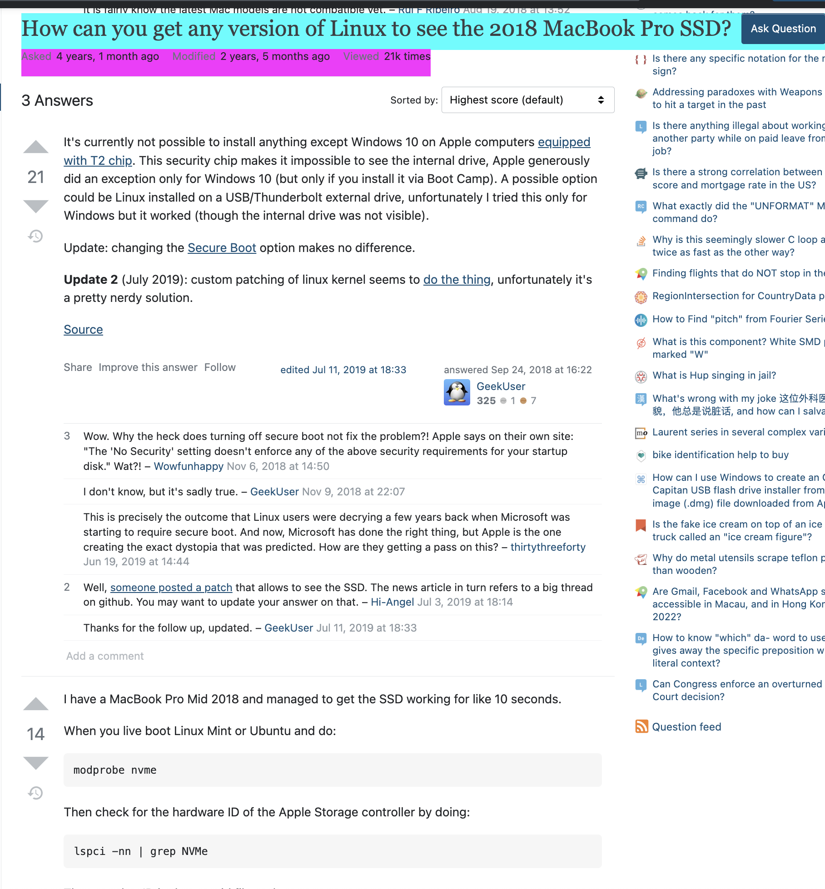

# mac + ubuntu 双系统

## refs

参考：[Installing Ubuntu on an external SSD drive on a Macbook – Floris van Breugel](https://florisvanbreugel.wordpress.com/2018/03/23/installing-ubuntu-on-an-external-ssd-drive-on-a-macbook/)

其中，解决Disk Utilities 没有分区选项：
- [No partition scheme option when erasing a USB disk in MacOS High Sierra? - Ask Different](https://apple.stackexchange.com/questions/304131/no-partition-scheme-option-when-erasing-a-usb-disk-in-macos-high-sierra)

其中，如何制作bootloader：

  推荐：
    - [Create a bootable USB stick on macOS | Ubuntu](https://ubuntu.com/tutorials/create-a-usb-stick-on-macos#7-boot-your-mac)
    - [balenaEtcher - Flash OS images to SD cards & USB drives](https://www.balena.io/etcher/)

  mac官方（不推荐）：
    - [How to create a bootable installer for macOS - Apple Support](https://support.apple.com/en-us/HT201372)`

## ubuntu无法读取mac的ssd

- [macintosh - How can you get any version of Linux to see the 2018 MacBook Pro SSD? - Unix & Linux Stack Exchange](https://unix.stackexchange.com/questions/463422/how-can-you-get-any-version-of-linux-to-see-the-2018-macbook-pro-ssd) said:

  
