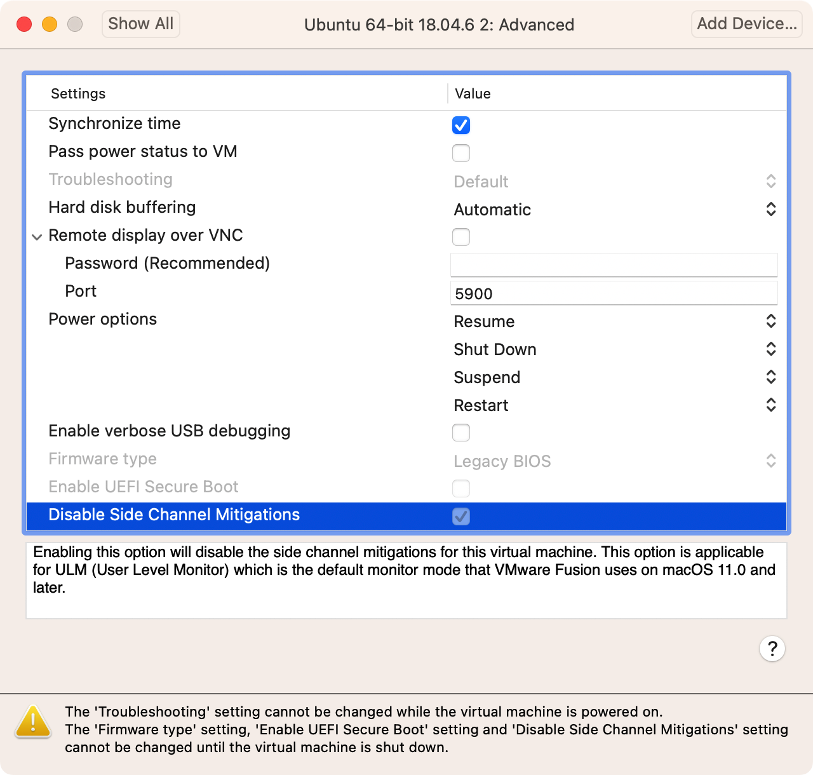

# ubuntu 18.04.6 LTS 虚拟机指南

## 1. 配置网络

比画面更要先配置，因为配置其他的大多数都要网络

测试网络通畅：（不要用`ping`，`ping`不等于实际网络效果，直接用火狐打开百度、谷歌测试）

### vpn桥接

只要把主机ip地址（`localhost`不行）与端口配置在http即可

  
 
如果不行的话，还要确定 vpn 软件是否开启了局域网

  

如此可以通过火狐上网。

### 环境变量配置

配置成 自动（wifi）模式后，再配置一下 proxy 和 deb source，即可使用apt

  

```sh
# change apt sources to speed up apt
sudo sed -i.bak -r  "s|deb \S+|deb http://mirrors.yun-idc.com/ubuntu/|g" /etc/apt/sources.list
```

```sh
# change proxy envs
export PROXY=192.168.1.246:7890
export proxy=$PROXY
export https_proxy=$PROXY

sudo apt update
sudo apt upgrade
```

## 配置界面

首先是虚拟机界面，确保开启了 retina 选项：

  

其次retina一般要对应放缩比例（为2），但启用这个需要重新装一下 `vm-tools`：

```sh
# ref: https://askubuntu.com/a/824341/1629991
sudo apt install open-vm-tools-desktop
```

:::tip
设置界面的这个 `(Re)Install Vmware Tools` 是没用的，可以无视

  

重要的是要在命令行里安装 `open-vm-tools-desktop`
:::

理论上无需重启，不然的话，再配置一下以下，然后重启：

```sh
# ref: https://askubuntu.com/a/1313971/1629991
gsettings set org.gnome.desktop.interface scaling-factor 2

# ref: https://askubuntu.com/a/1369571/1629991
gsettings set org.gnome.mutter experimental-features "['scale-monitor-framebuffer']"
```

## 配置复制粘贴

尽管我们已经在设置里启动了沙箱隔离里复制粘贴、拖拽选项：

  

但我们实际上还是不能正常使用剪切板等功能的（即使是在安装了`open-vm-tools-desktop`之后）：

  

解决办法是在安装了`open-vm-tools-desktop`之后，重启一下！（这个必须重启了）

  

## 配置sudo免密

```sh
echo "$USER ALL=(ALL:ALL) NOPASSWD: ALL" | sudo tee -a /etc/sudoers.d/$USER
```

## 安装常用命令行

```sh
sudo apt install -Y git curl wget terminator zsh vim tmux htop
```

### 配置 `oh-my-zsh`

```sh
# `curl, git` needs
sh -c "$(curl -fsSL https://raw.github.com/ohmyzsh/ohmyzsh/master/tools/install.sh)"
```

### 配置 `vim-plug`

TODO: 

## 磁盘共享

### from host to remote

- best recommended: https://askubuntu.com/a/1051620/1629991
- more fundamental one: https://kb.vmware.com/s/article/60262

### TODO: from remote to host

see:

- [via ` Disk Internal's Linux Reader (windows only)`](https://superuser.com/a/1077650/1365851)
- https://superuser.com/questions/67636/vmware-workstation-how-to-access-the-virtual-disk-from-the-host-system

## 性能优化

### 磁盘：关闭测通道缓冲

  

### 磁盘：开启 `IOMMU`

  
