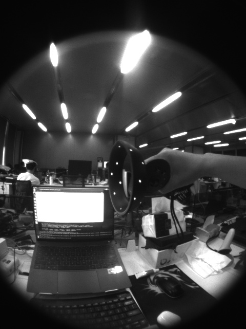

# A01: recognize lights

## 目标

给定使用 vr 眼镜拍摄的手柄的图片，识别图像中的灯环。

其中，灯环会发可见光，手柄为黑色，sample 如下：



## 目标一：灯环标定

金天推荐了 `labelme`（基于 `pyqt`） 和 `labelimage`（基于web），研究了一下，`labelme` 使用起来还行。

不过 `labelme` 直接用 `brew` 安装，会无法运行，用 `pip` 则没问题。

### usage

```sh
# usage
labelme xxx # xxx 为文件或者文件夹

# sample
labelme /Users/mark/work@arpara/SLAM/slam_research_datasets/hp_handheld-0720
```

### result

`/Users/mark/work@arpara/SLAM/slam_research_py/src/scripts/img_cropViaPolyline.py` 里包含了基于json格式polyline数据进行抠图与拼图的实现。

```sh
cd /Users/mark/work@arpara/SLAM/slam_research_py
source venv/bin/activate
python src/scripts/img_cropViaPolyline.py
```

## 目标二：算法测试

### 标定评估

可以先算出polyline的最小外接圆，然后得到其中心点坐标与半径，从而基于这两个维度去计算误差。

当然，更好一点的方案，是求其最小外接椭圆。

### 如何从图像中提取某个特定形状与特征的目标

 
