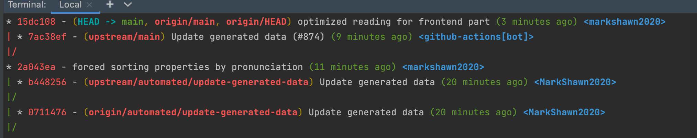
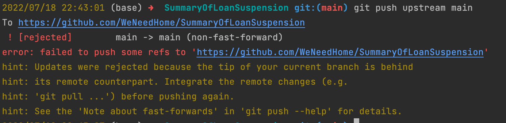
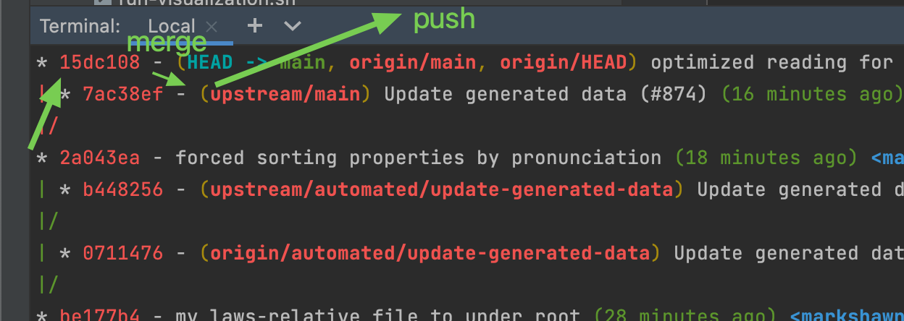
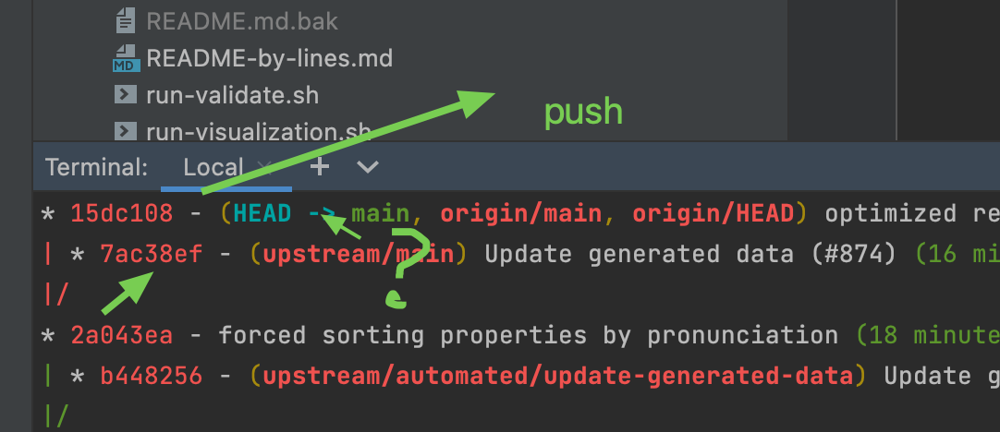
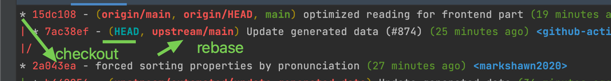

# git-howto

## improve git pull speed

### resolution 1: config proxy (vpn required)

how to config:

```sh
HTTP_PROXY=localhost:7890
git config --global http.proxy HTTP_PROXY
git config --global https.proxy HTTP_PROXY
```

confirm config:


config result:


### resolution 2: change url

`github.com` --> `github.com.cnpmjs.org`

ref:

- [(19 封私信 / 61 条消息) git clone 一个 github 上的仓库，太慢，经常连接失败，但是 github 官网流畅访问，为什么？ - 知乎](https://www.zhihu.com/question/27159393)

## improve terminal speed (lagged/delayed by git)

```sh
git config --add oh-my-zsh.hide-status 1
git config --add oh-my-zsh.hide-dirty 1
```

## git auth

### gitlab 每次都要输入密码的解决方案

分两步解决，首先要把自己的 ssh 公钥加入到 gitlab 用户配置里。

其次，还要设置远程仓库为 git 链接，而非 http（私库）。

```sh
# step 1. generate ssh-key if not exist
ssh-keygen -t rsa -C "shawninjuly@gmail.com" -b 4096

# step 2. show the ssh-public-key if generated
cat ~/.ssh/id_rsa.pub

# step 3. copy it into gitlab user settings

# step 4. test connection
ssh -T git@192.168.0.237
# Welcome to GitLab, @markshawn!

# step 5. set repo url to be git format (init first)
git remote set-url origin git@192.168.0.237:markshawn/hmdservice.git
```

ref:

- [Readme · Ssh · Help · GitLab](http://192.168.0.237/help/ssh/README#generating-a-new-ssh-key-pair)

### official password and authentication

ref:

### FIXED: `GitHub does not provide shell access`

Just change the remote url from `https` to `git`:

```text
raw:  https://github.com/arpara-vr/arpara-timewarp.git
then: git@github.com:arpara-vr/arpara-timewarp.git
```

```sh
git remote set-url origin git@github.com:arpara-vr/arpara-timewarp.git
git push
```

ref:

- [(1 条消息) 解决 git 连接问题: You‘ve successfully authenticated, but GitHub does not provide shell access.\_z 向前的博客-CSDN 博客](https://blog.csdn.net/weixin_42562387/article/details/114443451)

## git merge

### resolution 1

background:

本来想在`surfaceflinger`下操作全部 git 的，结果发现最后还是要动到外面的`renderengine`。


之前是在`native`下进行 git 管理的，这本来很 ok，后来因为景喆/西瓜的 `hmdservice` 放了进来，导致 git 一下就脏了，所以才想到与它的 service 隔离，缩小到 surfaceflinger 范围。

现在发现不可行，不过正好 `hmdservice` 已经让博文去搞了，所以我又可以了，那就还是在 `native` 下管理，可是现在 `surfaceflinger` 下已经有几个 commit 了，所以就涉及到迁移/合并问题。


resolution:

~~这里是否可以把 Bproject 设成/path/to/B 呢？这样是不是就不用生成新的文件夹了？~~

update：不是，跳过`git read-tree`步骤就可以。

```sh
git remote add -f Bproject /path/to/B
git merge -s ours --no-commit --allow-unrelated-histories Bproject/master
# git read-tree --prefix=dir-B/ -u Bproject/master
git commit -m "Merge B project as our subdirectory"
# git pull -s subtree Bproject master
```

ref:

- [Merge a subdirectory of another repository with git](https://bneijt.nl/blog/merge-a-subdirectory-of-another-repository-with-git/)

- [Git merge submodule into parent tree cleanly and preserving commit history - Stack Overflow](https://stackoverflow.com/questions/23327701/git-merge-submodule-into-parent-tree-cleanly-and-preserving-commit-history)

### FIXME: resolution 2 (maybe can be merged with 1)

!!!warning 这种方法只适合合并 git 追踪的文件，这将很容易导致一些问题，因为那些不被追踪的文件没有合并进来，比如我的 VERSION.txt

If you want to merge project-a into project-b:

```sh
cd path/to/project-b
git remote add project-a /path/to/project-a
git fetch project-a --tags
git merge --allow-unrelated-histories project-a/master # or whichever branch you want to merge
git remote remove project-a
```

ref:

- [How do you merge two Git repositories? - Stack Overflow](https://stackoverflow.com/questions/1425892/how-do-you-merge-two-git-repositories)

- [Merging Two Git Repositories Into One Repository Without Losing File History – SaintGimp](https://saintgimp.org/2013/01/22/merging-two-git-repositories-into-one-repository-without-losing-file-history/)

## git rebase

通过 `glola` 可以发现，我们当前的版本，和 upstream 从 2a043ea 开始产生了分歧：



所以此时推 upstream 是会被拒绝的，例如：



而 git 默认的提示是 使用 `git pull`，也就是先把最新的 upstream 拉下来，这其实就是一个 `merge` 的操作。

当我们这样做之后，等于是我们消化了 upstream，等我们改完冲突之后再 push 时，分支树就类似这样走：



但其实，这并不是最优雅的动作，因为为了解决你和 upstream 之间的这个 `merge` 问题，你似乎往回走了一步 （俗称非线性）。

有一种办法可以让整个流程看起来更顺畅，那就是想方设法变成从 upstream 通向你：



这就是 `rebase`。

`rebase` 是一个捏造词，也就是字面意义，重新 base 的意思，base 就是选择一个基底，按照我们的要求，我们只要选择 upstream 作为基底即可。

要使用 `rebase` 我们得先回到分叉口（或之前）：

```sh
git checkout 2a043ea # 查询 git log 得知的分叉口
```

然后 `rebase` 到 upstream：

```sh
git rebase upstream/main
```



## `git apply/am` (git patch)

### git patch workflow

ref:

- [How to apply a patch generated with git format-patch? - Stack Overflow](https://stackoverflow.com/questions/2249852/how-to-apply-a-patch-generated-with-git-format-patch)

- [Git - git-apply Documentation](https://git-scm.com/docs/git-apply)

#### Step 1. 下载 patch 文件


#### Step 2. 解压


此时假设文件路径在 `FILE.diff`，工程路径为`frameworks/native/`

#### Step 3. （可选）显示有哪些文件会被改动

```sh
git apply --stat $FILE.diff
```

#### Step 4. 检测 patch 是否可行

```sh
git apply --check $FILE.diff
```

如果没有输出，说明可行。

否则，说明此 patch 不可行，可能缺少之前的 patch 步骤

#### Step 5.1 `git am --signoff < `

```sh
git am --signoff < $FILE.diff
```

该命令也许会有一些 warning，但都是编码质量方面的，只要 check 那步没问题这一步就没问题。

打完之后，不放心可以打开某几个文件检查一下，看看代码是否修改成功。

#### step 5.2 `git apply -3 ` (solving error: `fatal: empty ident name (for \<\>) not allowed`)

```sh
git apply --reject PATCH_FILE
git apply -3 PATCH_FILE
```


> ref

- [Getting 'fatal: empty ident name not allowed' when doing 'Git commit --amend' - Stack Overflow](https://stackoverflow.com/questions/43662048/getting-fatal-empty-ident-name-not-allowed-when-doing-git-commit-amend/43662115)

- [github - git : empty ident name (for \<\>) not allowed - Stack Overflow](https://stackoverflow.com/questions/41832926/git-empty-ident-name-for-not-allowed)

- ["git apply" gives error "does not match index" when a previous apply skips hunks - Stack Overflow](https://stackoverflow.com/questions/54719824/git-apply-gives-error-does-not-match-index-when-a-previous-apply-skips-hunks)

- [patch - What to do if git-am fails with "does not match index"? - Stack Overflow](https://stackoverflow.com/questions/3575712/what-to-do-if-git-am-fails-with-does-not-match-index)

### merge git patch files

ref:

- [svn - How to Merge multiple patch files? - Stack Overflow](https://stackoverflow.com/questions/1818965/how-to-merge-multiple-patch-files)

#### Step 1. download `combinediff`

- release url: [Index of /tim/data/patchutils/stable](http://cyberelk.net/tim/data/patchutils/stable/)

- target latest download url(2022-01-25): [patchutils-0.4.2.tar.xz](http://cyberelk.net/tim/data/patchutils/stable/patchutils-0.4.2.tar.xz)

#### Step 2. build `combinediff`

1. extract the `xxx.tar.xz`

2. `./configure && make && make install`

##### Step 3. use `combinediff`

```sh
# combine
combinediff FILE1.diff FILE2.diff > merged.diff

# interpolate FILE1 - FILE2
combinediff --interpolate FILE1.diff FILE2.diff > interpolate.diff
```

##### Usage of `combinediff --interpolate`

```sh
# drop all the only diffs in patch2
perl -i.bak -0pe "s|^only in patch2.*||smg" interpolate.diff

# drop a specific big diff
# if there is "+++", you should use "\"
perl -i.bak2 -0pe "s|reverted:
--- b/services/surfaceflinger/HmdType6DistortionMesh.cpp.*?(?=reverted)||smg" interpolate.diff

# check the size difference of `xx | xx.bak | xx.bak2`
l | grep interpolate

# show the html
# ref: https://github.com/rtfpessoa/diff2html-cli#setup
diff2html -i file  --style side -- interpolate.diff
```

## `git submodule`

ref:

- [Git Submodule 介紹與使用 - 小惡魔 - AppleBOY](https://blog.wu-boy.com/2011/09/introduction-to-git-submodule/)

- [Git Submodule 介紹與使用 - 小惡魔 - AppleBOY](https://blog.wu-boy.com/2011/09/introduction-to-git-submodule/)

- [(23 条消息) git 中 submodule 子模块的添加、使用和删除\_guotianqing 的博客-CSDN 博客\_git 子模块](https://blog.csdn.net/guotianqing/article/details/82391665)

### config submodule

```sh
(.pyenv) ➜  mark_keeps_learning git:(master) ✗ cat .gitmodules                                                                  [23-01-22 | 5:39:31]
[submodule "whats-the-best-to-learn"]
        path="whats-the-best-to-learn"
        url="https://github.com/whats-the-best/whats-the-best-to-learn"
```

### init and push submodule

```sh
git submodule init

git push
```

### add submodule

```sh
git submodule add URL PATH
```

## `git commit`

### git remove a specific from specific commits

#### conclusion

```sh
FILE="XXX"

git reset --soft HEAD^
git reset HEAD $FILE
git rm -- cached $FILE
git commit --amend
```

#### detail

```sh
# step 1. stage all the committed files
git reset --soft HEAD^

# step 2. remove file from staging area
git reset HEAD <FILENAME>

# step 3. rm file from cached
git rm -- cached <FILENAME>

# step 4. re-commit
git commit --amend
```

ref:

- core ref: [How to Remove a File from Commit in Git](https://www.makeuseof.com/git-remove-file-from-commit/)

- :x: bad ref: [How To Remove Files From Git Commit – devconnected](https://devconnected.com/how-to-remove-files-from-git-commit/)

### git remove specific file from history

```sh
# solution 1. using `git filter-branch`
git filter-branch --force --index-filter 'git rm --cached --ignore-unmatch <path to the file or directory>' --prune-empty --tag-name-filter cat -- --all

# solution 2. using `git filter-repo`
pip3 install git-filter-repo
git filter-repo --path <path to the file or directory> --invert-paths
```

ref:

- core ref: [github - How to remove file from Git history? - Stack Overflow](https://stackoverflow.com/questions/43762338/how-to-remove-file-from-git-history)

### git merge commits (reset)

ref:

- [rebase - Squash my last X commits together using Git - Stack Overflow](https://stackoverflow.com/questions/5189560/squash-my-last-x-commits-together-using-git#)

#### Step 1. reset

```sh
# this would reset to before the SHA_ID (i.e. keep the SHA_ID, but remove all the commits before)
git reset --soft SHA_ID && git commit
```

#### Step 2. push

```sh
# since the commits are changed, the normal `push` won't help, you need to use `--force`
git push -f
```

### git commit amend

!!!warning Use the `git commit --amend` only when files are not changed, otherwise use a new commit and use the `git reset --soft ` if need to merge the history commits.

```sh
git commit --amend

git push -f
```

ref:

- [How do I push amended commit to the remote Git repository? - Stack Overflow](https://stackoverflow.com/questions/253055/how-do-i-push-amended-commit-to-the-remote-git-repository)

### generate diff file from commit

```sh
# check sha
git log --oneline

# generate diff
git diff <commit-sha> -p

# generate diff to file
git diff COMMIT_SHA -p > DIFF_FILE
```

ref:

- [Generate diff file of a specific commit in Git - Stack Overflow](https://stackoverflow.com/questions/42357521/generate-diff-file-of-a-specific-commit-in-git/42357601)

## `git reflog`

### customized git reflog

```sh
git reflog --format="%C(auto)%h %<|(17)%gd %C(blue)%ci %C(reset)%an %C(green)%gs"
```

The core concept is at [Git - pretty-formats Documentation](https://git-scm.com/docs/pretty-formats), and I explored the following formats relatively satisfying.

1. `--oneline` for short and easy to remember

   ```sh
   git reflog --oneline
   ```

   

2. `--date=iso` for short and datetime display

   ```sh
   git reflog --date=iso
   ```

   

3. `--format="%h %gd %ci %gs"` for full info

   ```sh
   git reflog --format="%h %gd %ci %gs"
   ```

   

4. for alignment of HEAD, since it may be two-digit

   ```sh
   git reflog --format="%h %<|(17)%gd %ci %gs"
   ```

   

5. [RECOMMEND] for alignment and color print

   ```sh
   git reflog --format="%C(auto)%h %gd %C(blue)%ci %C(reset)%an %C(green)%gs"
   ```

   

6. with align

   ```sh
   git reflog --format="%C(auto)%h %<|(17)%gd %C(blue)%ci %C(reset)%an %C(green)%gs"
   ```

   I quite love this color scheme!

### clean reflog (unreachable)

```sh
git reflog expire --expire=90.days.ago --expire-unreachable=now --all
```

before clean:

There are a lot of reflog entries, and a lot of them are unreachable (just a record).

after clean:

It becomes clean.


ref:

- [purge - GIT - Remove old reflog entries - Stack Overflow](https://stackoverflow.com/questions/49067898/git-remove-old-reflog-entries)

### delete one specific reflog entry

```sh
git reflog delete SHA_ID
```

ref:

- [Git - git-reflog Documentation](https://git-scm.com/docs/git-reflog#_description)

## git diff

### only show file names

```sh
git diff XXX --name-only
```

- [Git: How to show only filenames for a diff - makandra dev](https://makandracards.com/makandra/15763-git-how-to-show-only-filenames-for-a-diff)

### set tab width to be 4

```sh
git config --global core.pager 'less -x1,5'
```


ref:

- [whitespace - How to change tab width in git diff? - Stack Overflow](https://stackoverflow.com/questions/39352644/how-to-change-tab-width-in-git-diff)

## show config info (global)

```sh
git config --list
```

It's same to run as:

```sh
cat ~/.gitconfig
```

## github cli

documentation:

[gh | GitHub CLI](https://cli.github.com/manual/gh)

usage sample:

- [Importing a Git repository using the command line - GitHub Docs](https://docs.github.com/en/github/importing-your-projects-to-github/importing-source-code-to-github/importing-a-git-repository-using-the-command-line)

## `git lfs`: About Erasing Large File Commit in the Git History

ref:

- [详解 Git 大文件存储（Git LFS） - 知乎](https://zhuanlan.zhihu.com/p/146683392)

- [Git LFS - large file storage | Atlassian Git Tutorial](https://www.atlassian.com/git/tutorials/git-lfs)

- [git - LFS upload missing objectt but the file is there - Stack Overflow](https://stackoverflow.com/questions/52612880/lfs-upload-missing-objectt-but-the-file-is-there)

- [Projects API | GitLab](https://docs.gitlab.com/ee/api/projects.html#edit-project)

### Conclusion

#### clear commands

!!!warning 1. 注意`grep`不支持强化正则，比如 positive/negative lookahead/lookbackward，以及$这些 2. 如果一定要使用这些，推荐尝试`perl`或者`awk`

```sh
EXCLUDE_RE="life/王者荣耀"

# 有时需要加 `-f` 参数
# 删除全部
git filter-branch --prune-empty --index-filter "git rm --cached -rf --ignore-unmatch ${EXCLUDE_RE}"  --tag-name-filter cat -- --all
# 删除从某个commit到ref（比如HEAD）
git filter-branch -f --prune-empty --index-filter "git rm --cached -rf --ignore-unmatch ${EXCLUDE_RE}"  --tag-name-filter cat $COMMIT_ID...HEAD
```

执行成功后将会有修改记录输出，如下：


#### check if file exists in history

```sh
git log --graph --decorate --pretty=oneline --abbrev-commit --all --name-status  | grep -E ${EXCLUDE_RE}
```

#### check log history

```sh
git lola
```

#### push if ok

```sh
git push
```

### PR: update to use git filter-repo

### Details

这个问题的原因找到了，就在于我曾经 add 了大文件，然后又 delete 了，虽然文件已经不在了，最新的 commit 里也没有这个文件了，但是 history 里有，于是 git 不允许我 push commit，要么我采取 lfs（large file storage）的方法，要么想办法把这个记录从 history 里删掉:

```sh
git log --graph --decorate --pretty=oneline --abbrev-commit --all --name-status  | grep -E "Electron Framework$|^\*"
```


最后用这个命令，把 git history 中所有与那个大文件相关的（即 node_modules 文件夹）都删除就可以了：

```sh
git filter-branch --prune-empty -d ~/temp \
--index-filter "git rm --cached -rf --ignore-unmatch mark_learns_coding/JS/MarkLearningWebpack/demo7/node_modules"  \
--tag-name-filter cat -- --all
```


Acknowledgement: 非常感谢 stackoverflow 大佬专业又详细的回答，没有大佬的解答，我可能又要耗费一个通宵才能解决这个相对比较罕见的问题了：https://stackoverflow.com/a/2158271/9422455

另外，他使用的`git lola`很有用，需要在`~/.gitconfig`文件中加入以下：

```yaml
# git lola | Conrad Parker, http://blog.kfish.org/2010/04/git-lola.html
[alias]
        lol = log --graph --decorate --pretty=oneline --abbrev-commit
        lola = log --graph --decorate --pretty=oneline --abbrev-commit --all
[color]
        branch = auto
        diff = auto
        interactive = auto
        status = auto%
```

这样就可以使用酷酷的`git lola`命令了（可以显示历史变动情况），如果加上`git lola --name-status`之后还可以看到每次 git 会对哪些文件产生怎样的影响，非常好用！

ref:

- [Git - git-log Documentation](https://git-scm.com/docs/git-log)
- [git lola | Conrad Parker](http://blog.kfish.org/2010/04/git-lola.html)
- [version control - How to remove/delete a large file from commit history in the Git repository? - Stack Overflow](https://stackoverflow.com/questions/2100907/how-to-remove-delete-a-large-file-from-commit-history-in-the-git-repository)
- [About large files on GitHub - GitHub Docs](https://docs.github.com/en/repositories/working-with-files/managing-large-files/about-large-files-on-github)

## git cancel `reset --hard`

```sh
git reflog # to show the hashId list, select one

git reset --hard HASH-ID
```


ref:

- [version control - How can I undo git reset --hard HEAD~1? - Stack Overflow](https://stackoverflow.com/questions/5473/how-can-i-undo-git-reset-hard-head1)

## git pull --ff-only

> With git pull --ff-only, Git will update your branch only if it can be “fast-forwarded” without creating new commits. If this can’t be done, git pull --ff-only simply aborts with an error message. You can configure your Git client to always use --ff-only by default, so you get this behavior even if you forget the command-line flag:

git config --global pull.ff only ref: https://stackoverflow.com/a/62653400/9422455

## git exclude `.gitignore` file

```sh
echo .gitignore >> .git/info/exclude
```

ref:

- core ref: [git - How can I stop .gitignore from appearing in the list of untracked files? - Stack Overflow](https://stackoverflow.com/questions/767147/how-can-i-stop-gitignore-from-appearing-in-the-list-of-untracked-files)
