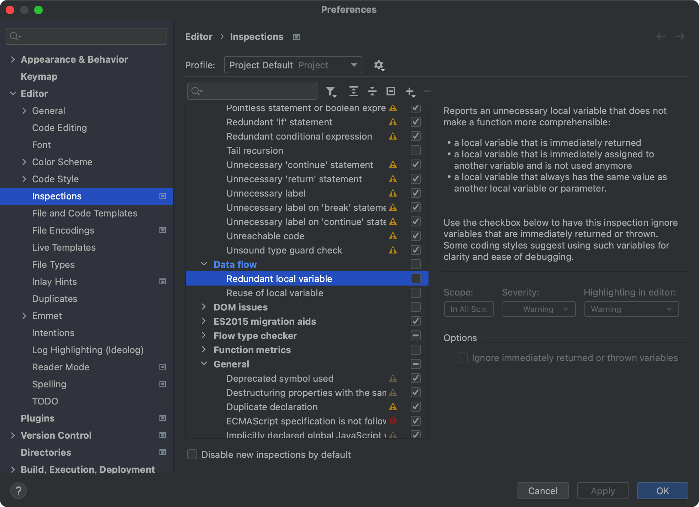
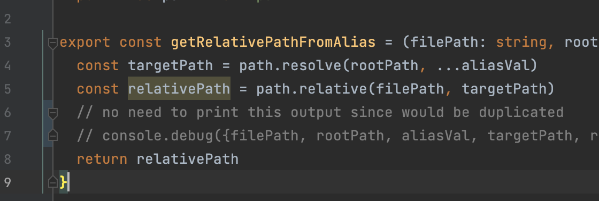
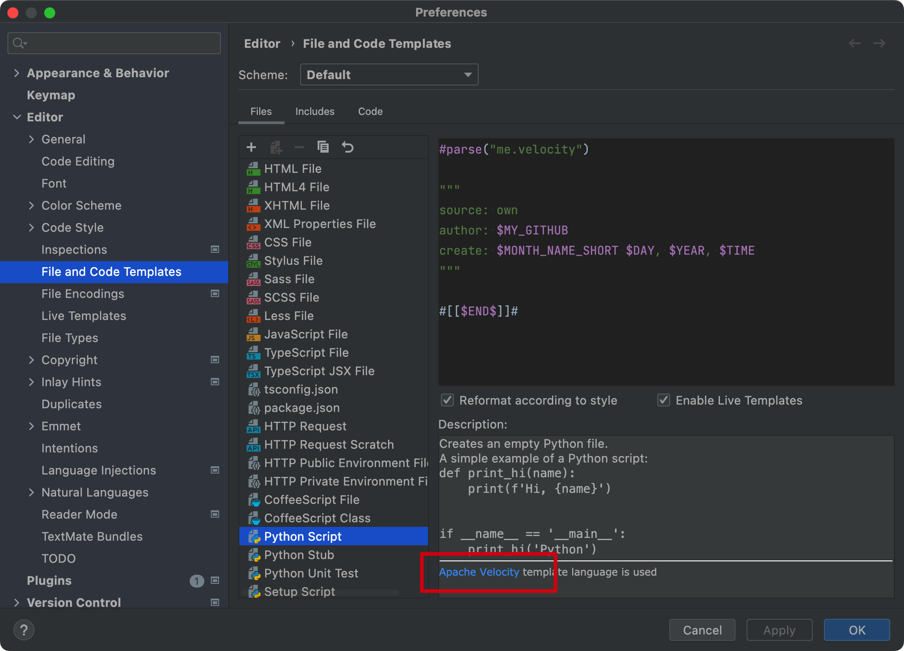
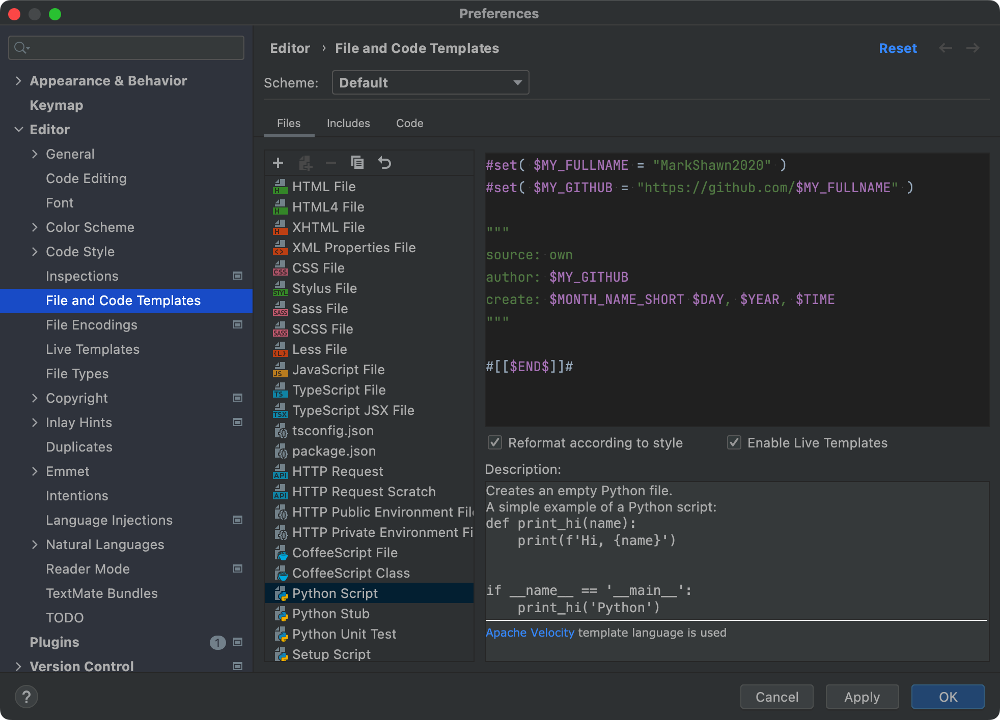
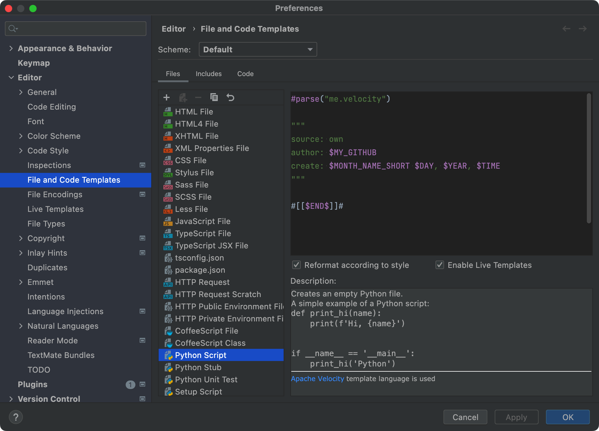
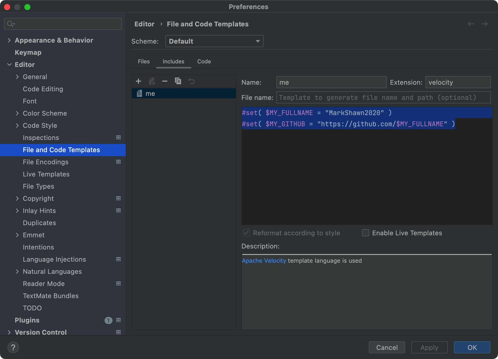

# jetbrains-howto

## my recommended configuration

### uncheck inspection on `redundant local variable`

config:

  

reason: 方便随时开合一些程序逻辑，inline不方便

  

if not:

  

## how to customize file template

:::warning
jb 的 `file template` 与 `live template` 是两套不同的体系，在 `live template` 中可以使用 `EDIT VARIABLES` 去自定义变量，但在 `file template` 中基于 `velocity` 语法，实现方式是不一样的，具体见下文。
:::

打开文件模板可以看到有个 [`Apache Velocity`](https://velocity.apache.org/engine/devel/user-guide.html) 的超链接，它表示 jb 的文件模板是基于 Velocity 这门语言的：

  

### 有哪些 jb 预定义的变量

参考：[File template variables | IntelliJ IDEA](https://www.jetbrains.com/help/idea/file-template-variables.html)

有：

  

值得注意的是，没有现成的 `YYYY-MM-DD` 格式的日期。如果需要的话，需要用 `velocity` 语法去实现。

### 如何在单文件定义变量

  

### 如何引用其他文件

直接把 `#set` 的部分拆出去，然后用 `#parse` 导入即可，不能用 `#include`，因为 `#include` 只是纯文本导入，而 `#parse` 可以解析。

  

  

## inspection on `suspicious.name.assignment`

官方解释：[Code Inspection: Suspicious variable/parameter name combination | PhpStorm](https://www.jetbrains.com/help/phpstorm/javascript-and-typescript-suspicious-variable-parameter-name-combination.html)

stackoverflow 的讨论 [java - IntelliJ says, should probably not be passed as parameter x - Stack Overflow](https://stackoverflow.com/questions/34379580/intellij-says-should-probably-not-be-passed-as-parameter-x)

指点的 jb 源码： [intellij-community/SuspiciousNameCombinationInspectionBase.java at 210e0ed138627926e10094bb9c76026319cec178 · JetBrains/intellij-community](https://github.com/JetBrains/intellij-community/blob/210e0ed138627926e10094bb9c76026319cec178/java/java-analysis-impl/src/com/intellij/codeInspection/suspiciousNameCombination/SuspiciousNameCombinationInspectionBase.java)

## nbsp 空格显示设置

see: - [2020.2 showing |NBSP| – IDEs Support (IntelliJ Platform) | JetBrains](https://intellij-support.jetbrains.com/hc/en-us/community/posts/360009442799-2020-2-showing-NBSP-)

在`Help | Find Action | Registry | editor.show.special.chars`里设置。

选择显示时的效果：


选择不显示时的效果：


## jetbrains 各版本下载链接生成脚本

```py
def gen_download_url(software="webstorm", name="WebStorm", version="2020.3.3", suffix="exe"):
    """
    download page (webstorm as the example): https://www.jetbrains.com/webstorm/download/other.html
    software: {pycharm, webstorm, ...}
    suffix: {exe, dmg}
    """
    url_pycharm_professional = "https://download-cdn.jetbrains.com/python/pycharm-professional-2020.3.5.dmg"
    url_webstorm = "https://download-cdn.jetbrains.com/webstorm/WebStorm-2020.3.3.exe"
    return f"https://download-cdn.jetbrains.com/{software}/{name}-{version}.{suffix}"
```

## BEST-PRACTICE: jetbrains version manage

### 1. the plugin of `eval restart`

plugin repo: https://plugins.zhile.io

plugin name: 'IDE Eval Reset'


### 2. the approach to manage versions

Download the toolbox at here: [JetBrains Toolbox App: Manage Your Tools with Ease](https://w ww.jetbrains.com/toolbox-app/)

And then download or uninstall specific versions of jetbrains products.

For example, since the hack plugin of `eval start` (which allows you to use jetbrains product periodically freely) won't support the versions of webstorm after 2021.2, we can easily download the old version in toolbox.


ref:

- [JetBrains 全系列软件激活教程激活码以及 JetBrains 系列软件汉化包](https://www.macwk.com/article/jetbrains-crack)

- [ide - How to downgrade IntelliJ to older version - Stack Overflow](https://stackoverflow.com/questions/18519560/how-to-downgrade-intellij-to-older-version)

## improve jetbrains efficiency

1. Disable all unnecessary plugins
2. Increase memory for IntelliJ IDEA [Help / Change memory settings]
3. Exclude folders and Unload modules
4. Disable on-the-fly import management
5. Pause inspections check


reference:

- [Simple Steps for Improving Your IDE Performance | The Kotlin Blog](https://blog.jetbrains.com/kotlin/2021/06/simple-steps-for-improving-your-ide-performance/)
