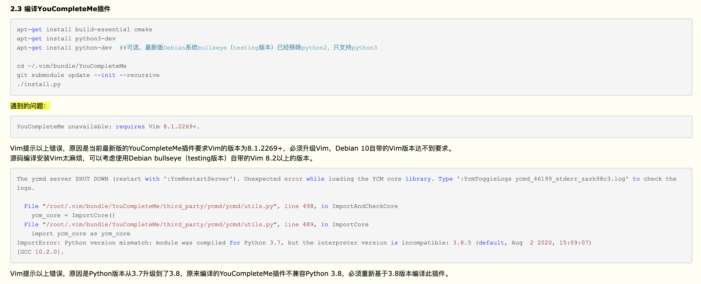
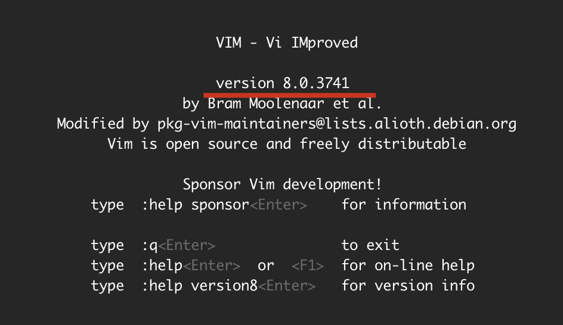
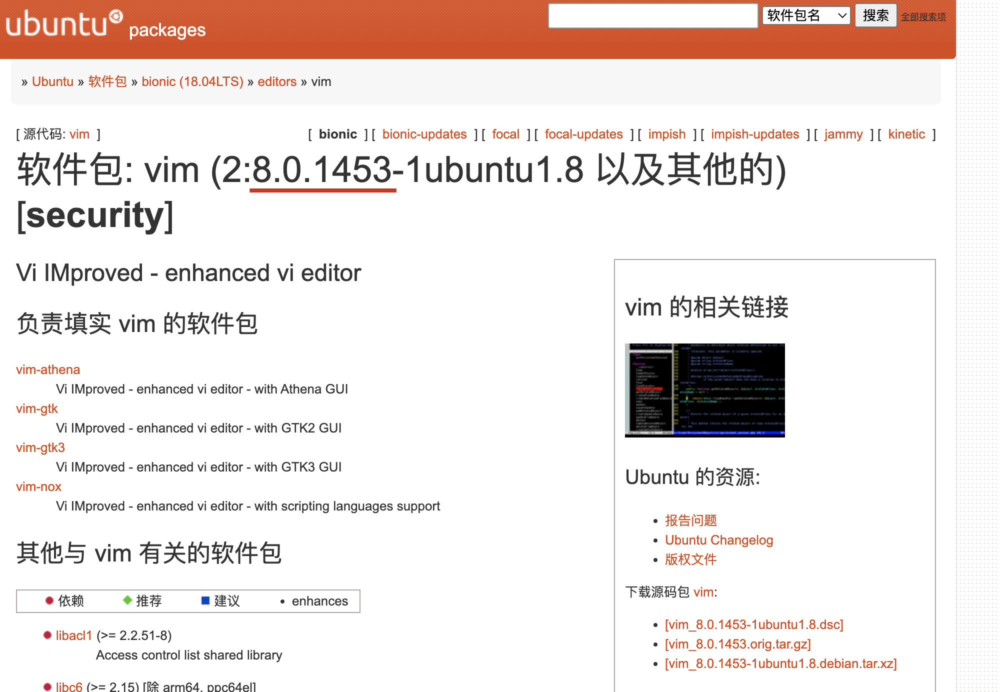

## init/config vim

### vim plugin: `Vundle`

ref:

- [VundleVim/Vundle.vim: Vundle, the plug-in manager for Vim](https://github.com/VundleVim/Vundle.vim#about)

### color scheme: `monokai`

```sh
mkdir -p ~/.vim/colors
curl https://raw.githubusercontent.com/sickill/vim-monokai/master/colors/monokai.vim > ~/.vim/colors/monokai.vim

echo "syntax enable
colorscheme monokai" >> ~/.vimrc
```

ref:

- [sickill/vim-monokai: Monokai color scheme for Vim converted from Textmate theme](https://github.com/sickill/vim-monokai)

### vim plugin: `file-line`: go/jump to line after name

```vim
Bundle 'bogado/file-line'
```

ref:

- [bogado/file-line: Plugin for vim to enabling opening a file in a given line](https://github.com/bogado/file-line)

### autocomplete support: `YouCompleteMe`

```sh
# !IMPORTANT: config proxies for installing YouCompleteMe
PROXY=http://localhost:7890
HTTP_PROXY=$PROXY
HTTPS_PROXY=$PROXY
GOPROXY=$PROXY
NPM_CONFIG_PROXY=$PROXY
NPM_CONFIG_REGISTRY=http://registry.npmmirror.com

# mac only, or installing `macvim`
    brew install python # !IMPORTANT: change default python to be python3 under `/usr/local/bin` instead of python2 under `/usr/bin`, if it doesn't work with `python -V`, resetting `$PATH` may be helpful!

# linux only
    sudo apt install -y build-essential cmake vim-nox python3-dev
    sudo apt install -y mono-complete golang nodejs default-jdk npm

git clone https://github.com/ycm-core/YouCompleteMe ~/.vim/bundle/YouCompleteMe
cd ~/.vim/bundle/YouCompleteMe
git submodule update --init --recursive

python3 install.py --all --verbose

echo "Bundle 'ycm-core/YouCompleteMe'" >> ~/.vimrc
```

ref:

- [ycm-core/YouCompleteMe: A code-completion engine for Vim](https://github.com/ycm-core/YouCompleteMe#linux-64-bit)

- [VIM and Python – A Match Made in Heaven – Real Python](https://realpython.com/vim-and-python-a-match-made-in-heaven/)

- [YouCompleteMe unavailable: requires Vim compiled with Python (3.6.0+) support - Stack Overflow](https://stackoverflow.com/questions/65413685/youcompleteme-unavailable-requires-vim-compiled-with-python-3-6-0-support)

#### bugfix: `No .ycm_extra_conf.py file detected. #415`

problem: 用`vim`打开某个 C++文件时，最底部会有一行红的报错，提示`No .ycm_extra_conf.py file detected.`（但又不影响代码阅读，因为代码还是高亮的），然后操作鼠标或者键盘后，该行又消失。

resolution: 搜了一下，重新“安装”一下`YouCompleteMe`就好。

```sh
cd ~/.vim/bundle/YouCompleteMe
python3 install.py
```


see: - [No .ycm_extra_conf.py file detected. · Issue #415 · ycm-core/YouCompleteMe](https://github.com/ycm-core/YouCompleteMe/issues/415)

### Add custom input

#### Add date input

```vim
" https://stackoverflow.com/questions/56052/best-way-to-insert-timestamp-in-vim
nmap <F3> i<C-R>=strftime("%Y-%m-%d %a %I:%M %p")<CR><Esc>
imap <F3> <C-R>=strftime("%Y-%m-%d %a %I:%M %p")<CR>
```

#### Add arpara signature input

```vim
nmap <F3> i<C-R>=strftime("ARPARA:markshawn@%Y/%m/%d: ")<CR><Esc>
imap <F3> <C-R>=strftime("ARPARA:markshawn@%Y/%m/%d: ")<CR>
```

### Add edit control

```vim
filetype plugin indent on
" show existing tab with 4 spaces width
set tabstop=4
" when indenting with '>', use 4 spaces width
set shiftwidth=4
" On pressing tab, insert 4 spaces
set expandtab
```

ref:

- [whitespace - Tab key == 4 spaces and auto-indent after curly braces in Vim - Stack Overflow](https://stackoverflow.com/questions/234564/tab-key-4-spaces-and-auto-indent-after-curly-braces-in-vim)

### Add display control

```vim
" show tabs as characters
set list
```

ref:

- [whitespace - Displaying tabs as characters - Vi and Vim Stack Exchange](https://vi.stackexchange.com/questions/422/displaying-tabs-as-characters)

## diff2html

ref: - [diff to html (diff2html) program - Stack Overflow](https://stackoverflow.com/questions/641055/diff-to-html-diff2html-program)

### recommended html render solution of `diff2html-cli` based on `npm`

ref: - [rtfpessoa/diff2html-cli: Pretty diff to html javascript cli (diff2html-cli)](https://github.com/rtfpessoa/diff2html-cli#readme)

```sh
# Step 1. install `diff2html-cli` based on `npm` (`npm` required)
npm i -g diff2html-cli

# Step 2. render

## usage 1. render `xxx.diff` file into temp file (auto open default)
FILE=xxx.diff
diff2html -i file -- $FILE

## usage 2. render `xxx.diff` file into local file (not auto open default)
FILE=xxx.diff
diff2html -i file -F $FILE.html -- $FILE
```


### a simpler solution to have a look at basic html style (based on vim)

```sh
FILE=xxx.diff
vim $FILE -c TOhtml -c ":saveas $FILE.vim.html" -c ":q" -c ":q"
```


### gerrit render effect

#### under file list view


ref: - [Change Ia9f7b656: merge from rk3399 | 192.168 Code Review](http://192.168.0.241:8080/#/c/479/)

#### under file content view


!!!tip Drawbacks of viewing diff on gerrit: 1. there is bug to scroll the page and affects the experience deeply. 2. since the list and the content view are separate, you need to manually switch between files, which is inflexible, comparing to the `diff2html-cli` solution of [recommended html render solution of `diff2html-cli` based on `npm`](#recommended-html-render-solution-of-diff2html-cli-based-on-npm)

ref: - [SurfaceFlinger.h | 192.168 Code Review](http://192.168.0.241:8080/#/c/479/1/services/surfaceflinger/SurfaceFlinger.h)

## copy selected lines to clipboard

In my mac, I can use `shift + V` then `:w !pbcopy`, but I found it invalid in ubuntu.

After a little search, I am suggested to install `xclip` and then I can use `shift + V` then `:w !xclip`.

TODO: Also, it introduced the GNU vim for ease, which deserves me to have a try 【允许我 yank 到全局剪切板，这样我按 y 就有了】.


see:

- [How to copy selected lines to clipboard in vim - Stack Overflow](https://stackoverflow.com/questions/9166328/how-to-copy-selected-lines-to-clipboard-in-vim#:~:text=Press%20Shift%20v%20to%20enter%20visual%20mode.,-Press%20%E2%86%93%20to&text=Press%20Ctrl%20c%20to%20copy,system%20clipboard%20text%20to%20vim.)

- [How can I copy text to the system clipboard from Vim? - Vi and Vim Stack Exchange](https://vi.stackexchange.com/questions/84/how-can-i-copy-text-to-the-system-clipboard-from-vim)

## how to delete from current position to the end of line

```sh
# resolution 1. general
d$

# resolution 2. synonym
D
```

> ref

- [vim - Delete from cursor to end of line in `vi` - Unix & Linux Stack Exchange](https://unix.stackexchange.com/questions/4415/delete-from-cursor-to-end-of-line-in-vi)

## how to force tab to be spaces (so that the git diff won't have errors)

```vim
" ref: https://vim.fandom.com/wiki/Converting_tabs_to_spaces
" ref: https://stackoverflow.com/questions/234564/tab-key-4-spaces-and-auto-indent-after-curly-braces-in-vim
filetype plugin indent on
:set expandtab
:set tabstop=4
:set shiftwidth=4
```

## how to filter matched lines

ref:

- [search - How to show only matching lines? - Vi and Vim Stack Exchange](https://vi.stackexchange.com/questions/2280/how-to-show-only-matching-lines)

### resolution 1. just to display (no buffer)

```vim
:g/PATTERN
```

### resolution 2. write into current files

```vim
" `m` means move, `0` means the head
:g/PATTERN/m0

" `$` means the end
:g/PATTERN/m$
```

### BEST-PRACTICE: resolution 3. open a new vim window

```vim
" 1. `%` means the current file, other files are also supported
" 2. this command would open matched lines in a new vim window (hidden)
:vim PATTERN %

" 1. `cw` is short for `cwindow`
" 2. it means to open the vim window
" 3. close the window via `cclose` or `ccl` for short
" 4. reopen the closed window via `cw` again
" 5. switch between window via `ctrl + w` then input arrow keys
:cw
```

## how to resize height and width

### resolution 1. use commands

```vim
" set the height to be 20 rows
:resize 20

" set the height to be 5 rows more
:resize +5

" set the height to be 10 rows less
:resize -10

" reset the height, i.e. set the hight to be highest possible
:resize "highest possible"

FIXME: set the width (the following one not work)
:vertical resize 10
```

ref:

- [Resize splits more quickly | Vim Tips Wiki | Fandom](https://vim.fandom.com/wiki/Resize_splits_more_quickly#:~:text=To%20increase%20a%20window%20to,%2C%20use%20Ctrl%2Dw%20%7C%20.&text=In%20Gvim%20and%20vim%20in,it%20into%20the%20desired%20direction.)

### resolution 2. use mouse

```vim
:set mouse=n
:set ttymouse=xterm2
```

And then we can hold on the split edge using mouse, and drag it to resize.

> :sparkles: 这一点，就跟我当初做字幕网时思考的东西是一样的！


ref:

- [How do I change the current split's width and height? - Vi and Vim Stack Exchange](https://vi.stackexchange.com/questions/514/how-do-i-change-the-current-splits-width-and-height)

## how to highlight line or column

> :sparkles:
>
> 1. `ctermXX`, the another type is `gui`(vim started via `gvim`), `cterm` controls what behaviors like in a vim started by terminal
> 2. to highlight column is similar to line, just to change the `cursorline` to be `cursorcolumn`

```vim
:hi cursorline ctermbg=darkgreen
```

1. `:hi` means highlight
2. `cursorline` means the line where the cursor is, so that `:hi cursorline` means to highlight an entire line
3. `ctermbg`, controls the background color, the general color string is supported, and my favorite one is `darkgreen`

ref:

- [Highlight current line | Vim Tips Wiki | Fandom](https://vim.fandom.com/wiki/Highlight_current_line#:~:text=Simply%20putting%20%3Aset%20cursorline%20in,highlight%20as%20the%20cursor%20moves.&text=With%20the%20default%20backslash%20leader,scrolling%20in%20a%20large%20file.)

- [How to control/configure vim colors | alvinalexander.com](https://alvinalexander.com/linux/vi-vim-editor-color-scheme-syntax/)

- [vim - what is the difference between cterm color and gui color? - Stack Overflow](https://stackoverflow.com/questions/60590376/what-is-the-difference-between-cterm-color-and-gui-color)

## mouse mode

```vim

" normal mode, 只支持鼠标点选切换焦点，不支持拖选区域，不支持系统自带右键
set mouse=n

" visual mode, 不支持鼠标点选切换焦点，支持拖选区域，支持系统自带右键
set mouse=v

" insert mode, 测试下来同visual mode
set mouse=i

" nvi mode, 支持鼠标点选（立即切换焦点），支持拖选区域（基于新的焦点为起点或终点），不支持系统自带右键
set mouse=nvi

" all mode, 测试下来同nvi
set mouse=a
```

> :sparkles: 推荐在 vim 中用`:h mouse`这种命令打开帮助菜单，显示效果很友好的，如图： 

ref:

- [Using the mouse for Vim in an xterm | Vim Tips Wiki | Fandom](https://vim.fandom.com/wiki/Using_the_mouse_for_Vim_in_an_xterm)

## vimdiff

### :white_check_mark: force `vimdiff` to wrap line

```vim
au VimEnter * if &diff | execute 'windo set wrap' | endif
```

ref:

- [vim - Forcing vimdiff to wrap lines? - Stack Overflow](https://stackoverflow.com/questions/16840433/forcing-vimdiff-to-wrap-lines)

### TODO: vimdiff show only differences

ref:

- [vimdiff / vim -d -- how to show only the differences and fold all identical lines? - Unix & Linux Stack Exchange](https://unix.stackexchange.com/questions/352199/vimdiff-vim-d-how-to-show-only-the-differences-and-fold-all-identical-line)

- [rickhowe/diffchar.vim: Highlight the exact differences, based on characters and words](https://github.com/rickhowe/diffchar.vim)

## bookmarks

```vim
" show all the marks (in normal mode)
:marks

" add mark (in normal mode)
mX

" jump mark (in normal mode)
`X

" delete marks (in normal mode, based on basic regex)
:delm X   " delm: delete marks

" clear all marks
:delmarks A-Z0-9
```

> usage


see:

- [How To Add Bookmarks Inside Vim Editor](https://www.thegeekstuff.com/2009/02/how-to-add-bookmarks-inside-vi-and-vim-editor/)

## files relative

### open other file

```vim
" open new file from current file
:e FILE_PREFIX<TAB>

" list buffer files
:ls

" choose next buffer file
:bn  " bn: buffer next
```

see:

- [vi - How to effectively work with multiple files in Vim - Stack Overflow](https://stackoverflow.com/questions/53664/how-to-effectively-work-with-multiple-files-in-vim#:~:text=You%20can%20say%20%3Atabe%20%5Bfilename,Vim%20even%20has%20graphical%20tabs.)

### copy between two vim files

```vim
:e ANOTHER_FILE (auto-complete support)
```

ref:

- [vim - Copy and paste content from one file to another file in vi - Stack Overflow](https://stackoverflow.com/questions/4620672/copy-and-paste-content-from-one-file-to-another-file-in-vi)

## how to update `vim`

ref:

- [What is the command in the terminal to update Vim on Ubuntu? - Ask Ubuntu](https://askubuntu.com/questions/406111/what-is-the-command-in-the-terminal-to-update-vim-on-ubuntu)

## multi-line insert under `visual mode`

1. `ctrl + v` into 'visual block' mode
2. `shift + i` into 'visual block insert' mode
3. input whatever I want (while only can see the realtime effect on first line)
4. `ESC` mark the modification has been done
5. `Enter` make the modification work

ref: recommend

- [vim Tutorial => Insert text into multiple lines at once](https://riptutorial.com/vim/example/7301/insert-text-into-multiple-lines-at-once)

## Copy-Paste in Vim

### copy paste of line

```vim
# copy line (yank)
y

# cut line (delete)
d

# paste after cursor (small case)
p

# paste before cursor (upper case)
P
```

### copy paste of selected

```vim
# select word (small case)
v

# select whole line (upper case)
V

# block(rectangular) select
ctrl + v

```

more:


> - [Copy, cut and paste | Vim Tips Wiki | Fandom](https://vim.fandom.com/wiki/Copy,_cut_and_paste)

- [meaning - Why does yank in vim mean copy? - English Language Learners Stack Exchange](https://ell.stackexchange.com/questions/14632/why-does-yank-in-vim-mean-copy)

### how to copy to clipboard

这篇提供了不少办法： https://stackoverflow.com/questions/3961859/how-to-copy-to-clipboard-in-vim#:~:text=In%20vim%20command%20mode%20press,and%20CMD%20%2B%20v%20to%20paste.

其中我最喜欢基于map的方案：https://stackoverflow.com/a/67890119/9422455

```vim
nnoremap Y "+y
vnoremap Y "+y
nnoremap yY ^"+y$
```

这个方案，在本地mac上测试通过，但是在公司服务器（ubuntu）上没有成功，就是没有进粘贴板，还没太明白。

## how to insert datetime

ref:

- [Insert current date or time | Vim Tips Wiki | Fandom](https://vim.fandom.com/wiki/Insert_current_date_or_time)

## column selection

Vim Tip: Select Column Put cursor and beginning of text to select. Press **\<CTRL-V\>** to begin select of the column. When you reach the end of your select, type '**\<c\>** ' Type the new text. Note that this will only replace the first instance. Now hit **\<ESC\>** . All the text has been changed!


ref:

https://sethmason.com/2007/09/27/vim-tip-select-column.html

## undo changes after file saved

There's persistent undo option in vim, :h persistent-undo Note: It was introduced in VIM 7.3 version, so for earlier versions, it will not work.

It can be turned on by placing following text in your `.vimrc`:

```vim
if has('persistent_undo')      "check if your vim version supports it
  silent !mkdir -p ~/.vim/undo
  set undofile                 "turn on the feature
  set undodir=$HOME/.vim/undo  "directory where the undo files will be stored
  endif
```

Note: Before enabling this option, whatever that was lost, remains lost. After enabling the option, you will be able to do subsequent undo/redo on whatever was added/deleted after enabling the option.

ref:

- [Vim undo: undo changes after file write - Stack Overflow](https://stackoverflow.com/questions/17936130/vim-undo-undo-changes-after-file-write)

## search for selected text


see:

- [How to search for selected text in Vim? - Super User](https://superuser.com/questions/41378/how-to-search-for-selected-text-in-vim)

## fold(collapse) and unfold(expand)

```vim
"~/.vimrc

set foldmethod=indent
set foldlevel=1
set foldclose=all
```

In-file Controls:

```yaml
zo: opens folds
zc: closes fold
zm: increases auto fold depth (collapse more)
zr: reduces auto fold depth (show more words)
zR: not fold (show the most words)
```


> ref

- [folding - Fold function in vim - Stack Overflow](https://stackoverflow.com/questions/2362914/fold-function-in-vim)

- [Folding | Vim Tips Wiki | Fandom](https://vim.fandom.com/wiki/Folding)

## Plugin Manager

### comparison

- [What are the differences between the vim plugin managers? - Vi and Vim Stack Exchange](https://vi.stackexchange.com/questions/388/what-are-the-differences-between-the-vim-plugin-managers)

### `vim-plug`

- [junegunn/vim-plug: Minimalist Vim Plugin Manager](https://github.com/junegunn/vim-plug)

install:

```sh
curl -fLo ~/.vim/autoload/plug.vim --create-dirs \
    https://raw.githubusercontent.com/junegunn/vim-plug/master/plug.vim
```

sample config of `vim-plug` official:

```txt
call plug#begin()
" The default plugin directory will be as follows:
"   - Vim (Linux/macOS): '~/.vim/plugged'
"   - Vim (Windows): '~/vimfiles/plugged'
"   - Neovim (Linux/macOS/Windows): stdpath('data') . '/plugged'
" You can specify a custom plugin directory by passing it as the argument
"   - e.g. `call plug#begin('~/.vim/plugged')`
"   - Avoid using standard Vim directory names like 'plugin'

" Make sure you use single quotes

" Shorthand notation; fetches https://github.com/junegunn/vim-easy-align
Plug 'junegunn/vim-easy-align'

" Any valid git URL is allowed
Plug 'https://github.com/junegunn/vim-github-dashboard.git'

" Multiple Plug commands can be written in a single line using | separators
Plug 'SirVer/ultisnips' | Plug 'honza/vim-snippets'

" On-demand loading
Plug 'scrooloose/nerdtree', { 'on':  'NERDTreeToggle' }
Plug 'tpope/vim-fireplace', { 'for': 'clojure' }

" Using a non-default branch
Plug 'rdnetto/YCM-Generator', { 'branch': 'stable' }

" Using a tagged release; wildcard allowed (requires git 1.9.2 or above)
Plug 'fatih/vim-go', { 'tag': '*' }

" Plugin options
Plug 'nsf/gocode', { 'tag': 'v.20150303', 'rtp': 'vim' }

" Plugin outside ~/.vim/plugged with post-update hook
Plug 'junegunn/fzf', { 'dir': '~/.fzf', 'do': './install --all' }

" Unmanaged plugin (manually installed and updated)
Plug '~/my-prototype-plugin'

" Initialize plugin system
" - Automatically executes `filetype plugin indent on` and `syntax enable`.
call plug#end()
" You can revert the settings after the call like so:
"   filetype indent off   " Disable file-type-specific indentation
"   syntax off            " Disable syntax highlighting
```

enable:

```sh
vim +PlugInstall
```

### install `YouCompleteMe` via `vim-plug`

```sh
# bugfix: CMake Error at ycm/CMakeLists file DOWNLOAD HASH mismatch #1711
# ref: https://github.com/ycm-core/YouCompleteMe/issues/1711#issuecomment-329520570
python3 ./install.py --clang-completer --system-libclang --all
```

### `vundle`: how to uninstall vim plugin

ref: https://stackoverflow.com/a/49251184/9422455

1. comment target plugin to be removed
2. `:BundleClean`

## bugfix: `YouCompleteMe unavailable: requires Vim 8.1.2269+.`

core ref: 
- [YouCompleteMe unavailable: requires Vim 8.1.2269+ · Issue #3764 · ycm-core/YouCompleteMe](https://github.com/ycm-core/YouCompleteMe/issues/3764)
- [Building Vim from source · ycm-core/YouCompleteMe Wiki](https://github.com/ycm-core/YouCompleteMe/wiki/Building-Vim-from-source)

### scenario

see: https://www.cnblogs.com/varden/p/13857004.html

  

### resolution 1: using an older version of `youcompleteme`

1. check vim version

check vim version installed on local (run `$ vim`):

  

check vim version supported for this system:

> ref: https://packages.ubuntu.com/bionic/vim

  

1. checkout youcompleteme

```sh
# ref: 
```

3. install 

```sh
cd ~/.vim/bundle/YouCompleteMe

# 要保证 github.com 的网速要好，最好用代理或者 host，否则很慢，以及看运气！
git submodule update --init --recursive
python3 install.py
```

### resolution 2: using the latest vim built from source

core ref: [Building Vim from source · ycm-core/YouCompleteMe Wiki](https://github.com/ycm-core/YouCompleteMe/wiki/Building-Vim-from-source)