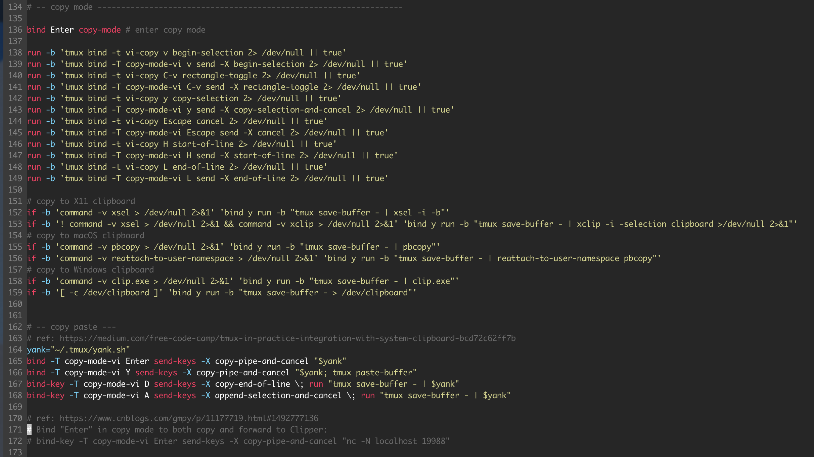

## Full Guide: how to sync clipboard over ssh + tmux + vim

## 1. enable `xclip` on remote ubuntu via ssh

to fix `Error: Can't open display: (null)` when using `echo "xx" | xclip` on remote ubuntu, I found we should config `ForwardX11 yes` in both local and remote ssh config, see: https://askubuntu.com/a/305681/1629991

### 1. config

```conf
## -- local ---
# /etc/ssh/ssh_config
Host *
    ForwardX11 yes

## -- remote ---
# /etc/ssh/sshd_config
X11Forwarding yes
```

### 2. connect on client

```sh
# the `-X` is to enable the `X11-forward` feature
ssh -X mark$ARPARA_AOSP_SERVER
```

### 3. test on remote

```sh
➜  ~ echo 'clip on air' | xclip
➜  ~ xclip -o
clip on air
➜  ~ xclip -selection clipboard -o
zzz2
➜  ~ echo 'clip on clipboard' | xclip -selection clipboard
➜  ~ xclip -o
clip on air
➜  ~ xclip -selection clipboard -o
clip on clipboard
➜  ~ xclip -sel clipboard -o
clip on clipboard
➜  ~ xclip -sel clip -o
clip on clipboard
```

## 2. enable access to clipboard on remote ubuntu at local (part 1: basic)

首先可以看一下这篇[Forward your clipboard via SSH reverse tunnels](https://gist.github.com/dergachev/8259104)，它给出了最简单的基于无限循环监听端口(`nc -l`)并复制(`pbcopy`)的方案。

### 1. enable listen on one shell

```sh
while (true); do nc -l 5556 | pbcopy; done
```

### 2. connect using reverse tunnelling

#### solution 1

```sh
ssh mark@$ARPARA_AOSP_SERVER -R 5556:localhost:5556
```

#### solution 2

1. config on local

```conf
# ~/.ssh/config
RemoteForward 5556 localhost:5556
```

2. (possibly necessary) reload ssh

```sh
sudo launchctl unload /System/Library/LaunchDaemons/ssh.plist
sudo launchctl load -w /System/Library/LaunchDaemons/ssh.plist
```

3. connect without `-R`

```sh
ssh mark@$ARPARA_AOSP_SERVER
```

### 3. test on remote

```sh
echo "test 1" | nc -q0 localhost 5556
```

then we can access the `test 1` in the local clipboard.

## 3. enable access to clipboard on remote ubuntu at local (part 2: socket)

ref: https://medium.com/hackernoon/tmux-in-practice-copy-text-from-remote-session-using-ssh-remote-tunnel-and-systemd-service-dd3c51bca1fa

### 1. config plist

```sh
PLIST_PBCOPY_SSH=`~/.pbcopy_ssh.plist`
```

```xml
<?xml version="1.0" encoding="UTF-8"?>
<!DOCTYPE plist PUBLIC "-//Apple//DTD PLIST 1.0//EN" "http://www.apple.com/DTDs/PropertyList-1.0.dtd">
<plist version="1.0">
<dict>
    <key>Label</key>
    <string>pbcopy-ssh</string>

    <key>UserName</key>
    <string>mark</string>

    <key>Program</key>
    <string>/usr/bin/pbcopy</string>

    <key>Sockets</key>
    <dict>
        <key>Listeners</key>
        <dict>
            <key>SockNodeName</key>
            <string>localhost</string>
            <key>SockServiceName</key>
            <string>19988</string>
        </dict>
    </dict>
    <key>inetdCompatibility</key>
    <dict>
        <key>Wait</key>
        <false/>
    </dict>
</dict>
</plist>
```

### 2. chmod (necessary)

```sh
chmod 755 $PLIST_PBCOPY_SSH
```
  
see https://developer.apple.com/forums/thread/665661?answerId=695171022#695171022, otherwise would have the following error if we `load` or `unload` the plist file:

```text
Load failed: 5: Input/output error
Try running `launchctl bootstrap` as root for richer errors.
```

### 3. start plist

```sh
launchctl load $PLIST_PBCOPY_SSH
launchctl start pbcopy-ssh
```

we can also check the running state of plist via `launchctl print gui/501/pbcopy-ssh | grep state` to only get `state = not running`, but it have worked actually.

### 4. test plist

```sh
ssh mark@$ARPARA_AOSP_SERVER -R 19988:localhost:19988

echo 'test 2' | nc -q0 localhost 19988
```

then we can access the `test 2` in the local clipboard.

## 4. vim copy to clipboard

> see more at: [How to copy to clipboard in Vim? - Stack Overflow](https://stackoverflow.com/questions/3961859/how-to-copy-to-clipboard-in-vim#:~:text=In%20vim%20command%20mode%20press,and%20CMD%20%2B%20v%20to%20paste.)

### 1. map `Y` to copy selected content into register `+`

```.vimrc
vnoremap Y "+y
```

### 2. usage

1. `shift + V` to switch to `Visual Mode` and select the current line, then use the Arrow key of `UP | DOWN` to select more lines.
2. press `Y` to copy the selected lines into the clipboard

## 5. vim copy to local clipboard

> see more at: [ssh - How to use X11 forwarding to copy from vim to local machine - Stack Overflow](https://stackoverflow.com/questions/47822357/how-to-use-x11-forwarding-to-copy-fro m-vim-to-local-machine)

Based on section of "4. vim copy to clipboard", we can manually run a system command that send the registered content into system clipboard (local via `xclip or pbcopy` or remote via `nc and xclip or pbcopy`).

For example, we can use `: call system('nc -q0 localhost 19988', @+)` to send the content in register `+` to the local port at 19988.

:::caution
we should add `-q0` for `nc` if necessary, otherwise I found that the command just won't stop input (since it would has verbose output).
:::

So, for convenience, we can directly use the following vim script to map the sequences into one key of `Y`:

```.vimrc
" -- enable Y to copy to clipboard, ref: https://stackoverflow.com/a/67890119/9422455
" how to map two commands with only one key, ref: https://vi.stackexchange.com/a/3886
" what's the meaning of <CR> (which can be omitted in bottom command), ref: https://stackoverflow.com/a/22143208/9422455

vnoremap Y "+y :call system('nc -q0 localhost 19988', @+)<CR>
```

## 6. tmux copy to local clipboard

> see more at: [vim与系统剪切板之间的复制粘贴 - 广漠飘羽 - 博客园](https://www.cnblogs.com/gmpy/p/11177719.html)

after vim configured, the tmux copy paste would runs well if we use the `oh-my-tmux` config at `https://github.com/gpakosz/.tmux`

  

## core reference

- [Forward your clipboard via SSH reverse tunnels](https://gist.github.com/dergachev/8259104)
- [vim与系统剪切板之间的复制粘贴 - 广漠飘羽 - 博客园](https://www.cnblogs.com/gmpy/p/11177719.html#1492777136)
- [tmux in practice: integration with the system clipboard | by Alexey Samoshkin | We’ve moved to freeCodeCamp.org/news | Medium](https://medium.com/free-code-camp/tmux-in-practice-integration-with-system-clipboard-bcd72c62ff7b)
- [tmux in practice: copy text from remote session using SSH remote tunnel and systemd service | by Alexey Samoshkin | HackerNoon.com | Medium](https://medium.com/hackernoon/tmux-in-practice-copy-text-from-remote-session-using-ssh-remote-tunnel-and-systemd-service-dd3c51bca1fa)
- [gpakosz/.tmux: 🇫🇷 Oh my tmux! My self-contained, pretty & versatile tmux configuration made with ❤️](https://github.com/gpakosz/.tmux)