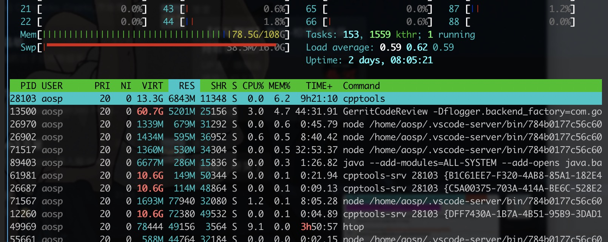

- [overview](#overview)
- [memory](#memory)
	- [check memory stat (`free`)](#check-memory-stat-free)
	- [check memory stat with details (`htop`)](#check-memory-stat-with-details-htop)
	- [check zfs arc (`arc_summary`)](#check-zfs-arc-arc_summary)
	- [modify zfs config file](#modify-zfs-config-file)
	- [QA: why memory usage does not add up with processes](#qa-why-memory-usage-does-not-add-up-with-processes)

## overview

- [How To Monitor Your CPU and RAM in Linux | Tom's Hardware](https://www.tomshardware.com/how-to/monitor-cpu-and-ram-in-linux)

## memory

### check memory stat (`free`)
 
```sh
➜  ~ free -g
              total        used        free      shared  buff/cache   available
Mem:            108          78           7           0          21          28
Swap:            15           0          15
```

### check memory stat with details (`htop`)

  

If we look at `htop` memory usage carefully, we may find that the memory usage doesn't add up to the processes.

It is mainly because zfs uses 50% (default) of memory as cache.

see: 

- [ubuntu - htop memory usage does not add up with process list - Super User](https://superuser.com/questions/1337660/htop-memory-usage-does-not-add-up-with-process-list)
- [ram - Is ZFS on Ubuntu 20.04 using a ton of memory? - Ask Ubuntu](https://askubuntu.com/questions/1230150/is-zfs-on-ubuntu-20-04-using-a-ton-of-memory)

### check zfs arc (`arc_summary`)

> see: - [ram - Is ZFS on Ubuntu 20.04 using a ton of memory? - Ask Ubuntu](https://askubuntu.com/questions/1230150/is-zfs-on-ubuntu-20-04-using-a-ton-of-memory)

```sh
$ arc_summary

------------------------------------------------------------------------
ZFS Subsystem Report				Thu Sep 08 22:56:19 2022
ARC Summary: (HEALTHY)
	Memory Throttle Count:			0

ARC Misc:
	Deleted:				97.48m
	Mutex Misses:				13.77k
	Evict Skips:				4.02m

ARC Size:				88.42%	47.82	GiB
	Target Size: (Adaptive)		88.48%	47.85	GiB
	Min Size (Hard Limit):		6.25%	3.38	GiB
	Max Size (High Water):		16:1	54.08	GiB
```

### modify zfs config file

```sh
sudo vim /etc/modprobe.d/zfs.conf
```

### QA: why memory usage does not add up with processes

see: [check memory stat with details (`htop`)](#check-memory-stat-with-details-htop)
