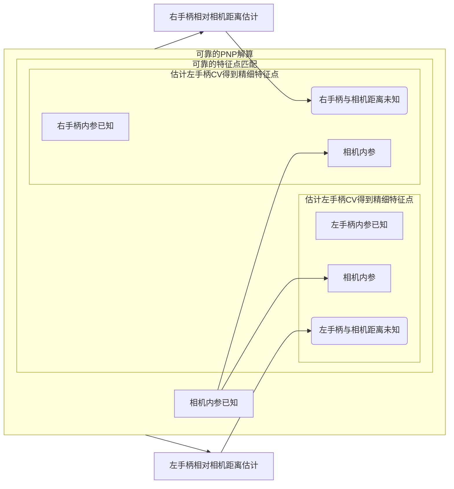
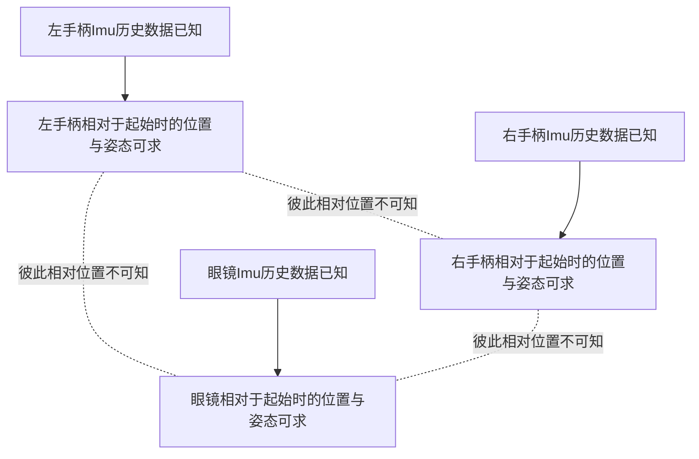

## logic

```mermaid
flowchart LR
CameraIntrKnown[相机内参已知]

LIntrKnown[左手柄内参已知]

RIntrKnown[右手柄内参已知]

LDistance(左手柄与相机距离未知)

RDistance(右手柄与相机距离未知)

subgraph LCVEstimate[估计左手柄CV得到精细特征点]
direction TB
CameraIntrForL[相机内参]
LIntrKnown
LDistance
end

subgraph RCVEstimate[估计左手柄CV得到精细特征点]
direction TB
CameraIntrForR[相机内参]
RIntrKnown
RDistance
end

CameraIntrKnown --> CameraIntrForL
CameraIntrKnown --> CameraIntrForR

subgraph ReliableFeaturesMatch[可靠的特征点匹配]
LCVEstimate
RCVEstimate
end

subgraph PNP[可靠的PNP解算]
CameraIntrKnown
ReliableFeaturesMatch
end

PNP --> LDistanceEstimate[左手柄相对相机距离估计]
PNP --> RDistanceEstimate[右手柄相对相机距离估计]
LDistanceEstimate --> LDistance
RDistanceEstimate --> RDistance
```

```mermaid
flowchart
LImuKnown[左手柄Imu历史数据已知] --> LRelPoseLocKnown[左手柄相对于起始时的位置与姿态可求]

RImuKnown[右手柄Imu历史数据已知] --> RRelPoseLocKnown[右手柄相对于起始时的位置与姿态可求]

HImuKnown[眼镜Imu历史数据已知] --> HRelPoseLocKnown[眼镜相对于起始时的位置与姿态可求]

LRelPoseLocKnown  -. 彼此相对位置不可知 .-  RRelPoseLocKnown
LRelPoseLocKnown  -. 彼此相对位置不可知 .-  HRelPoseLocKnown
RRelPoseLocKnown  -. 彼此相对位置不可知 .-  HRelPoseLocKnown

```
