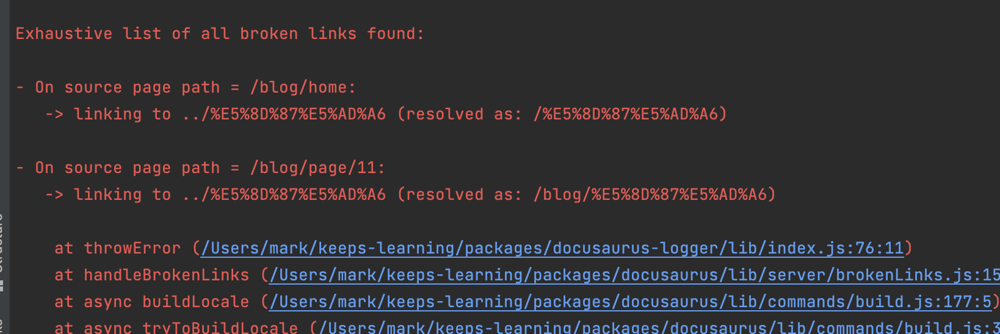
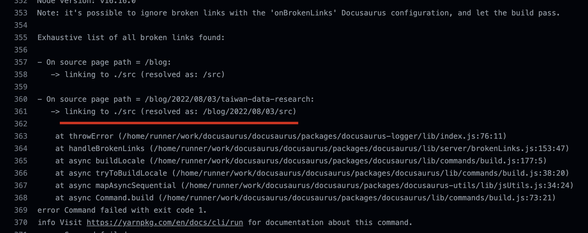
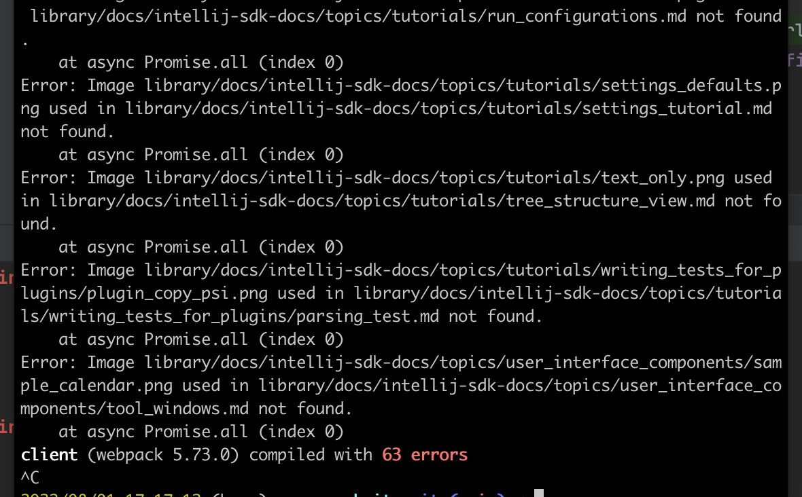
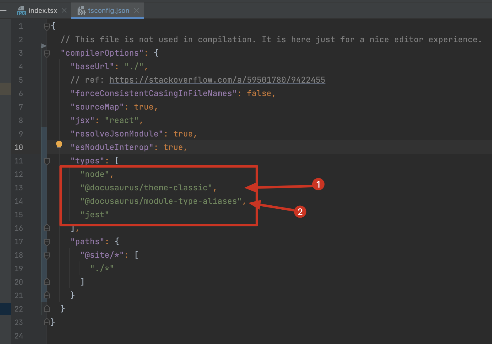
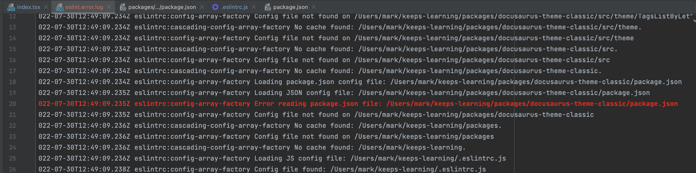
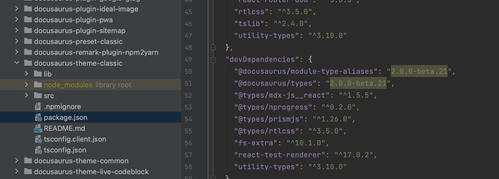
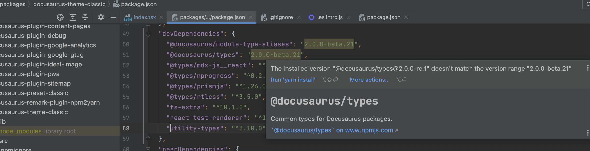
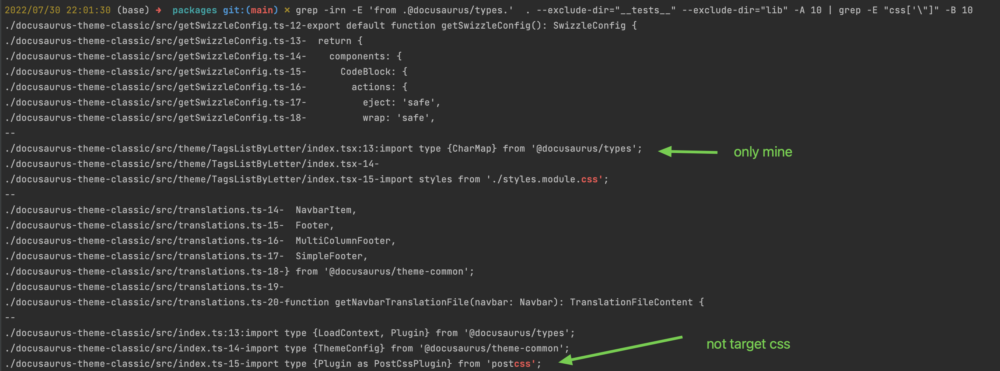
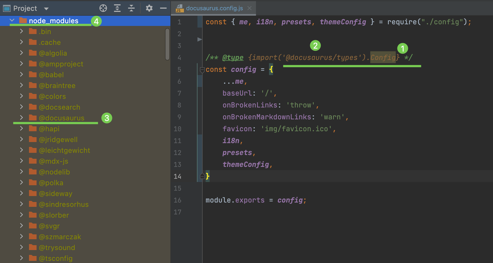
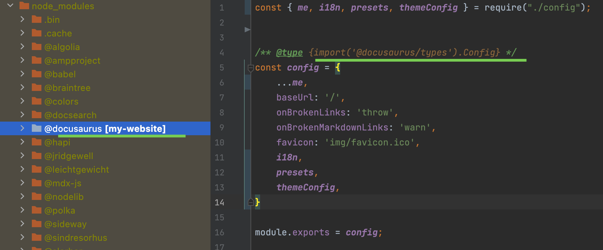

## Plugin Development

- doc: https://docusaurus.io/docs/api/plugins/@docusaurus/plugin-content-docs

## Todo

- [ ] 设置基于文件夹的默认列表页，允许对文件夹的引用（例如`../升学`），进行导航

  

- [ ] 追踪 slug，区分基于 mdx?或基于 tsx，增强 RouteConfig 数据结构，从而更好的溯源，比如对 slug 重复进行报错

## Issue

### reference to directory

  

### SOLVED: typescript for config

solution:

```js
// docusaurus.config.js
'use strict';


require("tsconfig-paths").register({
    baseUrl: "./",
    paths: require("./tsconfig.json").compilerOptions.paths,
});

require('ts-node').register({
    scope: true,
    scopeDir: __dirname,
    swc: true,
    transpileOnly: true,
});

module.exports = require('./config/src/index.ts');
```


see: [A full typescript implementation for config · Issue #7911 · facebook/docusaurus](https://github.com/facebook/docusaurus/issues/7911)

!!!note

    ## Source Code

    ```ts
    // config/src/index.ts

    import type {Config} from '@docusaurus/types'

    // here is a sample of async config, and it would be also OK to just put a Config here
    export const configCreatorAsync = async (): Promise<Config> => ({
      ...
      baseUrl: '/',
      docs: {...},
      blog:{...},
      ...
    })

    export default configCreatorAsync
    ```

    ```json
    // config/tsconfig.json
    {
      "compilerOptions": {
        "baseUrl": ".",

        "module": "commonjs", // docusaturus is based on CJS now
        "target": "esnext",   // to make the transpiled js more readable than es5 or like

        "outDir": "../..",    // directly output all the generated files under current website root dir, so **[important]**
                              // prevent the js failing to run in case of any path problems
        "rootDir": "../..",   // keep the project structure

        "resolveJsonModule": true,   // json support
        "esModuleInterop": true,     // esm support
        "moduleResolution": "node",  // node support

        "skipLibCheck": true,        // ensure true to avoid annoying type inspection errors
        "skipDefaultLibCheck": true, // the same as above 

        "sourceMap": false,          // unnecessary to generate map
        "declaration": false         // unnessary to genrate d.ts            
      },
      "include": [
        "src/**/*.ts",
        ...     // other files we need to be imported by src under src, e.g. my `../src/ds/tasks.ts`
      ],
      "exclude": [
        "**/node_modules"
      ]
    }
    ```

    ```json
    // package.json
    {
      "scripts": {
        "prestart": "cd config && tsc",
        "start": "docusaurus start --config config/src/index.js",
      }
    }
    ```

    ## Attention

    - prevent using `path alias` in our ts config file, since it would introduce troubles when transpiling into js, `tsconfig-paths` or `tsc-alias` may be helpful if you need it.
    - It's ok to not use `outDir` and `rootDir` in `tsconfig.json`, but it would fail if using `tsc-alias` at the same time since a `outDir` is need.
    - It's ok to just write one ts config file just like what the `docusaurus.config.js` did, but the config would become harder to manage as you have seen.

    ## Other Practices

    I also tried to use webpack to pack all the ts files into one `docusaurus.config.webpack.js` file and almost succeded with these settings:

    ```ts
    // webpack.config.ts

    import path from "path"

    import type {Configuration} from 'webpack/types'

    import nodeExternals from 'webpack-node-externals'

    const config: Configuration = {
      resolve: {
        extensions: [".tsx", ".ts", ".jsx", ".js"],
        alias: {
          // target for tsconfig.json, ref: https://webpack.js.org/configuration/resolve/#resolvealias
          "@site": path.resolve(__dirname, "../"),
        }
      },
      entry: "./src/index.ts",
      output: {
        filename: 'docusaurus.config.webpack.js',
        path: path.resolve(__dirname, ".."),
        library: { // --> IMPORTANT <--
          type: 'commonjs-module',
          export: 'default'
        }
      },
      target: 'node',             // must enable, otherwise can't resolve `fs|path`
      node: {
        __dirname: true          // /my-website/src/css/theme.css
        // __dirname: false      // /my-website/css/theme.css (default)
      },
      externals: [nodeExternals()],

      module: {
        rules: [
          {
            test: /\.tsx?$/,
            use: 'ts-loader',
            exclude: /node_modules/,
          }
        ],
      },
    };


    const isProduction = process.env.NODE_ENV === "production";

    module.exports = () => {
      if (isProduction) {
        config.mode = "production";
      } else {
        config.mode = "development";
      }
      return config;
    };
    ```

    But it failed with the unknown error `request argument is not a string`, which seems raised by the webpack inner docusaurus.

    ### ACCEPTED: better-engineering: warn the broken image path

    problem: there are too many errors if we import one doc library from somewhere with uncertain images.

    


## PR

## Howto

### add `jest` for sub-project `my-website`

ref: [Fix - Cannot find name 'describe' Error in TypeScript | bobbyhadz](https://bobbyhadz.com/blog/typescript-cannot-find-name-describe#:~:text=To%20solve%20the%20%22Cannot%20find,json%20file.)

1. `yarn add -D @types/jest ts-jest jest`
2. add `compileOptions.types.jest` in `tsconfig.json`

### how to build one specific workspace

命令格式就是这个，重点是 XXX 该怎么写：

```sh
yarn workspace XXX build
```

因为这个 XXX 不等于workspaces下面的文件名，实际上，它们是每一个 workspace 里 `package.json` 里的名字，比如 `plugin-content-blog`。

所以例如：

```sh
yarn workspace plugin-content-blog build
yarn workspace my-website start
```

### vercel build using hook (api)

ref: https://vercel.com/docs/concepts/git/deploy-hooks#
command: `curl -X POST https://api.vercel.com/v1/integrations/deploy/prj_EFC7HzRJH3t5ENxjB5GkESOPwPAy/3SsPLXHylh`

but this solution would fail since the vercel cannot auto clone private repos (which is finished in Github actions via `action/checkout` with an ACCESS_TOKEN key).

### :rocket: private submodules recursively fork

solution:

- discussion on vercel (but with no valid solution: https://github.com/vercel/community/discussions/44
- √ use github actions for vercel (with more info can be found): https://vercel.com/support/articles/how-can-i-use-github-actions-with-vercel

result:

- github action page: https://github.com/MarkShawn2020/docusaurus/actions

other refs:

- generate ssh keys on Github: https://docs.github.com/en/authentication/connecting-to-github-with-ssh/generating-a-new-ssh-key-and-adding-it-to-the-ssh-agent#generating-a-new-ssh-key
- run ssh command when deploy (maybe helpful): https://answers.netlify.com/t/support-guide-using-an-ssh-key-via-environment-variable-during-build/2457

### 配置 Sidebar 部分章节打开

根据 [Autogenerated | Docusaurus](https://docusaurus.io/docs/sidebar/autogenerated#category-item-metadata) 配置如下：

[slam-sidebar-config](../../SLAM/_category_.yml)

## Bugfix

### change declaration order

The order of types in `tsconfig.json` is important!

  

### fixed eslint import order problem

solution:

```sh
npx eslint packages/docusaurus-theme-classic/src/theme/TagsListByLetter/index.tsx --debug 2> eslint.error.log
```

Since I haven't initialized the workspace, the eslint does't work fully.







#### check import css followed after `@docusaurus/types`

run: `grep -irn -E 'from .@docusaurus/types.' . --exclude-dir="__tests__" --exclude-dir="lib" -A 10 | grep -E "css['\"]" -B 10`

result:



### 解决在 webstorm 中部分 type annotation 不起作用（但 vscode 可以）

问题：

如下，webstorm 的 Config 类就没有获得类型提示，原因很简单，就是因为对应的库被 webstorm 默认给 excluded 了：



解决方案：

只要把 `@docusaurus` 这个库右键 “cancel exclusion” 即可（秒 ok），另一种方法是对 `node_modules` 进行 “cancel exclusion”，但并不推荐，因为会拖慢 ide 的运行速度。


