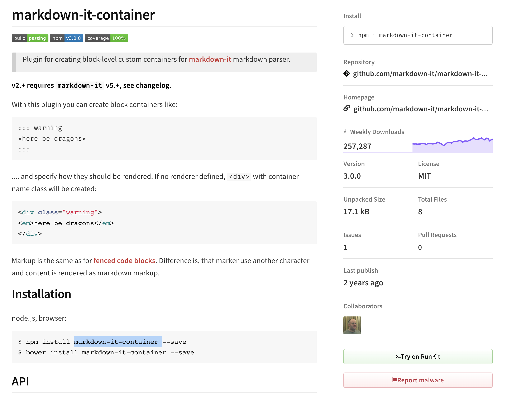
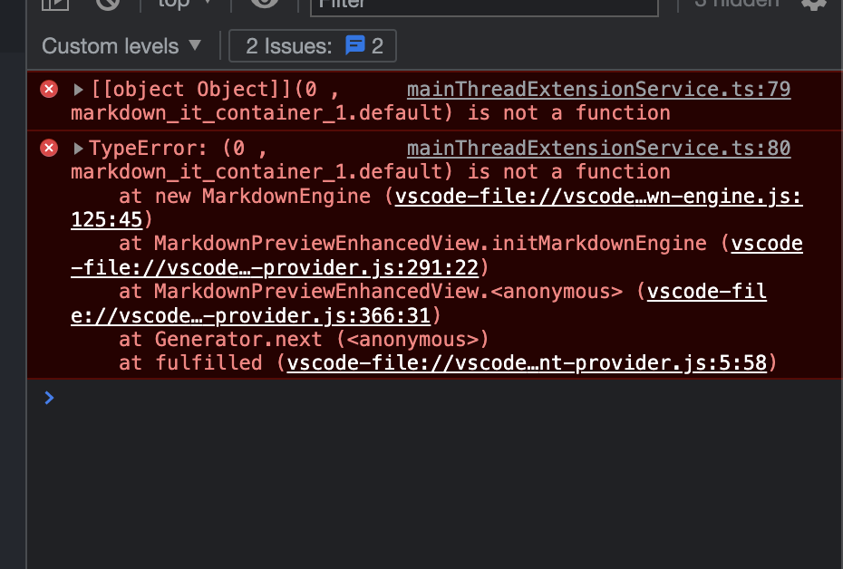

# vscode extensions howto

## markdown extensions selection

### ★★★ `Markdown All in One`

- advantages
  - ~~allows me to `create table of content`, which doesn't pollute my headings and can directly jump with `command + click` and in preview mode~~
  - More intelligent about markdown, allowing auto completion of markdown link to files, auto indent of lists, ...
- usage
  - set the markdown `indent` to be `inherit`, and always set the markdown indent to be 4 in order not to catch the unified indent problems
- remark
  - update@2022-02-06: since the table of content generated directly in file would cause trouble in `mdnice.com`, and if I use a simple `[TOC]`, then I can also share the heading jump powered by `markdown preview extended`, so I decided to not use `table of content` feature powered by `Markdown All In One`.

### ★★★ `Markdown Image`

#### usage of `Markdown Image`

do not enable `html` choice, since it doesn't support the `command + click` jump feature

#### advantages of `Markdown Image`

- allows me to paste image, auto saved to pre-specific folder
- allows me to upload to cloud, need configuration, yet not enabled now, since I will use typora with PicGo to upload if I need to publish some articles to public platforms, such as wechat public accounts

#### disadvantages of `Markdown IMage`

All the markdown files need to be named using English, otherwise would cause markdown reference error in typora

#### dependencies of `Markdown Preview Extended (MPE)`: `princes`

download from [Prince - Download Prince 14.2](https://www.princexml.com/download/) for exporting pdf from rendered html, especially supporting the markdown containers.

TODO: configure the theme and the path.

> usage


> result


#### advantages of `Markdown Preview Enhanced`

allows me to render more beautifully with more themes and enhanced plugins

### ★★★ `Markdown Preview Enhanced`

official site: [Introduction](https://shd101wyy.github.io/markdown-preview-enhanced/#/)

#### custom-css_for-sidebar(toc)-wider

1. `Command + Shipt + P` search `customize css`, it would show the target css file place !!!tip the place is not `~/.mume/styles.less` indicated as official. indeed, it's `~/.local/state/mume/styles.less`

And write those css statements under the root level:


> see

- [建议: Preview 界面的 TOC 可以做到浮空吗? · Issue #526 · shd101wyy/markdown-preview-enhanced](https://github.com/shd101wyy/markdown-preview-enhanced/issues/526)

- [Customize CSS](https://shd101wyy.github.io/markdown-preview-enhanced/#/customize-css)

#### export pdf via chrome


- [PDF](https://shd101wyy.github.io/markdown-preview-enhanced/#/pdf)

### ★★★ `Markdown Lint`

#### advantages

allows me to write formatted markdown file

#### configurations

```json
// settings.json
    "markdownlint.config": {
        "no-inline-html": {
            "allowed_elements": [ // ref: [MD033 allowed_elements highlights the wrong element in mixed element scenarios · Issue #179 · DavidAnson/markdownlint](https://github.com/DavidAnson/markdownlint/issues/179)
                "img" // since I need to control my imgs under specific layout at some time, so I need to use raw html element in markdown
            ]
        },
        "MD010": false,
        "MD034": false,
        "MD038": false,
        "MD007": {
            "indent": 4
        }
    },
```

### :x: `Markdown PDF`

- advantages:
  - allows me to export/render to PDF and with delicate typography
- disadvantages:
  - it provides me many configuration choices in the settings, which would be better if allows me to do the adjustment before I confirm the execution of export
- conclusion
  - update@2022-02-08: 考虑到 pdf 导出现在基于`MPE`的浏览器导出，而且效果很好，所以就不使用`Markdown PDF`插件了，因为这样预览时和导出时不统一，比如`Container`和`TOC`都不正常显示。

### :x: Markdown Extended

- disadvantages
  - the url render is not as expected when it comes `.ts` end, and it didn't give much space for us to manipulate the settings, not like `Markdown Preview Enhanced`
  - update@2022-02-08: 主要是目前没发现必须用`Markdown Extended`的地方，`All In One`好像就能满足大部分编辑需求了，`MPE`在预览上足够强大，`Markdown Image`上传图片一绝，`Markdown Lint`质量很稳定！

### :x: Markdown Notes

- advantages
  - allows me to use `[[TARGET_FILE_PATH]]` to point out to file I can jump to
  - allows me to later back in left panel
- disadvantages:
  - the link cannot end with headings, otherwise the `command + click` would perform a `new file` which is not as expected

## extension:Todo-Tree

### usage

It's important to use `"type": "tag"` in `"todo-tree.highlights.customHighlight"` in order to get a better display effect of tags.

### configuration

```json
// Settings.json
    "todo-tree.general.tags": [
        "EMERGENT: ",
        "FIXME: ",
        "TODO: ",
        "PR: "
        // "BEST-PRACTICE: ",
    ],
    "todo-tree.highlights.customHighlight": {
        "BEST-PRACTICE: ": {
            "icon": "key",
            "iconColor": "#ff6"
        },
        "FIXME: ": {
            "foreground": "#333",
            "gutterIcon": true,
            "iconColour": "#f33"
        },
        "PR: ": {
            "icon": "arrow-up-right",
            "iconColor": "#3d3"
        },
        "TODO: ": {
            "icon": "clock",
            "iconColor": "#3c3",
            "type": "tag"
        }
    },
```

### effect


## extension:markdown-preview-enhanced

### develop: general

We can get the instruction on how to develop vscode extension of MPE by ourselves: [For Developer](https://shd101wyy.github.io/markdown-preview-enhanced/#/developer?id=develop-this-package-for-vs-code)

There are two versions of MPE:

1. [shd101wyy/markdown-preview-enhanced: One of the 'BEST' markdown preview extensions for Atom editor!](https://github.com/shd101wyy/markdown-preview-enhanced)
2. [shd101wyy/vscode-markdown-preview-enhanced: One of the "BEST" markdown preview extensions for Visual Studio Code](https://github.com/shd101wyy/vscode-markdown-preview-enhanced)

Both depends on the `mume` core package:

- [shd101wyy/mume: Powerful markdown tool](https://github.com/shd101wyy/mume)

### develop: markdown-it-container integration

We can get markdown container of `:::` from package: [markdown-it-container - npm](https://www.npmjs.com/package/markdown-it-container)

  

```sh
cd packages/mume/dependencies/markdown-it/extensions && wget https://raw.githubusercontent.com/markdown-it/markdown-it-container/master/dist/markdown-it-container.min.js
```

```js
// packages/mume/src/markdown-engine.ts:255
    const getPluginFromPath = p => require(path.resolve(extensionDirectoryPath, p))
    extensions.forEach(p => {
      this.md.use(getPluginFromPath(p))
    });

    ["info", "warning", "tip", "question"].forEach(name => {
      this.md.use(getPluginFromPath("markdown-it-container.min.js"), name);
    });
```

### develop: markdown-it-container bugfix

  


### change pdf output style, e.g. prince font

file location:

`/Users/mark/.local/state/mume/style.less`

we can get it via:


and custom it [^custom-mpe-pdf-output-style] at here:


refer to [CSS font-family 詳細介紹 - OXXO.STUDIO](https://www.oxxostudio.tw/articles/201811/css-font-family.html) see more about css font-family.

and we can get all the fonts supported in our system via built-in software of `font book`:


[^custom-mpe-pdf-output-style]: [shd101wyy/markdown-preview-enhanced](https://github.com/shd101wyy/markdown-preview-enhanced/blob/master/docs/customize-css.md)

## extension:markdown-pdf

### how to use custom styles in markdown-pdf

resolution:

Setup the `markdown-pdf styles` option in the settings:


Or setup a relative one based on the option of `markdown-pdf styles relative path file`:


In case I don't catch where does the-relative really relative to, I used an absolute path even with the relative option checked.

The content inner `mdnice-purple.css`, which copied from `mdnice.com` and dropped the raw `mdnice` prefix, looks like this:


result:

the css file is included in the target html file (not written directly into html).


ref:

- [Styles settings not working as expected with HTML · Issue #213 · yzane/vscode-markdown-pdf](https://github.com/yzane/vscode-markdown-pdf/issues/213)

## extension:markdown-image

### diy the image path

Since I want to systematically record all my notes in one giant working directory, it's no need to create any sub directories to store the images for each single article in different path. It's better for me to centrally store all the images in one same directory, so I tried to find how to help me achieve this goal in the plugin 'markdown-image'

Luckily, I found I didn't need to do much work only if I experimented and realized that:

- `.imgs`: `{CUR_FILE_DIR}/.imgs`, which in fact equals `./.imgs`
- `/.imgs`: `{PROJECT_DIR}/.imgs`, which in fact turns into `../../.imgs` if it lies in the third layer of project.

Hence, the settings of `/.imgs` meets my expectation much. Thanks ~


### TODO: Script of migrating all the images in different sub-folders everywhere to the central image asserts directory

## FIXED: markdown image links invalid

When keeping updating this project, the directories and files would change continuously, causing the image links in markdown files to be invalid, since they could not change synchronously like coding refactors.

But don't worry, it's easy to turn these links to be valid again, since all the real images are saved at the `.imgs` under the root directory.

So, just replace the prefix of each image links, with a shorter or longer `..`, since all the image links are formatted as relative paths based on the plugin of `markdown images`.

here is an easy sample of increasing a depth of images:

```sh
# add '../' before
gsed -ri 's|(["\(])\.\.|\1\.\./\.\.|g' FILE

# remove '../' before
gsed -ri 's|(["\(])\.\./|\1|g' FILE
```

## FIXED: markdown containers support

There are a few of solutions for markdown containers support, such as `!!!warning` for `markdownAllInOne` plugin in vscode and `:::warning` for npm package of `markdown-it`.

But they can not ensure run well anywhere.

The most recommended approach is to use `> :warning: TEXT` so that it can render acceptably in no matter of vscode, github and wechat, etc.

The effect in vscode is as the following:


ref:

- [How to make a styled Markdown admonition box in a GitHub Gist? - Stack Overflow](https://stackoverflow.com/questions/50544499/how-to-make-a-styled-markdown-admonition-box-in-a-github-gist)

---

update @2022-02-08: solution using `Admonition` supported by markdown preview enhanced:

- [Markdown Basics](https://shd101wyy.github.io/markdown-preview-enhanced/#/markdown-basics?id=admonition)
